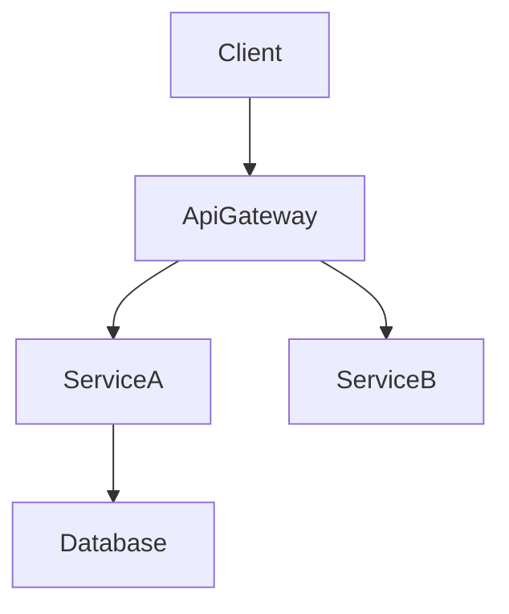

# 技術設計ルールと原則

## コア設計原則

### 1. 型安全性は必須
- TypeScript のインターフェースで `any` 型は**絶対に使わない**
- すべての引数と戻り値に明示的な型を定義する
- エラーハンドリングは判別共用体を使う
- ジェネリック制約を明確にする

### 2. 設計と実装の分離
- **HOW ではなく WHAT に集中**
- コードではなくインターフェースと契約を定義する
- 振る舞いは事前/事後条件で示す
- アルゴリズムではなくアーキテクチャ決定を記録する

### 3. 視覚的コミュニケーション
- **単純な機能**: 基本的なコンポーネント図、または省略
- **中程度の複雑さ**: アーキテクチャ + データフロー
- **高い複雑さ**: 複数図（アーキテクチャ、シーケンス、状態）
- **常に純粋な Mermaid**: スタイルなし、構造のみ

### 4. コンポーネント設計ルール
- **単一責任**: 1 コンポーネント 1 目的
- **明確な境界**: 明示的なドメイン所有
- **依存方向**: アーキテクチャレイヤに従う
- **インターフェース分離**: 最小で焦点の合ったインターフェース
- **チーム安全なインターフェース**: 並行実装でも衝突しない境界設計
- **調査トレーサビリティ**: 境界判断と根拠を `research.md` に記録

### 5. データモデリング基準
- **ドメイン優先**: ビジネス概念から始める
- **整合性境界**: 明確な集約ルート
- **正規化**: 性能と整合性のバランス
- **進化**: スキーマ変更を見据える

### 6. エラーハンドリング哲学
- **フェイルファスト**: 早期かつ明確な検証
- **グレースフルデグラデーション**: 完全失敗より部分的機能
- **ユーザー文脈**: 実行可能なエラーメッセージ
- **可観測性**: 包括的なログと監視

### 7. 統合パターン
- **疎結合**: 依存を最小化
- **契約優先**: 実装前にインターフェース定義
- **バージョニング**: API 進化を計画
- **冪等性**: リトライ安全を設計
- **契約の可視性**: API/イベント契約は design.md に明示し、詳細は `research.md` へリンク

## ドキュメント標準

### 言語とトーン
- **宣言的**: "The system authenticates users" のように断定形
- **正確**: 曖昧語ではなく具体的な技術用語
- **簡潔**: 必要最小限の情報
- **形式的**: プロフェッショナルな技術文書

### 構造要件
- **階層的**: 明確なセクション構成
- **追跡可能**: 要件からコンポーネントへの紐づけ
- **完全**: 実装に必要な全要素
- **一貫性**: 用語を統一
- **集中**: design.md はアーキテクチャと契約に集中し、調査ログや長い比較は `research.md` へ移す

## セクション執筆ガイド

### グローバル順序
- 既定フロー: Overview → Goals/Non-Goals → Requirements Traceability → Architecture → Technology Stack → System Flows → Components & Interfaces → Data Models → Optional sections。
- 明確性が増す場合、Traceability を前倒ししたり Data Models を Architecture 近くに置いてよい。ただしセクション見出しは維持する。
- 各セクション内は **Summary → Scope → Decisions → Impacts/Risks** を守り、レビューで走査しやすくする。

### 要件 ID
- 要件は `2.1, 2.3` のように参照（"Requirement 2.1" は不要）。
- すべての要件は数値 ID が必須。欠けている場合は `requirements.md` を修正してから進める。
- `N.M` 形式を使用する。`N` は requirements.md の上位要件番号（例: Requirement 1 → 1.1, 1.2; Requirement 2 → 2.1, 2.2）。
- すべてのコンポーネント、タスク、トレーサビリティ行は同一の正準 ID を参照する。

### 技術スタック
- 本機能で影響する層のみを含める（フロントエンド、バックエンド、データ、メッセージング、インフラ）。
- 各層にツール/ライブラリ + バージョン + 役割を記載し、詳細な根拠や比較、ベンチマークは `research.md` に移す。
- 既存システム拡張時は、現行スタックからの逸脱と新規依存を明示する。

### システムフロー
- 振る舞いの理解に必要な場合のみ図を追加:
  - **Sequence**: 複数ステップの相互作用
  - **Process/State**: 分岐ルールやライフサイクル
  - **Data/Event**: パイプラインや非同期
- 常に純粋な Mermaid を使用。複雑なフローがない場合はセクション全体を省略する。

### 要件トレーサビリティ
- 標準表（`Requirement | Summary | Components | Interfaces | Flows`）でカバレッジを示す。
- 単一要件が 1:1 でコンポーネントに対応する場合のみ、箇条書きへ簡略化。
- シンプルな対応はコンポーネント要約表で十分。複雑/コンプライアンス要件では完全な表を用いる。
- 要件やコンポーネント変更時は必ず再マッピングしてドリフトを防ぐ。

### コンポーネント & インターフェース執筆
- ドメイン/レイヤごとにコンポーネントをまとめ、各コンポーネントに 1 ブロック。
- 先頭に要約表（Component, Domain, Intent, Requirements, Key Dependencies, Contracts）を置く。
- 表のフィールド: Intent（1 行）、Requirements（`2.1, 2.3`）、Owner/Reviewers（任意）。
- 依存表は Inbound/Outbound/External を区別し、重要度（`P0` ブロッキング、`P1` 高リスク、`P2` 参考）を付与。
- 外部依存の詳細調査は `research.md` に置き、ここでは要約のみ。
- design.md はレビュー用に自己完結させる。`research.md` は背景参照のみとし、結論はここに再掲する。
- 契約は該当タイプのみチェック（Service/API/Event/Batch/State）。未選択のタイプは後続セクションに出さない。
- サービスインターフェースはメソッドシグネチャ、入出力、エラー封筒を明示。API/Event/Batch はトリガー、ペイロード、配信、冪等性などを表/箇条書きで示す。
- ロールアウト戦略、可観測性、未決事項は **Integration & Migration Notes**, **Validation Hooks**, **Open Questions / Risks** に記録する。
- 詳細密度ルール:
  - **フルブロック**: 新しい境界を導入するコンポーネント（ロジックフック、共有サービス、外部統合、データ層）。
  - **要約のみ**: 新境界のない表示/UI コンポーネント（必要なら短い Implementation Note だけ）。
- Implementation Notes は Integration / Validation / Risks を一つの箇条書き小節にまとめる。
- 短いデータはリストやインラインで、比較が必要な場合のみ表を使う。

### 共有インターフェース & Props
- 繰り返し使う UI コンポーネントはベース interface（例: `BaseUIPanelProps`）を定義し、差分だけを拡張する。
- 新しい契約を導入するフック/ユーティリティ/アダプタは、TypeScript シグネチャを完全に記載する。
- ベース契約の再利用時は明示的に参照し、コードブロックの重複を避ける（例: "Extends `BaseUIPanelProps` with `onSubmitAnswer` callback"）。

### データモデル
- Domain Model は集約、エンティティ、値オブジェクト、ドメインイベント、不変条件を扱う。関係が非自明なら Mermaid 図。
- Logical Data Model は構造、インデックス、シャーディング、ストレージ特性（イベントストア、KV/ワイドカラム）に触れる。
- Data Contracts & Integration では API ペイロード、イベントスキーマ、サービス間同期パターンを記載する。
- 長大な型定義やベンダー依存のオプションは design.md の Supporting References に置き、該当箇所からリンクする。調査メモは `research.md` に残す。
- Supporting References は任意。本文の可読性が下がる場合のみ作成する。判断は本文に残し、design.md の自己完結性を保つ。

### エラー/テスト/セキュリティ/性能セクション
- 機能固有の判断や逸脱のみを記録する。ベースラインの方針はステアリングを参照する。

### 図と本文の重複排除
- 図の内容を本文で逐語的に繰り返さない。本文は図にない判断、トレードオフ、影響を示す。
- 判断が図注で完結する場合、短い「Key Decisions」箇条書きで十分。

### 一般的な重複排除
- Overview/Architecture/Components で同じ情報を繰り返さない。文脈が同一なら参照にとどめる。
- 要件/コンポーネント関係が要約表で示せるなら、別途書き直さない（追加のニュアンスがある場合のみ記述）。

## 図のガイドライン

### 図を含める条件
- **Architecture**: 3 つ以上のコンポーネント/外部システムが関与する場合
- **Sequence**: 呼び出し/ハンドシェイクが複数ステップにわたる場合
- **State / Flow**: 複雑な状態機械や業務フロー
- **ER**: 非自明なデータモデル関係
- **Skip**: 単一コンポーネントの軽微変更は不要

### Mermaid 要件

- **プレーン Mermaid のみ** – カスタムスタイルや非対応構文は避ける。
- **ノード ID** – 英数字とアンダースコアのみ（例: `Client`, `ServiceA`）。`@`, `/`, 先頭 `-` は不可。
- **ラベル** – シンプルな単語のみ。括弧 `()`, 角括弧 `[]`, クォート `"`, スラッシュ `/` は含めない。
  - ❌ `DnD[@dnd-kit/core]` → ID に `@` が含まれる
  - ❌ `UI[KanbanBoard(React)]` → ラベルに `()` が含まれる
  - ✅ `DndKit[dnd-kit core]` → 技術詳細は説明文に回す
  - ℹ️ Mermaid の strict モードでは `Expecting 'SQE' ... got 'PS'` のようなエラーが出るため、ラベルから記号を除去する。
- **エッジ** – データ/制御フローの方向を示す。
- **グループ** – subgraph でのクラスタリングは許可。明確化のため最小限に。

## 品質指標
### 設計の完全性チェックリスト
- すべての要件に対応
- 実装詳細が混入していない
- 明確なコンポーネント境界
- 明示的なエラーハンドリング
- 包括的なテスト戦略
- セキュリティの考慮
- 性能目標の定義
- 移行経路が明確（該当時）

### ありがちなアンチパターン
❌ 設計と実装の混同
❌ あいまいなインターフェース定義
❌ エラーシナリオの欠落
❌ 非機能要件の無視
❌ 過度に複雑なアーキテクチャ
❌ コンポーネント間の強結合
❌ データ整合性戦略の欠落
❌ 依存分析の不完全
