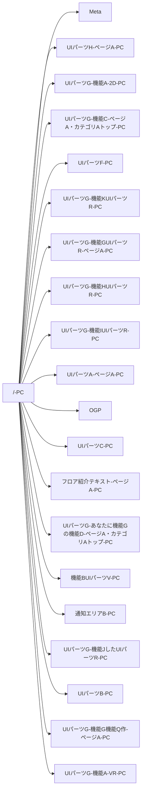

| 対象URL | https://example.com |
| --- | --- |

# **全体画像**

| Image |  |
| --- | --- |
| 撮影日 2025/06/09 | 該当ページのスクショを挿入すること 複数ある場合列を追加 画像の上に撮影日を入れること 画像が古い場合気づいた人が更新すること 幅400 高さ480 に収まるようにサイズ指定すること 該当画像が必要ない場合は、日付を消して該当無しを記載すること |

| Figma |  |
| --- | --- |
| .widget-link { min-width: 64px; background-image: url("/download/resources/com.atlassian.confluence.extra.widgetconnector:widget/widget.png"); background-repeat: no-repeat; background-position: 50% 0; text-align: center; padding-top: 65px; text-decoration: none; color: #CCC; font-weight: bold; display: inline-block; font-size: .8em; text-decoration: none; } .widget-link:hover { color: #868686; } UIパーツWを入れる | コンポーネントを挿入すること 複数ある場合ウィジェットを追加 幅640 高さ480 に収まるようにサイズ指定すること 該当UIパーツWがない場合はウィジェットを消して、該当無しを記載すること |

| Componentdocs |  |
| --- | --- |
| [https://example-componentdocs-xyz123.pages.github.io/componentdocs/?path=/docs/src-pages-pc--docs](https://example-componentdocs-xyz123.pages.github.io/componentdocs/?path=/docs/src-pages-pc--docs) | Componentdocsの のUIパーツWを記載すること共有LinkではなくコンポーネントへのUIパーツWを記載すること例：https://example-componentdocs-xyz123.pages.github.io/componentdocs/?path=/story/src-model-performer-nav-performer--cinema 共有LinkではなくコンポーネントへのUIパーツWを記載すること 例：https://example-componentdocs-xyz123.pages.github.io/componentdocs/?path=/story/src-model-performer-nav-performer--cinema 複数ある場合は、リスト形式で記載 該当UIパーツWがない場合は該当無しを記載すること |

  

# **Meta-共通**

各ページごとの設定は以下のスプレッドシートを参照すること

-   [meta一覧スプレッドシート](https://docs.google.com/spreadsheets/d/1TQOgn_rFxvwEtlbe5_f6KAJSvij5Dmn6TO1Cr5RUqqU/edit?gid=1137564869#gid=1137564869&range=186:189)
    

# **OGP-共通**

PC/SP/各ページ共通

| 項目 | 値 | 備考 |
| --- | --- | --- |
| og:title | なし |  |
| og:description | なし |  |
| og:locale | ja_JP |  |
| og:site_name | ExampleService |  |
| og:url |  |  |

  

  

# **開発資料**

| Title | UIパーツW |
| --- | --- |
| 設計Issue | ※リプレイスチームが、対応したgithubUIパーツWがある場合記載する。 |
| Miro | ※リプレイスチームが、対応したMiroなどの資料がある場合記載する。 |

  

  

* * *

  

**▶ UIパーツB-PCメインUIパーツZ-PC2025年グローバルUIパーツB-PC2025年UIパーツO-PC2025年UIパーツN-PC2025年**  
  

# **UIパーツBPC**

```mermaid
flowchart LR
    node1["グローバルUIパーツB-PC"]
    node2["UIパーツB-PC"]
    node3["メインUIパーツZ-PC"]
    node4["UIパーツN-PC"]
    node5["UIパーツO-PC"]
    node6["/category-b/content/?id=xxxx-PC"]
    node7["/category-c-PC"]
    node8["/category-c/producer-PC"]
    node9["/category-a/collection-PC"]
    node10["/category-a/list/?key=xxx-PC"]
    node11["/-PC"]
    node12["/category-d/list/?key=xxx-PC"]
    node13["/category-a/content/?id=xxxx-PC"]
    node14["/category-c/category/?display=syllabary-PC"]
    node15["/category-a/producer/?syllabary=a-PC"]
    node16["/category-c/category-PC"]
    node17["/basket-PC"]
    node18["/category-d-PC"]
    node19["/category-d/content/?id=xxxx-PC"]
    node20["/category-c/collection/?syllabary=a-PC"]
    node21["/category-d/collection-PC"]
    node22["/category-d/category-PC"]
    node23["/category-a/performer/?syllabary=a-PC"]
    node24["/amateur-PC"]
    node25["/category-c/content/?id=xxxx-PC"]
    node26["/category-c/collection-PC"]
    node27["/av-PC"]
    node28["/category-a/producer/?category=xxxx-PC"]
    node29["/category-b/category/?display=syllabary-PC"]
    node30["/category-b/category-PC"]
    node31["【反映済】 /category-b/category/?display=syllabary-PC_【恒久】20251113_リスト ソート順Aの新設 他フロア展開（カテゴリB）"]
    node32["/category-b/performer/?syllabary=a-PC"]
    node33["/vr-PC"]
    node34["/search/?key=xxx-PC"]
    node35["/category-a/producer/?category=top-PC"]
    node36["/category-a/category-PC"]
    node37["/category-c/performer-content/?syllabary=a-PC"]
    node38["/category-d/producer-PC"]
    node39["/category-b/list/?key=xxx-PC"]
    node40["/category-d/category/?display=syllabary-PC"]
    node41["/category-c/creator/?syllabary=a-PC"]
    node42["/category-a/category/?display=syllabary-PC"]
    node43["/category-c/writer/?syllabary=a-PC"]
    node44["/category-c/list/?key=xxx-PC"]
    node45["/category-d/collection/?syllabary=a-PC"]
    node46["/category-a/collection/?syllabary=a-PC"]
    node47["/category-c/performer/?syllabary=a-PC"]
    node2 --> node1
    node2 --> node3
    node2 --> node4
    node2 --> node5
    node6 --> node2
    node7 --> node2
    node8 --> node2
    node9 --> node2
    node10 --> node2
    node11 --> node2
    node12 --> node2
    node13 --> node2
    node14 --> node2
    node15 --> node2
    node16 --> node2
    node17 --> node2
    node18 --> node2
    node19 --> node2
    node20 --> node2
    node21 --> node2
    node22 --> node2
    node23 --> node2
    node24 --> node2
    node25 --> node2
    node26 --> node2
    node27 --> node2
    node28 --> node2
    node29 --> node2
    node30 --> node2
    node31 --> node2
    node32 --> node2
    node33 --> node2
    node34 --> node2
    node35 --> node2
    node36 --> node2
    node37 --> node2
    node38 --> node2
    node39 --> node2
    node40 --> node2
    node41 --> node2
    node42 --> node2
    node43 --> node2
    node44 --> node2
    node45 --> node2
    node46 --> node2
    node47 --> node2
```

/*<!--\[CDATA\[*/ div.rbtoc1766199452675 {padding: 0px;} div.rbtoc1766199452675 ul {margin-left: 0px;} div.rbtoc1766199452675 li {margin-left: 0px;padding-left: 0px;} /*\]\]-->*/

-   [UIパーツBPC](#id-/PC-UIパーツBPC)
    -   [メインUIパーツZ-PC](#id-/PC-メインUIパーツZ-PC)
        -   [更新履歴](#id-/PC-更新履歴)
        -   [デザイン](#id-/PC-デザイン)
        -   [仕様](#id-/PC-仕様)
        -   [開発資料](#id-/PC-開発資料)
            -   [画面仕様書移植確認リスト](#id-/PC-画面仕様書移植確認リスト)
    -   [グローバルUIパーツB-PC](#id-/PC-グローバルUIパーツB-PC)
        -   [更新履歴](#id-/PC-更新履歴.1)
        -   [デザイン](#id-/PC-デザイン.1)
        -   [仕様](#id-/PC-仕様.1)
        -   [開発資料](#id-/PC-開発資料.1)
            -   [画面仕様書移植確認リスト](#id-/PC-画面仕様書移植確認リスト.1)
    -   [UIパーツO-PC](#id-/PC-UIパーツO-PC)
        -   [更新履歴](#id-/PC-更新履歴.2)
        -   [デザイン](#id-/PC-デザイン.2)
        -   [仕様](#id-/PC-仕様.2)
        -   [開発資料](#id-/PC-開発資料.2)
        -   [画面仕様書移植確認リスト](#id-/PC-画面仕様書移植確認リスト.2)
    -   [UIパーツN-PC](#id-/PC-UIパーツN-PC)
        -   [更新履歴](#id-/PC-更新履歴.3)
        -   [デザイン](#id-/PC-デザイン.3)
        -   [仕様](#id-/PC-仕様.3)
        -   [開発資料](#id-/PC-開発資料.3)
        -   [画面仕様書移植確認リスト](#id-/PC-画面仕様書移植確認リスト.3)
            -   [画面仕様書移植確認リスト](#id-/PC-画面仕様書移植確認リスト.4)

  

* * *

  

 メインUIパーツZ-PC

## **メインUIパーツZ-PC**

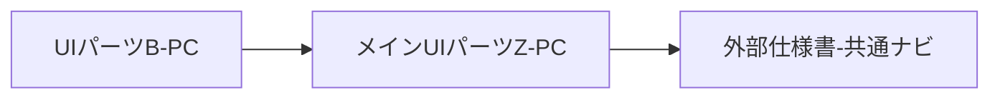

### 更新履歴

 2025年

| 日付 | 施策・修正コンフルURL |
| --- | --- |
| 2025/01/10 | 下書き追加 |

### デザイン

| Image |  |
| --- | --- |
| 撮影日2025/01/09 | 該当ブロックのスクショを挿入すること 複数ある場合列を追加 画像の上に撮影日を入れること 画像が古い場合気づいた人が更新すること 幅400 高さ480 に収まるようにサイズ指定すること 該当画像が必要ない場合は、日付を消して該当無しを記載すること |

| Figma |  |
| --- | --- |
| 該当なし ※PF要素のため | コンポーネントを挿入すること 複数ある場合ウィジェットを追加 幅640 高さ480 に収まるようにサイズ指定すること 該当UIパーツWがない場合はウィジェットを消して、該当無しを記載すること |

| Componentdocs |  |
| --- | --- |
| 該当なし | Componentdocsの のUIパーツWを記載すること共有LinkではなくコンポーネントへのUIパーツWを記載すること例：https://example-componentdocs-xyz123.pages.github.io/componentdocs/?path=/story/src-model-performer-nav-performer--cinema 共有LinkではなくコンポーネントへのUIパーツWを記載すること 例：https://example-componentdocs-xyz123.pages.github.io/componentdocs/?path=/story/src-model-performer-nav-performer--cinema 複数ある場合は、リスト形式で記載 該当UIパーツWがない場合は該当無しを記載するこ |

### 仕様

| 機能名 | 機能概要 | 表示仕様 | 表示条件 | ログイン判定 | アクション | トラッキングシステム | API |
| --- | --- | --- | --- | --- | --- | --- | --- |
| メインUIパーツZUIパーツZ | APIベータの返却データに依存 | Apibetaから返却された他サービスの導線を表示 | メインUIパーツZUIパーツXにカーソルをホバー | - | 各サービスのURLへ遷移 | click_commonglobal global※PF管理のため上記コンフル側での記載管理はなし | [外部仕様書-共通ナビ](/pages/viewpage.action?pageId=2000000032)[api-deltaContents](https://example-bff.gh-pages.example.com/public/queries/api-deltaContents) |

### 開発資料

| Title | UIパーツW |
| --- | --- |
| 設計Issue | [カテゴリCフロア_カテゴリ一覧ページ: api-beta の設計・テストケース作成](https://github.com/example-org/project-alpha/issues/124)[カテゴリCフロア_カテゴリ一覧ページ: api-beta の実装](https://github.com/example-org/project-alpha/issues/125) |
| 共通APIベータ | [外部仕様書-共通ナビ](/pages/viewpage.action?pageId=2000000032) |

#### **画面仕様書移植確認リスト**

チェックボックス @名前 チェックした日付　のフォーマットでチェック

-   ベース記載 2025/01/09 [小谷野 諭@FE](/display/~koyano-satoshi) 
-   FE  日付を記載 2025/01/15 [宮尾 健](/display/~miyao-ken) 
-   DES 2025/01/16 [中田 裕美子@DES](/display/~nakada-yumiko) 
-   最終確認 [小谷野 諭@FE](/display/~koyano-satoshi)  日付を記載
-   元ページへのUIパーツWの記載　[小谷野 諭@FE](/display/~koyano-satoshi)

  

* * *

  

 グローバルUIパーツB-PC

## **グローバルUIパーツB-PC**

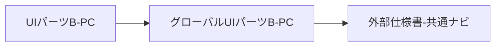

### 更新履歴

 2025年

| 日付 | 施策・修正コンフルURL |
| --- | --- |
| 2025/01/01 |  |

### デザイン

| Image |  |
| --- | --- |
| 撮影日2025/01/10 | 該当ブロックのスクショを挿入すること 複数ある場合列を追加 画像の上に撮影日を入れること 画像が古い場合気づいた人が更新すること 幅400 高さ480 に収まるようにサイズ指定すること 該当画像が必要ない場合は、日付を消して該当無しを記載すること |

| Figma |  |
| --- | --- |
| 該当なし ※PF要素のため | コンポーネントを挿入すること 複数ある場合ウィジェットを追加 幅640 高さ480 に収まるようにサイズ指定すること 該当UIパーツWがない場合はウィジェットを消して、該当無しを記載すること |

| Componentdocs |  |
| --- | --- |
| 該当なし | Componentdocsの のUIパーツWを記載すること共有LinkではなくコンポーネントへのUIパーツWを記載すること例：https://example-componentdocs-xyz123.pages.github.io/componentdocs/?path=/story/src-model-performer-nav-performer--cinema 共有LinkではなくコンポーネントへのUIパーツWを記載すること 例：https://example-componentdocs-xyz123.pages.github.io/componentdocs/?path=/story/src-model-performer-nav-performer--cinema 複数ある場合は、リスト形式で記載 該当UIパーツWがない場合は該当無しを記載すること |

### 仕様

| 機能名 | 機能概要 | 表示仕様 | 表示条件 | ログイン判定 | アクション | トラッキングシステム | API |
| --- | --- | --- | --- | --- | --- | --- | --- |
| ExampleService内各サービスへのグローバルUIパーツWのUIパーツZUIパーツX | PF管轄 | 固定 | - | ホバー: メインUIパーツZが開く | - | click_commonsearchnotificationfavoritecouponpointbasketlogin search notification favorite coupon point basket login※PF管理のため上記コンフル側での記載管理はなし | [外部仕様書-共通ナビ](/pages/viewpage.action?pageId=2000000032) |
| サービスロゴ | ExampleServiceコンテンツのロゴ | PF管轄 | 固定 | - | ExampleServiceページAへ画面遷移 | - | - |

### 開発資料

| Title | UIパーツW |
| --- | --- |
| 設計Issue | [カテゴリCフロア_カテゴリ一覧ページ: api-beta の設計・テストケース作成](https://github.com/example-org/project-alpha/issues/124)[カテゴリCフロア_カテゴリ一覧ページ: api-beta の実装](https://github.com/example-org/project-alpha/issues/125) |
| 共通APIベータ | [外部仕様書-共通ナビ](/pages/viewpage.action?pageId=2000000032) |

#### **画面仕様書移植確認リスト**

チェックボックス @名前 チェックした日付　のフォーマットでチェック

-   ベース記載 2025/01/10 [小谷野 諭@FE](/display/~koyano-satoshi) 
-   FE  日付を記載 2025/01/15 [宮尾 健](/display/~miyao-ken) 
-   DES 2025/01/16 [中田 裕美子@DES](/display/~nakada-yumiko) 
-   最終確認 [小谷野 諭@FE](/display/~koyano-satoshi)  日付を記載
-   元ページへのUIパーツWの記載　[小谷野 諭@FE](/display/~koyano-satoshi)

  

* * *

  

 UIパーツO-PC

## UIパーツO-PC

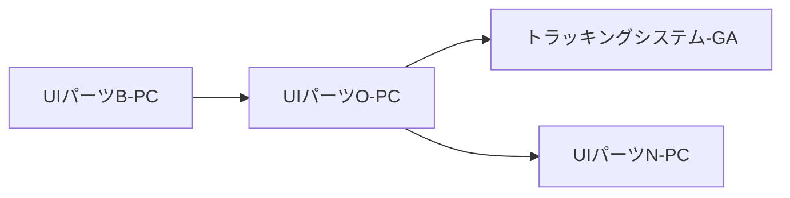

### 更新履歴

 2025年

| 日付 | 施策・修正コンフルURL |
| --- | --- |
| 2025/01/01 |  |

### デザイン

| Image |  |
| --- | --- |
| 撮影日2025/01/10 | 該当ブロックのスクショを挿入すること 複数ある場合列を追加 画像の上に撮影日を入れること 画像が古い場合気づいた人が更新すること 幅400 高さ480 に収まるようにサイズ指定すること 該当画像が必要ない場合は、日付を消して該当無しを記載すること |

| Figma |  |
| --- | --- |
| 該当なし 2025/01/15作成予定あり 2025/01/16 中田 裕美子@DES | コンポーネントを挿入すること 複数ある場合ウィジェットを追加 幅640 高さ480 に収まるようにサイズ指定すること 該当UIパーツWがない場合はウィジェットを消して、該当無しを記載すること |

| Componentdocs |  |
| --- | --- |
| [component-alpha](https://example-componentdocs-xyz123.pages.github.io/componentdocs/?path=/docs/src-model-menugation-component-alpha--docs) | Componentdocsの のUIパーツWを記載すること共有LinkではなくコンポーネントへのUIパーツWを記載すること例：https://example-componentdocs-xyz123.pages.github.io/componentdocs/?path=/story/src-model-performer-nav-performer--cinema 共有LinkではなくコンポーネントへのUIパーツWを記載すること 例：https://example-componentdocs-xyz123.pages.github.io/componentdocs/?path=/story/src-model-performer-nav-performer--cinema 複数ある場合は、リスト形式で記載 該当UIパーツWがない場合は該当無しを記載するこ |

### 仕様

| 機能名 | 機能概要 | 表示仕様 | 表示条件 | ログイン判定 | アクション | トラッキングシステム | API |
| --- | --- | --- | --- | --- | --- | --- | --- |
| ページA | ページAへのUIパーツW | video.example.comの各フロアディレクトリ(av, vr, amateurなど)配下の画面表示時背景色を黒色で非アクティブ表示 背景色を黒色で非アクティブ表示 | - | - | ページAへ遷移 | click_commonheader_service_menugation header_service_menugation | - |
| カテゴリA | カテゴリAトップへのUIパーツW | video.example.com/category-a/* のURLの画面表示時 カーソルホバー時 背景色を赤色でアクティブ表示 背景色を赤色でアクティブ表示 video.example.com/category-a/* に合致しないURLの画面表示時背景色を黒色で非アクティブ表示 背景色を黒色で非アクティブ表示 | - | - | カテゴリAトップへ遷移 | - |
| VRコンテンツ | ページCへのUIパーツW | video.example.com/category-e/* のURLの画面表示時 カーソルホバー時 背景色を赤色でアクティブ表示 背景色を赤色でアクティブ表示 video.example.com/category-e/* に合致しないURLの画面表示時背景色を黒色で非アクティブ表示 背景色を黒色で非アクティブ表示 | - | - | ページCへ遷移 | - |
| カテゴリB | ページDへのUIパーツW | video.example.com/category-b/* のURLの画面表示時 カーソルホバー時 背景色を赤色でアクティブ表示 背景色を赤色でアクティブ表示 video.example.com/category-b/* に合致しないURLの画面表示時背景色を黒色で非アクティブ表示 背景色を黒色で非アクティブ表示 | - | - | ページDへ遷移 | - |
| カテゴリD | ページEへのUIパーツW | video.example.com/category-d/* のURLの画面表示時 カーソルホバー時 背景色を赤色でアクティブ表示 背景色を赤色でアクティブ表示 video.example.com/category-d/* に合致しないURLの画面表示時背景色を黒色で非アクティブ表示 背景色を黒色で非アクティブ表示 | 日本国外からのアクセスの場合は非表示 | - | ページEへ遷移 | - |
| カテゴリC | ページFへのUIパーツW | video.example.com/category-c/* のURLの画面表示時 カーソルホバー時 背景色を赤色でアクティブ表示 背景色を赤色でアクティブ表示 video.example.com/category-c/* に合致しないURLの画面表示時背景色を黒色で非アクティブ表示 背景色を黒色で非アクティブ表示 | - | - | ページFへ遷移 | - |
| グラビア | グラビア(一般)へのUIパーツW | カーソルホバー時背景色を赤色でアクティブ表示 背景色を赤色でアクティブ表示 それ以外背景色を黒色で固定表示 背景色を黒色で固定表示 | - | - | ExampleService TVのグラビアカテゴリトップへ遷移ログインセッションを引き継ぐ | - |
| デバイス | [UIパーツN-PC](/pages/viewpage.action?pageId=2000000011)参照 | - | - | - | - | - | - |

### 開発資料

| Title | UIパーツW |
| --- | --- |
| 設計Issue | component-alpha の設計・テストケース作成 component-alpha の実装 |
| UIパーツN-PC | [UIパーツN-PC](/pages/viewpage.action?pageId=2000000011) |
| トラッキングシステム | [トラッキングシステムシステムA](/pages/viewpage.action?pageId=2000000033) |

### **画面仕様書移植確認リスト**

チェックボックス @名前 チェックした日付　のフォーマットでチェック

-   ベース記載 2025/01/10 [小谷野 諭@FE](/display/~koyano-satoshi) 
-   FE  2025/01/15  [小野寺 剣人](/display/~onodera-kento) 
-   DES 2025/01/10 [中田 裕美子@DES](/display/~nakada-yumiko) 
-   最終確認 [小谷野 諭@FE](/display/~koyano-satoshi)  日付を記載
-   元ページへのUIパーツWの記載　[小谷野 諭@FE](/display/~koyano-satoshi)

  

* * *

  

 UIパーツN-PC

## **UIパーツN-PC**

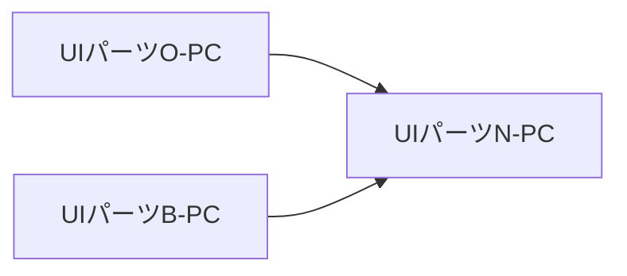

### 更新履歴

 2025年

| 日付 | 施策・修正コンフルURL |
| --- | --- |
| 2025/01/01 |  |

### デザイン

| Image |  |
| --- | --- |
| 撮影日2025/01/10 | 該当ブロックのスクショを挿入すること 複数ある場合列を追加 画像の上に撮影日を入れること 画像が古い場合気づいた人が更新すること 幅400 高さ480 に収まるようにサイズ指定すること 該当画像が必要ない場合は、日付を消して該当無しを記載すること |

| Figma |  |
| --- | --- |
| 該当なし 2025/01/15作成予定あり 2025/01/16 中田 裕美子@DES | コンポーネントを挿入すること 複数ある場合ウィジェットを追加 幅640 高さ480 に収まるようにサイズ指定すること 該当UIパーツWがない場合はウィジェットを消して、該当無しを記載すること |

| Componentdocs |  |
| --- | --- |
| [component-alpha](https://example-componentdocs-xyz123.pages.github.io/componentdocs/?path=/docs/src-model-menugation-component-alpha--docs) | Componentdocsの のUIパーツWを記載すること共有LinkではなくコンポーネントへのUIパーツWを記載すること例：https://example-componentdocs-xyz123.pages.github.io/componentdocs/?path=/story/src-model-performer-nav-performer--cinema 共有LinkではなくコンポーネントへのUIパーツWを記載すること 例：https://example-componentdocs-xyz123.pages.github.io/componentdocs/?path=/story/src-model-performer-nav-performer--cinema 複数ある場合は、リスト形式で記載 該当UIパーツWがない場合は該当無しを記載するこ |

### 仕様

| 機能名 | 機能概要 | 表示仕様 | 表示条件 | ログイン判定 | アクション | トラッキングシステム | API |
| --- | --- | --- | --- | --- | --- | --- | --- |
| iPhone/iPad | ガイドページ(iPhone/iPad)へのUIパーツW | カーソルホバー時背景色を赤色でアクティブ表示 背景色を赤色でアクティブ表示 それ以外背景色を黒色で固定表示 背景色を黒色で固定表示 | 「デバイス」にカーソルホバーで表示 | - | 以下ページへ画面遷移https://example.com https://example.com ログインセッションを引き継ぐ | click_commonheader_service_menugation header_service_menugation | - |
| Android | ガイドページ(Android)へのUIパーツW | カーソルホバー時背景色を赤色でアクティブ表示 背景色を赤色でアクティブ表示 それ以外背景色を黒色で固定表示 背景色を黒色で固定表示 | 「デバイス」にカーソルホバーで表示 | - | 以下ページへ画面遷移https://example.com https://example.com ログインセッションを引き継ぐ | - |
| Chromecast | ガイドページ(Chromecast)へのUIパーツW | カーソルホバー時背景色を赤色でアクティブ表示 背景色を赤色でアクティブ表示 それ以外背景色を黒色で固定表示 背景色を黒色で固定表示 | 「デバイス」にカーソルホバーで表示 | - | 以下ページへ画面遷移https://example.com新基盤への移行後、新URLに変更する https://example.com 新基盤への移行後、新URLに変更する | - |
| Amazon Fire TV端末 | ガイドページ(Amazon Fire TV端末)へのUIパーツW | カーソルホバー時背景色を赤色でアクティブ表示 背景色を赤色でアクティブ表示 それ以外背景色を黒色で固定表示 背景色を黒色で固定表示 | 「デバイス」にカーソルホバーで表示 | - | 以下ページへ画面遷移https://example.com新基盤への移行後、新URLに変更する https://example.com 新基盤への移行後、新URLに変更する | - |
| AppleTV | ガイドページ(AppleTV)へのUIパーツW | カーソルホバー時背景色を赤色でアクティブ表示 背景色を赤色でアクティブ表示 それ以外背景色を黒色で固定表示 背景色を黒色で固定表示 | 「デバイス」にカーソルホバーで表示 | - | 以下ページへ画面遷移https://example.com新基盤への移行後、新URLに変更する https://example.com 新基盤への移行後、新URLに変更する | - |
| Android TV | ガイドページ(Android TV)へのUIパーツW | カーソルホバー時背景色を赤色でアクティブ表示 背景色を赤色でアクティブ表示 それ以外背景色を黒色で固定表示 背景色を黒色で固定表示 | 「デバイス」にカーソルホバーで表示 | - | 以下ページへ画面遷移https://example.com新基盤への移行後、新URLに変更する https://example.com 新基盤への移行後、新URLに変更する | - |
| テレビ | ガイドページ(テレビ)へのUIパーツW | カーソルホバー時背景色を赤色でアクティブ表示 背景色を赤色でアクティブ表示 それ以外背景色を黒色で固定表示 背景色を黒色で固定表示 | 「デバイス」にカーソルホバーで表示 | - | 以下ページへ画面遷移https://example.com新基盤への移行後、新URLに変更する https://example.com 新基盤への移行後、新URLに変更する | - |
| PS5/PS4 | ガイドページ(PS5/PS4)へのUIパーツW | カーソルホバー時背景色を赤色でアクティブ表示 背景色を赤色でアクティブ表示 それ以外背景色を黒色で固定表示 背景色を黒色で固定表示 | 「デバイス」にカーソルホバーで表示 | - | 以下ページへ画面遷移https://example.com新基盤への移行後、新URLに変更する https://example.com 新基盤への移行後、新URLに変更する | - |
| VR | LP(VR)へのUIパーツW | カーソルホバー時背景色を赤色でアクティブ表示 背景色を赤色でアクティブ表示 それ以外背景色を黒色で固定表示 背景色を黒色で固定表示 | 「デバイス」にカーソルホバーで表示 | - | 以下ページへ画面遷移https://example.com新基盤への移行後、新URLに変更する https://example.com 新基盤への移行後、新URLに変更する | - |

### 開発資料

| Title | UIパーツW |
| --- | --- |
| 設計Issue | component-alpha の設計・テストケース作成 component-alpha の実装 |

### **画面仕様書移植確認リスト**

チェックボックス @名前 チェックした日付　のフォーマットでチェック

-   ベース記載 2025/01/10 [小谷野 諭@FE](/display/~koyano-satoshi) 
-   FE  2025/01/15 [小野寺 剣人](/display/~onodera-kento) 
-   DES 2025/01/10 [中田 裕美子@DES](/display/~nakada-yumiko) 
-   最終確認 [小谷野 諭@FE](/display/~koyano-satoshi)  日付を記載
-   元ページへのUIパーツWの記載　[小谷野 諭@FE](/display/~koyano-satoshi)

  

* * *

  

#### **画面仕様書移植確認リスト**

チェックボックス @名前 チェックした日付　のフォーマットでチェック

-   ベース記載 2025/01/17 [小谷野 諭@FE](/display/~koyano-satoshi) 
-   FE  日付を記載 @名前を入力
-   DES 日付を記載 @名前を入力
-   最終確認 [小谷野 諭@FE](/display/~koyano-satoshi)  日付を記載
-   元ページへのUIパーツWの記載　[小谷野 諭@FE](/display/~koyano-satoshi)

  

* * *

  

**▶ UIパーツH-ページA-PC2025年**  
  

# **UIパーツH-ページA-PC**

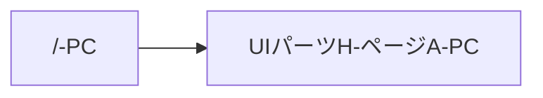

## 更新履歴

 2025年

| 日付 | 施策・修正コンフルURL |
| --- | --- |
| 2025/05/30 |  |

## **デザイン**

| Image |  |
| --- | --- |
| 撮影日 2025/06/09 | 該当ブロックのスクショを挿入すること 複数ある場合列を追加 画像の上に撮影日を入れること 画像が古い場合気づいた人が更新すること 幅400 高さ480 に収まるようにサイズ指定すること 該当画像が必要ない場合は、日付を消して該当無しを記載すること |

| Figma |  |
| --- | --- |
| .widget-link { min-width: 64px; background-image: url("/download/resources/com.atlassian.confluence.extra.widgetconnector:widget/widget.png"); background-repeat: no-repeat; background-position: 50% 0; text-align: center; padding-top: 65px; text-decoration: none; color: #CCC; font-weight: bold; display: inline-block; font-size: .8em; text-decoration: none; } .widget-link:hover { color: #868686; } UIパーツWを入れる | コンポーネントを挿入すること 複数ある場合ウィジェットを追加 幅640 高さ480 に収まるようにサイズ指定すること 該当UIパーツWがない場合はウィジェットを消して、該当無しを記載すること |

| Componentdocs |  |
| --- | --- |
| [https://example-componentdocs-xyz123.pages.github.io/componentdocs/?path=/docs/src-model-section-top-headline--docs](https://example-componentdocs-xyz123.pages.github.io/componentdocs/?path=/docs/src-model-section-top-headline--docs) | Componentdocsの のUIパーツWを記載すること共有LinkではなくコンポーネントへのUIパーツWを記載すること例：https://example-componentdocs-xyz123.pages.github.io/componentdocs/?path=/story/src-model-performer-nav-performer--cinema 共有LinkではなくコンポーネントへのUIパーツWを記載すること 例：https://example-componentdocs-xyz123.pages.github.io/componentdocs/?path=/story/src-model-performer-nav-performer--cinema 複数ある場合は、リスト形式で記載 該当UIパーツWがない場合は該当無しを記載すること |

### 仕様

| 機能名 | 機能概要 | 表示仕様 | 表示条件 | ログイン判定 | アクション | トラッキングシステム | API |
| --- | --- | --- | --- | --- | --- | --- | --- |
| UIパーツI | トップページのUIパーツIを表示 | 以下テキストを固定で表示「CONTENT 100万点超のコンテンツ・カテゴリA配信中！」 | ー | ー | ー |  |  |

## **開発資料**

| Title | UIパーツW |
| --- | --- |
| 設計Issue | ※リプレイスチームが、対応したgithubUIパーツWがある場合記載する。 |
| Miro | ※リプレイスチームが、対応したMiroなどの資料がある場合記載する。 |

  

* * *

  

**▶ 通知エリアB-PC2025年**  
  

### **通知エリアB-PC**

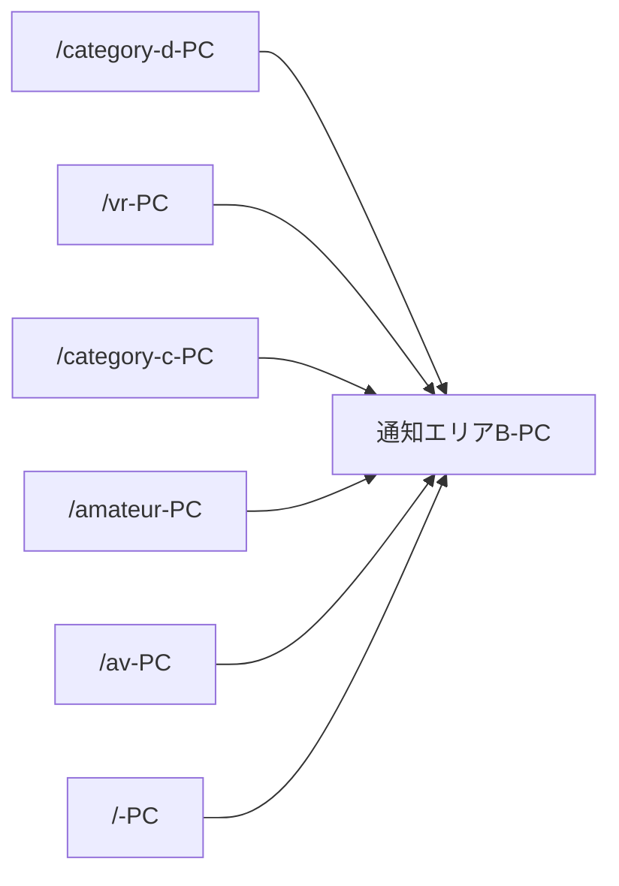

## 更新履歴

 2025年

| 日付 | 施策・修正コンフルURL |
| --- | --- |
| 2025/01/01 |  |

## **デザイン**

| Image |  |
| --- | --- |
| 撮影日 2025/06/03 | 該当ブロックのスクショを挿入すること 複数ある場合列を追加 画像の上に撮影日を入れること 画像が古い場合気づいた人が更新すること 幅400 高さ480 に収まるようにサイズ指定すること 該当画像が必要ない場合は、日付を消して該当無しを記載すること |

| Figma |  |
| --- | --- |
| .widget-link { min-width: 64px; background-image: url("/download/resources/com.atlassian.confluence.extra.widgetconnector:widget/widget.png"); background-repeat: no-repeat; background-position: 50% 0; text-align: center; padding-top: 65px; text-decoration: none; color: #CCC; font-weight: bold; display: inline-block; font-size: .8em; text-decoration: none; } .widget-link:hover { color: #868686; } UIパーツWを入れる | コンポーネントを挿入すること 複数ある場合ウィジェットを追加 幅640 高さ480 に収まるようにサイズ指定すること 該当UIパーツWがない場合はウィジェットを消して、該当無しを記載すること |

| Componentdocs |  |
| --- | --- |
| [UIパーツWを入れる](UIパーツWを入れる) | Componentdocsの のUIパーツWを記載すること共有LinkではなくコンポーネントへのUIパーツWを記載すること例：https://example-componentdocs-xyz123.pages.github.io/componentdocs/?path=/story/src-model-performer-nav-performer--cinema 共有LinkではなくコンポーネントへのUIパーツWを記載すること 例：https://example-componentdocs-xyz123.pages.github.io/componentdocs/?path=/story/src-model-performer-nav-performer--cinema 複数ある場合は、リスト形式で記載 該当UIパーツWがない場合は該当無しを記載すること |

### 仕様

| 機能名 | 機能概要 | 表示仕様 | 表示条件 | ログイン判定 | アクション | トラッキングシステム | API |
| --- | --- | --- | --- | --- | --- | --- | --- |
| 通知エリアA | 告知管理で登録されたメンテナンス・障害の告知を表示 | 表示する告知がない場合は枠ごと非表示同一期間に複数告知が設定されている場合、掲載開始日時が新しい順に表示詳細：[告知：告知バー](/pages/viewpage.action?pageId=2000000005) | 告知管理 で有効な告知が設定されている期間のみ表示 告知管理で設定することでログイン状態・未ログイン状態に応じて表示が可能になる | 告知管理の設定に応じて判定 | ー |  |  |
| 告知UIパーツI | 告知のUIパーツI文を表示 | 右に管理画面で設定された掲載UIパーツIを表示 | 同上 | 同上 | UIパーツW設定されている場合、指定されたUIパーツWURLに遷移 |  |  |
| 閉じる | 告知を非表示にする | 枠内右端に「×」UIパーツXを表示 | 同上 | 同上 | クリックした枠の告知を利用中の端末・ブラウザでそれ以降は非表示にする。告知バーの非表示は永続的ではなく、ページ遷移等を行って告知バー掲載ページに戻ってくると、また表示される。 |  |  |

## **開発資料**

| Title | UIパーツW |
| --- | --- |
| 設計Issue | ※リプレイスチームが、対応したgithubUIパーツWがある場合記載する。 |
| Miro | ※リプレイスチームが、対応したMiroなどの資料がある場合記載する。 |

  

* * *

  

**▶ UIパーツA-ページA-PCUIパーツA共通UIパーツWUIパーツVブロック-PC2025年機能O-PC2025年カテゴリAUIパーツRはこちら-PC2025年カテゴリBUIパーツRはこちら-PC2025年カテゴリDUIパーツRはこちら-PC2025年カテゴリCUIパーツRはこちら-PC2025年お知らせブロック-PC2025年UIパーツAUIパーツCUIパーツL-PC2025年**  
  

# **UIパーツA-ページA-PC**

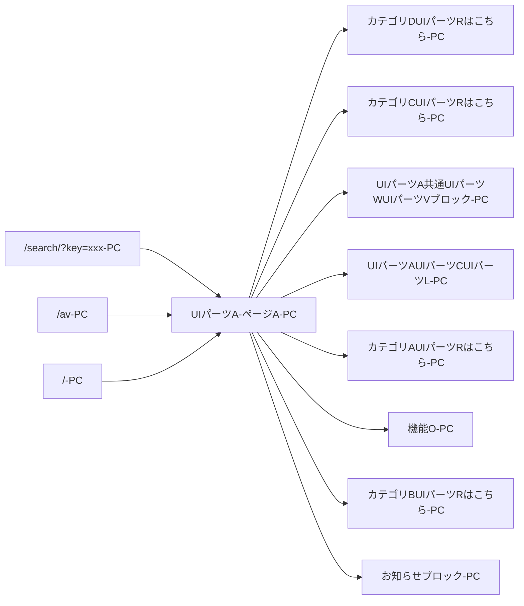

/*<!--\[CDATA\[*/ div.rbtoc1766199455368 {padding: 0px;} div.rbtoc1766199455368 ul {margin-left: 0px;} div.rbtoc1766199455368 li {margin-left: 0px;padding-left: 0px;} /*\]\]-->*/

-   [UIパーツA-ページA-PC](#id-/PC-UIパーツA-ページA-PC)
    -   [全体画面](#id-/PC-全体画面)
    -   [開発資料](#id-/PC-開発資料)
    -   [UIパーツA共通UIパーツWUIパーツVブロック-PC](#id-/PC-UIパーツA共通UIパーツWUIパーツVブロック-PC)
        -   [更新履歴](#id-/PC-更新履歴)
        -   [デザイン](#id-/PC-デザイン)
        -   [仕様](#id-/PC-仕様)
        -   [開発資料](#id-/PC-開発資料.1)
            -   [画面仕様書移植確認リスト](#id-/PC-画面仕様書移植確認リスト)
    -   [機能O-PC](#id-/PC-機能O-PC)
        -   [更新履歴](#id-/PC-更新履歴.1)
        -   [デザイン](#id-/PC-デザイン.1)
        -   [仕様](#id-/PC-仕様.1)
        -   [開発資料](#id-/PC-開発資料.2)
            -   [画面仕様書移植確認リスト](#id-/PC-画面仕様書移植確認リスト.1)
    -   [カテゴリAUIパーツRはこちら-PC](#id-/PC-カテゴリAUIパーツRはこちら-PC)
        -   [更新履歴](#id-/PC-更新履歴.2)
        -   [デザイン](#id-/PC-デザイン.2)
        -   [仕様](#id-/PC-仕様.2)
        -   [開発資料](#id-/PC-開発資料.3)
            -   [画面仕様書移植確認リスト](#id-/PC-画面仕様書移植確認リスト.2)
    -   [カテゴリBUIパーツRはこちら-PC](#id-/PC-カテゴリBUIパーツRはこちら-PC)
        -   [更新履歴](#id-/PC-更新履歴.3)
            -   [【恒久】20251113_リスト ソート順Aの新設 他フロア展開（カテゴリC・カテゴリD・コンテンツフロアトップ）](#id-/PC-【恒久】20251113_リストソート順Aの新設他フロア展開（カテゴリC・カテゴリD・コンテンツフロアトップ）)
        -   [デザイン](#id-/PC-デザイン.3)
        -   [仕様](#id-/PC-仕様.3)
        -   [開発資料](#id-/PC-開発資料.4)
            -   [画面仕様書移植確認リスト](#id-/PC-画面仕様書移植確認リスト.3)
    -   [カテゴリDUIパーツRはこちら-PC](#id-/PC-カテゴリDUIパーツRはこちら-PC)
        -   [更新履歴](#id-/PC-更新履歴.4)
            -   [【恒久】20251113_リスト ソート順Aの新設 他フロア展開（カテゴリC・カテゴリD・コンテンツフロアトップ）](#id-/PC-【恒久】20251113_リストソート順Aの新設他フロア展開（カテゴリC・カテゴリD・コンテンツフロアトップ）.1)
        -   [デザイン](#id-/PC-デザイン.4)
        -   [仕様](#id-/PC-仕様.4)
        -   [開発資料](#id-/PC-開発資料.5)
            -   [画面仕様書移植確認リスト](#id-/PC-画面仕様書移植確認リスト.4)
    -   [カテゴリCUIパーツRはこちら-PC](#id-/PC-カテゴリCUIパーツRはこちら-PC)
        -   [更新履歴](#id-/PC-更新履歴.5)
            -   [【恒久】20251113_リスト ソート順Aの新設 他フロア展開（カテゴリC・カテゴリD・コンテンツフロアトップ）](#id-/PC-【恒久】20251113_リストソート順Aの新設他フロア展開（カテゴリC・カテゴリD・コンテンツフロアトップ）.2)
        -   [デザイン](#id-/PC-デザイン.5)
        -   [仕様](#id-/PC-仕様.5)
        -   [開発資料](#id-/PC-開発資料.6)
            -   [画面仕様書移植確認リスト](#id-/PC-画面仕様書移植確認リスト.5)
    -   [お知らせブロック-PC](#id-/PC-お知らせブロック-PC)
        -   [更新履歴](#id-/PC-更新履歴.6)
        -   [デザイン](#id-/PC-デザイン.6)
        -   [仕様](#id-/PC-仕様.6)
        -   [開発資料](#id-/PC-開発資料.7)
            -   [画面仕様書移植確認リスト](#id-/PC-画面仕様書移植確認リスト.6)
    -   [UIパーツAUIパーツCUIパーツL-PC](#id-/PC-UIパーツAUIパーツCUIパーツL-PC)
        -   [更新履歴](#id-/PC-更新履歴.7)
        -   [デザイン](#id-/PC-デザイン.7)
        -   [仕様](#id-/PC-仕様.7)
        -   [開発資料](#id-/PC-開発資料.8)
            -   [画面仕様書移植確認リスト](#id-/PC-画面仕様書移植確認リスト.7)
            -   [画面仕様書移植確認リスト](#id-/PC-画面仕様書移植確認リスト.8)

## 全体画面

| Image |  |
| --- | --- |
| 撮影日2025/11/26 | 該当ブロックのスクショを挿入すること 複数ある場合列を追加 画像の上に撮影日を入れること 画像が古い場合気づいた人が更新すること 幅400 高さ480 に収まるようにサイズ指定すること 該当画像が必要ない場合は、日付を消して該当無しを記載すること |

  

| Figma |  |
| --- | --- |
| 該当無し | コンポーネントを挿入すること 複数ある場合ウィジェットを追加 幅640 高さ480 に収まるようにサイズ指定すること 該当UIパーツWがない場合はウィジェットを消して、該当無しを記載すること |

  

| Componentdocs |  |
| --- | --- |
| [https://example-componentdocs-xyz123.pages.github.io/componentdocs/?path=/docs/src-model-menugation-pc-nav-sidebar-top--docs](https://example-componentdocs-xyz123.pages.github.io/componentdocs/?path=/docs/src-model-menugation-pc-nav-sidebar-top--docs) | Componentdocsの のUIパーツWを記載すること共有LinkではなくコンポーネントへのUIパーツWを記載すること例：https://example-componentdocs-xyz123.pages.github.io/componentdocs/?path=/story/src-model-performer-nav-performer--cinema 共有LinkではなくコンポーネントへのUIパーツWを記載すること 例：https://example-componentdocs-xyz123.pages.github.io/componentdocs/?path=/story/src-model-performer-nav-performer--cinema 複数ある場合は、リスト形式で記載 該当UIパーツWがない場合は該当無しを記載すること |

## 開発資料

| Title | UIパーツW |
| --- | --- |
| 設計Issue | リプレイスチームが、対応したgithubUIパーツWを入れる |

* * *

  

 UIパーツA共通UIパーツWUIパーツVブロック-PC

## **UIパーツA共通UIパーツWUIパーツVブロック-PC**

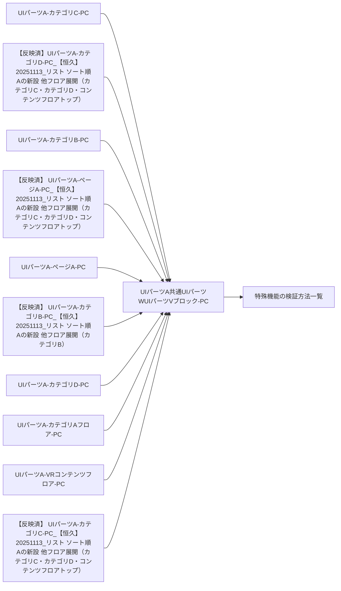

### 更新履歴

 2025年

| 日付 | 施策・修正コンフルURL |
| --- | --- |
| 2025/01/20 | 機能HリストUIパーツVの API の Variables が間違っていたため修正 |

### **デザイン**

| Image |  |  |  |  |
| --- | --- | --- | --- | --- |
| 撮影日2025/01/14 | 撮影日2025/01/14 | 撮影日2025/01/14 | 撮影日 2025/01/14 | 該当ブロックのスクショを挿入すること 複数ある場合列を追加 画像の上に撮影日を入れること 画像が古い場合気づいた人が更新すること 幅400 高さ480 に収まるようにサイズ指定すること 該当画像が必要ない場合は、日付を消して該当無しを記載すること |

  

| Figma |  |
| --- | --- |
| 該当無し 2025/01/15 | コンポーネントを挿入すること 複数ある場合ウィジェットを追加 幅640 高さ480 に収まるようにサイズ指定すること 該当UIパーツWがない場合はウィジェットを消して、該当無しを記載すること |

  

| Componentdocs |  |
| --- | --- |
| [https://example-componentdocs-xyz123.pages.github.io/componentdocs/?path=/docs/src-model-menugation-pc-nav-sidebar-block-my-contents--docs](https://example-componentdocs-xyz123.pages.github.io/componentdocs/?path=/docs/src-model-menugation-pc-nav-sidebar-block-my-contents--docs) | Componentdocsの のUIパーツWを記載すること共有LinkではなくコンポーネントへのUIパーツWを記載すること例：https://example-componentdocs-xyz123.pages.github.io/componentdocs/?path=/story/src-model-performer-nav-performer--cinema 共有LinkではなくコンポーネントへのUIパーツWを記載すること 例：https://example-componentdocs-xyz123.pages.github.io/componentdocs/?path=/story/src-model-performer-nav-performer--cinema 複数ある場合は、リスト形式で記載 該当UIパーツWがない場合は該当無しを記載すること |

### 仕様

| 機能名 | 機能概要 | 表示仕様 | 表示条件 | ログイン判定 | アクション | トラッキングシステム | API |
| --- | --- | --- | --- | --- | --- | --- | --- |
| 機能LUIパーツV | 機能MへのUIパーツW | 固定で「機能L」のUIパーツVを表示 | - | - | 単品コンテンツの機能M画面へ遷移する | - | - |
| 機能NUIパーツRUIパーツV | 機能N一覧へのUIパーツW | 固定で「機能NUIパーツR」のUIパーツVを表示 | - | - | 単品コンテンツの機能NUIパーツR一覧へ遷移する | - | - |
| 機能HリストUIパーツV | 機能HリストへのUIパーツW | 「★機能Hリスト」のUIパーツVを表示機能Hリストに状態AのUIパーツR・エンティティAの機能E・機能Dの状態に応じて以下を表示する機能E・機能D内容を示す吹き出しUIパーツV内のnewUIパーツX | 機能H状態AUIパーツRで状態B数が1件以上「機能FがありますN点機能E」 「機能FがありますN点機能E」 機能H状態AエンティティAが関連AするUIパーツRで状態C数が1件以上「機能FがありますN人状態Cあり」 「機能FがありますN人状態Cあり」 上記2つどちらにも該当「機能FがありますN点機能E、M人状態Cあり」 「機能FがありますN点機能E、M人状態Cあり」QA方法:[特殊機能の検証方法一覧](/pages/viewpage.action?pageId=2000000034) | ログイン時のみ状態B数に応じてUIパーツXと吹き出しを表示 | 機能Hリストへ遷移する | - | 2025/01/20Query:userwishListdiscountItemsTotalperformerBookmarkdiscountCount userwishListdiscountItemsTotalperformerBookmarkdiscountCount wishListdiscountItemsTotal discountItemsTotal performerBookmarkdiscountCount discountCount Variables: 無し 無し |

  

言葉の定義

-   状態B：機能HUIパーツRが機能D、または状態Dされて安くなった日から2週間以内である。   
    -   対応は、UIパーツRの機能Hリストのみ。  
        
    -   状態Dされて安くなった日から2週間以内であっても、機能H登録より前に状態Dされていた場合は「状態D」UIパーツR扱いはしない。  
        
    -   また「状態D」表示期間に機能Dが適応されていれば状態E後、残りの「状態D」表示期間が残っていても「状態D」UIパーツR扱いはしない。

### 開発資料

| Title | UIパーツW |
| --- | --- |
| 設計Issue | [https://github.com/example-org/project-alpha/issues/120](https://github.com/example-org/project-alpha/issues/120) |
| 特殊機能周りの検証方法一覧 | [https://example-confluence.example.com/pages/viewpage.action?pageId=2000000034](https://example-confluence.example.com/pages/viewpage.action?pageId=2000000034) |

#### **画面仕様書移植確認リスト**

チェックボックス @名前 チェックした日付　のフォーマットでチェック

-   ベース記載 2025/01/14 [小谷野 諭@FE](/display/~koyano-satoshi) 
-   FE 2025/01/20  [藤野 勇輝@FE](/display/~fujino-yuki) 
-   DES 2025/01/15 [北島 加奈@DES](/display/~kitajima-kana) 
-   最終確認 [小谷野 諭@FE](/display/~koyano-satoshi)  日付を記載
-   元ページへのUIパーツWの記載　[小谷野 諭@FE](/display/~koyano-satoshi)

* * *

  

 機能O-PC

## **機能O-PC**

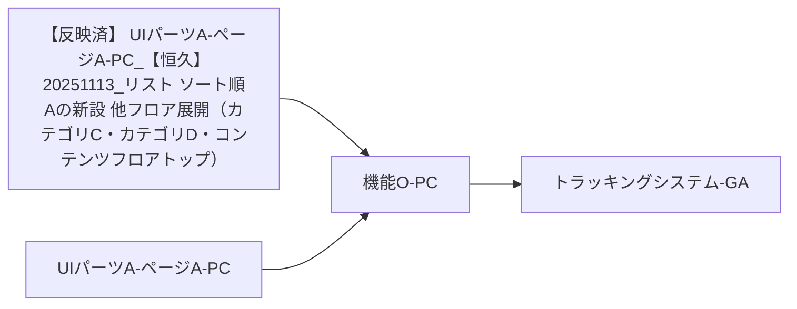

### 更新履歴

 2025年

| 日付 | 施策・修正コンフルURL |
| --- | --- |
| 2025/01/01 |  |

### デザイン

| Image |  |
| --- | --- |
| 撮影日2025/01/15 | 該当ブロックのスクショを挿入すること 複数ある場合列を追加 画像の上に撮影日を入れること 画像が古い場合気づいた人が更新すること 幅400 高さ480 に収まるようにサイズ指定すること 該当画像が必要ない場合は、日付を消して該当無しを記載すること |

| Figma |  |
| --- | --- |
| 該当なし | コンポーネントを挿入すること 複数ある場合ウィジェットを追加 幅640 高さ480 に収まるようにサイズ指定すること 該当UIパーツWがない場合はウィジェットを消して、該当無しを記載すること |

| Componentdocs |  |
| --- | --- |
| 該当なし | Componentdocsの のUIパーツWを記載すること共有LinkではなくコンポーネントへのUIパーツWを記載すること例：https://example-componentdocs-xyz123.pages.github.io/componentdocs/?path=/story/src-model-performer-nav-performer--cinema 共有LinkではなくコンポーネントへのUIパーツWを記載すること 例：https://example-componentdocs-xyz123.pages.github.io/componentdocs/?path=/story/src-model-performer-nav-performer--cinema 複数ある場合は、リスト形式で記載 該当UIパーツWがない場合は該当無しを記載すること |

### 仕様

| 機能名 | 機能概要 | 表示仕様 | 表示条件 | ログイン判定 | アクション | トラッキングシステム | API |
| --- | --- | --- | --- | --- | --- | --- | --- |
| カテゴリA | カテゴリAフロアトップへのUIパーツW | 固定 | - | - | カテゴリAフロアトップへ遷移する | Click時:発火[外部仕様書-トラッキングシステム click_common](https://example-confluence.example.com/pages/viewpage.action?pageId=2000000033#id-%E5%A4%96%E9%83%A8%E4%BB%95%E6%A7%98%E6%9B%B8%E3%83%88%E3%83%A9%E3%83%83%E3%82%AD%E3%83%B3%E3%82%B0-%E5%A4%96%E9%83%A8%E4%BB%95%E6%A7%98%E6%9B%B8%E3%83%88%E3%83%A9%E3%83%83%E3%82%AD%E3%83%B3%E3%82%B0-click_common) | - |
| カテゴリB | カテゴリBフロアトップへのUIパーツW | 固定 | - | - | カテゴリBフロアトップへ遷移する | - |
| カテゴリD | カテゴリDフロアトップへのUIパーツW | 固定 | - | - | カテゴリDフロアトップへ遷移する | - |
| カテゴリC | ページFへのUIパーツW | 固定 | - | - | ページFへ遷移する | - |

### 開発資料

| Title | UIパーツW |
| --- | --- |
| 設計Issue | リプレイスチームが、対応したgithubUIパーツWを入れる |
| トラッキングシステム | [トラッキングシステムシステムA](/pages/viewpage.action?pageId=2000000033) |

#### **画面仕様書移植確認リスト**

チェックボックス @名前 チェックした日付　のフォーマットでチェック

-   ベース記載 2025/01/15 [小谷野 諭@FE](/display/~koyano-satoshi) 
-   FE  2025/01/21 [浅野 友亮](/display/~asano-tomoaki) 
-   DES 2025/01/17 [北島 加奈@DES](/display/~kitajima-kana) 
-   最終確認 [小谷野 諭@FE](/display/~koyano-satoshi)  日付を記載
-   元ページへのUIパーツWの記載　[小谷野 諭@FE](/display/~koyano-satoshi)

* * *

  

 カテゴリAUIパーツRはこちら-PC

## **カテゴリAUIパーツRはこちら-PC**


  

### 更新履歴

 2025年

| 日付 | 施策・修正コンフルURL |
| --- | --- |
| 2025/01/01 |  |

### デザイン

| Image |  |
| --- | --- |
| 撮影日2025/01/15 | 該当ブロックのスクショを挿入すること 複数ある場合列を追加 画像の上に撮影日を入れること 画像が古い場合気づいた人が更新すること 幅400 高さ480 に収まるようにサイズ指定すること 該当画像が必要ない場合は、日付を消して該当無しを記載すること |

| Figma |  |
| --- | --- |
| 該当なし | コンポーネントを挿入すること 複数ある場合ウィジェットを追加 幅640 高さ480 に収まるようにサイズ指定すること 該当UIパーツWがない場合はウィジェットを消して、該当無しを記載すること |

| Componentdocs |  |
| --- | --- |
| 該当なし | Componentdocsの のUIパーツWを記載すること共有LinkではなくコンポーネントへのUIパーツWを記載すること例：https://example-componentdocs-xyz123.pages.github.io/componentdocs/?path=/story/src-model-performer-nav-performer--cinema 共有LinkではなくコンポーネントへのUIパーツWを記載すること 例：https://example-componentdocs-xyz123.pages.github.io/componentdocs/?path=/story/src-model-performer-nav-performer--cinema 複数ある場合は、リスト形式で記載 該当UIパーツWがない場合は該当無しを記載すること |

### 仕様

| 機能名 | 機能概要 | 表示仕様 | 表示条件 | ログイン判定 | アクション | トラッキングシステム | API |
| --- | --- | --- | --- | --- | --- | --- | --- |
| 機能RUIパーツR | カテゴリAフロアのソートごとのUIパーツR一覧ページ（list）へのUIパーツW | 固定で下記テキストUIパーツWを表示ソート順A ソート順D 売上本数順 評価の高い順 機能H数順 | 固定 | - | ソート順AカテゴリAフロア リストページ(ソート順Aソート) カテゴリAフロア リストページ(ソート順Aソート) ソート順DカテゴリAフロア リストページ(ソート順Dソート) カテゴリAフロア リストページ(ソート順Dソート) 売上本数順カテゴリAフロア リストページ(売上本数順ソート) カテゴリAフロア リストページ(売上本数順ソート) 評価の高い順カテゴリAフロア リストページ(評価の高い順ソート) カテゴリAフロア リストページ(評価の高い順ソート) 機能H数順カテゴリAフロア リストページ(機能H数順ソート) カテゴリAフロア リストページ(機能H数順ソート) | Click時:発火[外部仕様書-トラッキングシステム click_common](https://example-confluence.example.com/pages/viewpage.action?pageId=2000000033#id-%E5%A4%96%E9%83%A8%E4%BB%95%E6%A7%98%E6%9B%B8%E3%83%88%E3%83%A9%E3%83%83%E3%82%AD%E3%83%B3%E3%82%B0-%E5%A4%96%E9%83%A8%E4%BB%95%E6%A7%98%E6%9B%B8%E3%83%88%E3%83%A9%E3%83%83%E3%82%AD%E3%83%B3%E3%82%B0-click_common) | - |
| お得なUIパーツR | カテゴリAフロアの機能Dで絞り込んだUIパーツR一覧ページ(list)へのUIパーツW | 実施中の割引機能Uに応じてテキストUIパーツWを表示機能C 機能D管理で設定された開催中の機能U終了日時の昇順で表示設定状況に応じて内容・数は変動機能DグループIDが設定されていない、もしくは機能DグループIDに紐づく開催中の機能Dが単一機能D名を表示機能DグループIDに紐づく開催中の機能Dが複数存在する機能Dグループ名を表示 終了日時の昇順で表示 設定状況に応じて内容・数は変動 機能DグループIDが設定されていない、もしくは機能DグループIDに紐づく開催中の機能Dが単一機能D名を表示 機能D名を表示 機能DグループIDに紐づく開催中の機能Dが複数存在する機能Dグループ名を表示 機能Dグループ名を表示 ポイント還元機能U管理で設定された開催中の機能U機能U終了日時の昇順機能UグループIDが設定されていない、もしくは機能UグループIDに紐づく開催中の機能Uが単一機能U名を表示機能UグループIDに紐づく開催中の機能Uが複数存在する機能Uグループ名を表示 機能U終了日時の昇順 機能UグループIDが設定されていない、もしくは機能UグループIDに紐づく開催中の機能Uが単一機能U名を表示 機能U名を表示 機能UグループIDに紐づく開催中の機能Uが複数存在する機能Uグループ名を表示 機能Uグループ名を表示 期間限定機能D 300円以下 | 機能C固定 固定 機能D管理で設定された開催中の機能U機能U終了時間の10分前から対象機能U項目は非表示にする1件も開催中の機能Uがない場合は非表示表示項目にはそれぞれnewUIパーツXを表示する 機能U終了時間の10分前から対象機能U項目は非表示にする 1件も開催中の機能Uがない場合は非表示 表示項目にはそれぞれnewUIパーツXを表示する ポイント還元機能U管理で設定された開催中の機能U機能U終了時間の10分前から対象機能U項目は非表示にする1件も開催中の機能Uがない場合は非表示表示項目にはそれぞれnewUIパーツXを表示する 機能U終了時間の10分前から対象機能U項目は非表示にする 1件も開催中の機能Uがない場合は非表示 表示項目にはそれぞれnewUIパーツXを表示する 期間限定機能Dテキストは黄色マーカーで表示する テキストは黄色マーカーで表示する 300円以下固定 固定 | - | 機能C 割引機能U管理で設定された開催中の機能U対象機能Uで絞り込まれたリストページ 対象機能Uで絞り込まれたリストページ 期間限定機能DカテゴリAフロアのkeyword_id:6565で絞り込まれたリストページソート順Aソート カテゴリAフロアのkeyword_id:6565で絞り込まれたリストページ ソート順Aソート 300円以下カテゴリAフロアのリストページ価格フィルタ:300円以下配信形式 : ストリーミングソート順Aソート カテゴリAフロアのリストページ価格フィルタ:300円以下配信形式 : ストリーミング 価格フィルタ:300円以下 配信形式 : ストリーミング ソート順Aソート | 最終更新日:2024/03/25 2024/03/25 Query:campaignsidtitleencodedTitle campaignsidtitleencodedTitle id title encodedTitle Variables:$floor:AV $floor:AV AV |
| ジャンル | カテゴリAフロアのジャンルで絞り込んだUIパーツR一覧ページ(list)へのUIパーツW | ジャンル名のテキストUIパーツW5件とカテゴリ一覧への導線を固定で表示巨乳 熟女 ギャル 人妻・主婦 女子校生 カテゴリ一覧へ | カテゴリ一覧へ日本国外からのアクセスの場合は非表示 日本国外からのアクセスの場合は非表示 | - | 巨乳keyword_id : 2001 keyword_id : 2001 熟女keyword_id : 1014 keyword_id : 1014 ギャルkeyword_id : 1034 keyword_id : 1034 人妻・主婦keyword_id : 1039 keyword_id : 1039 女子校生keyword_id : 1018 keyword_id : 1018 カテゴリ一覧へカテゴリAフロアのカテゴリ一覧ページ カテゴリAフロアのカテゴリ一覧ページ | - |
| AVエンティティA | カテゴリAフロアのAVエンティティAで絞り込んだUIパーツR一覧ページ(list)へのUIパーツW | AVエンティティA名のテキストUIパーツWとAVエンティティA一覧への導線を表示表示するAVエンティティA名は集計結果に応じて可変。 | 集計ロジック・頻度を現行仕様に合わせて自動化 | - | AVエンティティA名カテゴリAフロアの対象エンティティAで絞り込まれたリストページ カテゴリAフロアの対象エンティティAで絞り込まれたリストページ AVエンティティA一覧へカテゴリAフロアのAVエンティティA一覧ページ カテゴリAフロアのAVエンティティA一覧ページ | 最終更新日:2024/04/22 2024/04/22 Query:performeresRankingrankactresnameid performeresRankingrankactresnameid rank actresnameid name id Variables:$floor: AV$type:SALES_MONTHLY$limit: 5 $floor: AV $type:SALES_MONTHLY $limit: 5 |

### 開発資料

| Title | UIパーツW |
| --- | --- |
| 設計Issue | リプレイスチームが、対応したgithubUIパーツWを入れる |
| トラッキングシステム | [トラッキングシステムシステムA](/pages/viewpage.action?pageId=2000000033) |

#### **画面仕様書移植確認リスト**

チェックボックス @名前 チェックした日付　のフォーマットでチェック

-   ベース記載 2025/01/15 [小谷野 諭@FE](/display/~koyano-satoshi) 
-   FE  2025/01/21 [浅野 友亮](/display/~asano-tomoaki) 
-   DES 2025/01/17 [北島 加奈@DES](/display/~kitajima-kana) 
-   最終確認 [小谷野 諭@FE](/display/~koyano-satoshi)  日付を記載
-   元ページへのUIパーツWの記載　[小谷野 諭@FE](/display/~koyano-satoshi)

* * *

  

 カテゴリBUIパーツRはこちら-PC

## **カテゴリBUIパーツRはこちら-PC**

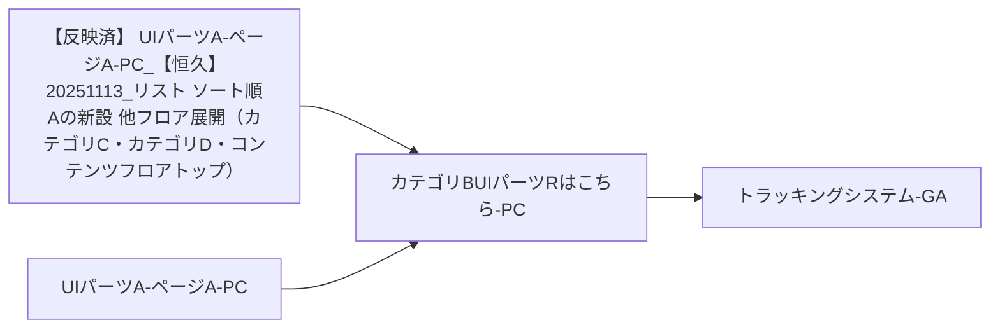

### 更新履歴

 2025年

| 日付 | 施策・修正コンフルURL |
| --- | --- |
| 2025/08/20 | [【恒久】20250807_機能D統合リスト本実装](/pages/viewpage.action?pageId=2000000086) |
| 2025/11/26 | 
###### [【恒久】20251113_リスト ソート順Aの新設 他フロア展開（カテゴリC・カテゴリD・コンテンツフロアトップ）](https://example-confluence.example.com/pages/viewpage.action?pageId=2000000089)

 |

### デザイン

| Image |  |
| --- | --- |
| 撮影日2025/11/26 | 該当ブロックのスクショを挿入すること 複数ある場合列を追加 画像の上に撮影日を入れること 画像が古い場合気づいた人が更新すること 幅400 高さ480 に収まるようにサイズ指定すること 該当画像が必要ない場合は、日付を消して該当無しを記載すること |

| Figma |  |
| --- | --- |
| 該当なし | コンポーネントを挿入すること 複数ある場合ウィジェットを追加 幅640 高さ480 に収まるようにサイズ指定すること 該当UIパーツWがない場合はウィジェットを消して、該当無しを記載すること |

| Componentdocs |  |
| --- | --- |
| 該当なし | Componentdocsの のUIパーツWを記載すること共有LinkではなくコンポーネントへのUIパーツWを記載すること例：https://example-componentdocs-xyz123.pages.github.io/componentdocs/?path=/story/src-model-performer-nav-performer--cinema 共有LinkではなくコンポーネントへのUIパーツWを記載すること 例：https://example-componentdocs-xyz123.pages.github.io/componentdocs/?path=/story/src-model-performer-nav-performer--cinema 複数ある場合は、リスト形式で記載 該当UIパーツWがない場合は該当無しを記載すること |

### 仕様

| 機能名 | 機能概要 | 表示仕様 | 表示条件 | ログイン判定 | アクション | トラッキングシステム | API |
| --- | --- | --- | --- | --- | --- | --- | --- |
| 機能RUIパーツR | カテゴリBフロアのソートごとのUIパーツR一覧ページ（list）へのUIパーツW | 固定で下記テキストUIパーツWを表示ソート順A ソート順D 売上本数順 評価の高い順 機能H数順 | 固定 | - | ソート順AカテゴリBフロア リストページ(ソート順Aソート) カテゴリBフロア リストページ(ソート順Aソート) ソート順DカテゴリBフロア リストページ(ソート順Dソート) カテゴリBフロア リストページ(ソート順Dソート) 売上本数順カテゴリBフロア リストページ(売上本数順ソート) カテゴリBフロア リストページ(売上本数順ソート) 評価の高い順カテゴリBフロア リストページ(評価の高い順ソート) カテゴリBフロア リストページ(評価の高い順ソート) 機能H数順カテゴリBフロア リストページ(機能H数順ソート) カテゴリBフロア リストページ(機能H数順ソート) | Click時:発火[外部仕様書-トラッキングシステム click_common](https://example-confluence.example.com/pages/viewpage.action?pageId=2000000033#id-%E5%A4%96%E9%83%A8%E4%BB%95%E6%A7%98%E6%9B%B8%E3%83%88%E3%83%A9%E3%83%83%E3%82%AD%E3%83%B3%E3%82%B0-%E5%A4%96%E9%83%A8%E4%BB%95%E6%A7%98%E6%9B%B8%E3%83%88%E3%83%A9%E3%83%83%E3%82%AD%E3%83%B3%E3%82%B0-click_common) | - |
| お得なUIパーツR | カテゴリBフロアの機能Dで絞り込んだUIパーツR一覧ページ(list)へのUIパーツW | 実施中の割引機能Uに応じてテキストUIパーツWを表示機能C 割引機能U管理で設定された開催中の機能U設定状況に応じて内容・数は変動 設定状況に応じて内容・数は変動 期間限定機能D | 機能C機能Dが複数ある場合に表示 機能Dが複数ある場合に表示 割引機能U管理で設定された開催中の機能U機能U終了時間の10分前から対象機能U項目は非表示にする1件も開催中の機能Uがない場合は非表示表示項目にはそれぞれnewUIパーツXを表示する 機能U終了時間の10分前から対象機能U項目は非表示にする 1件も開催中の機能Uがない場合は非表示 表示項目にはそれぞれnewUIパーツXを表示する 期間限定機能Dテキストは黄色マーカーで表示する テキストは黄色マーカーで表示する | - | 機能C 割引機能U管理で設定された開催中の機能U機能U終了時間の10分前から対象機能U項目は非表示にする1件も開催中の機能Uがない場合は非表示表示項目にはそれぞれnewUIパーツXを表示する 機能U終了時間の10分前から対象機能U項目は非表示にする 1件も開催中の機能Uがない場合は非表示 表示項目にはそれぞれnewUIパーツXを表示する 期間限定機能DカテゴリBフロアのkeyword_id:6565で絞り込まれたリストページ カテゴリBフロアのkeyword_id:6565で絞り込まれたリストページ | 最終更新日:2024/03/25 2024/03/25 Query:campaignsidtitleencodedTitle campaignsidtitleencodedTitle id title encodedTitle Variables:$floor:AMATEUR $floor:AMATEUR AMATEUR |
| ジャンル | カテゴリBフロアのジャンルで絞り込んだUIパーツR一覧ページ(list)へのUIパーツW | ジャンル名のテキストUIパーツWとカテゴリ一覧への導線を表示巨乳 熟女 人妻・主婦 女子校生 中出し カテゴリ一覧へ | カテゴリ一覧へ日本国外からのアクセスの場合は非表示 日本国外からのアクセスの場合は非表示 | - | 巨乳keyword_id : 2001 keyword_id : 2001 熟女keyword_id : 1014 keyword_id : 1014 人妻・主婦keyword_id : 1039 keyword_id : 1039 女子校生keyword_id : 1018 keyword_id : 1018 中出しkeyword_id : 5001 keyword_id : 5001 カテゴリ一覧へカテゴリBフロアのカテゴリ一覧ページ カテゴリBフロアのカテゴリ一覧ページ | - |

### 開発資料

| Title | UIパーツW |
| --- | --- |
| 設計Issue | リプレイスチームが、対応したgithubUIパーツWを入れる |
| トラッキングシステム | [トラッキングシステムシステムA](/pages/viewpage.action?pageId=2000000033) |

#### **画面仕様書移植確認リスト**

チェックボックス @名前 チェックした日付　のフォーマットでチェック

-   ベース記載 2025/01/15 [小谷野 諭@FE](/display/~koyano-satoshi) 
-   FE  2025/01/21 [浅野 友亮](/display/~asano-tomoaki) 
-   DES 2025/01/17 [北島 加奈@DES](/display/~kitajima-kana) 
-   最終確認 [小谷野 諭@FE](/display/~koyano-satoshi)  日付を記載
-   元ページへのUIパーツWの記載　[小谷野 諭@FE](/display/~koyano-satoshi)

* * *

  

 カテゴリDUIパーツRはこちら-PC

## **カテゴリDUIパーツRはこちら-PC**


### 更新履歴

 2025年

| 日付 | 施策・修正コンフルURL |
| --- | --- |
| 2025/08/20 | [【恒久】20250807_機能D統合リスト本実装](/pages/viewpage.action?pageId=2000000086) |
| 2025/11/26 | 
###### [【恒久】20251113_リスト ソート順Aの新設 他フロア展開（カテゴリC・カテゴリD・コンテンツフロアトップ）](https://example-confluence.example.com/pages/viewpage.action?pageId=2000000089)

 |

### デザイン

| Image |  |
| --- | --- |
| 撮影日2025/11/26 | 該当ブロックのスクショを挿入すること 複数ある場合列を追加 画像の上に撮影日を入れること 画像が古い場合気づいた人が更新すること 幅400 高さ480 に収まるようにサイズ指定すること 該当画像が必要ない場合は、日付を消して該当無しを記載すること |

| Figma |  |
| --- | --- |
| 該当なし | コンポーネントを挿入すること 複数ある場合ウィジェットを追加 幅640 高さ480 に収まるようにサイズ指定すること 該当UIパーツWがない場合はウィジェットを消して、該当無しを記載すること |

| Componentdocs |  |
| --- | --- |
| 該当なし | Componentdocsの のUIパーツWを記載すること共有LinkではなくコンポーネントへのUIパーツWを記載すること例：https://example-componentdocs-xyz123.pages.github.io/componentdocs/?path=/story/src-model-performer-nav-performer--cinema 共有LinkではなくコンポーネントへのUIパーツWを記載すること 例：https://example-componentdocs-xyz123.pages.github.io/componentdocs/?path=/story/src-model-performer-nav-performer--cinema 複数ある場合は、リスト形式で記載 該当UIパーツWがない場合は該当無しを記載すること |

### 仕様

| 機能名 | 機能概要 | 表示仕様 | 表示条件 | ログイン判定 | アクション | トラッキングシステム | API |
| --- | --- | --- | --- | --- | --- | --- | --- |
| 機能RUIパーツR | カテゴリDフロアのソートごとのUIパーツR一覧ページ（list）へのUIパーツW | 固定で下記テキストUIパーツWを表示ソート順A ソート順D 売上本数順 評価の高い順 機能H数順 | 固定 | - | ソート順AカテゴリDフロア リストページ(ソート順Aソート) カテゴリDフロア リストページ(ソート順Aソート) ソート順DカテゴリDフロア リストページ(ソート順Dソート) カテゴリDフロア リストページ(ソート順Dソート) 売上本数順カテゴリDフロア リストページ(売上本数順ソート) カテゴリDフロア リストページ(売上本数順ソート) 評価の高い順カテゴリBフロア リストページ(評価の高い順ソート) カテゴリBフロア リストページ(評価の高い順ソート) 機能H数順カテゴリBフロア リストページ(機能H数順ソート) カテゴリBフロア リストページ(機能H数順ソート) | Click時:発火[外部仕様書-トラッキングシステム click_common](https://example-confluence.example.com/pages/viewpage.action?pageId=2000000033#id-%E5%A4%96%E9%83%A8%E4%BB%95%E6%A7%98%E6%9B%B8%E3%83%88%E3%83%A9%E3%83%83%E3%82%AD%E3%83%B3%E3%82%B0-%E5%A4%96%E9%83%A8%E4%BB%95%E6%A7%98%E6%9B%B8%E3%83%88%E3%83%A9%E3%83%83%E3%82%AD%E3%83%B3%E3%82%B0-click_common) | - |
| お得なUIパーツR | カテゴリDフロアの機能Dで絞り込んだUIパーツR一覧ページ(list)へのUIパーツW | 実施中の割引機能Uに応じてテキストUIパーツWを表示機能C 割引機能U管理で設定された開催中の機能U設定状況に応じて内容・数は変動 設定状況に応じて内容・数は変動 期間限定機能D | 機能C機能Dが複数ある場合に表示 機能Dが複数ある場合に表示 割引機能U管理で設定された開催中の機能U機能U終了時間の10分前から対象機能U項目は非表示にする1件も開催中の機能Uがない場合は非表示表示項目にはそれぞれnewUIパーツXを表示する 機能U終了時間の10分前から対象機能U項目は非表示にする 1件も開催中の機能Uがない場合は非表示 表示項目にはそれぞれnewUIパーツXを表示する | - | 機能C 割引機能U管理で設定された開催中の機能U機能U終了時間の10分前から対象機能U項目は非表示にする1件も開催中の機能Uがない場合は非表示表示項目にはそれぞれnewUIパーツXを表示する 機能U終了時間の10分前から対象機能U項目は非表示にする 1件も開催中の機能Uがない場合は非表示 表示項目にはそれぞれnewUIパーツXを表示する | 最終更新日:2024/03/25 2024/03/25 Query:campaignsidtitleencodedTitle campaignsidtitleencodedTitle id title encodedTitle Variables:$floor:ANIME $floor:ANIME ANIME |
| ジャンル | カテゴリDフロアのジャンルで絞り込んだUIパーツR一覧ページ(list)へのUIパーツW | ジャンル名のテキストUIパーツWとカテゴリ一覧への導線を表示人妻・主婦 巨乳 触手 女子校生 レズビアン カテゴリ一覧へ | カテゴリ一覧へ日本国外からのアクセスの場合は非表示 日本国外からのアクセスの場合は非表示 | - | 人妻・主婦keyword_id : 1050 keyword_id : 1050 巨乳keyword_id : 2017カテゴリBフロアの場合keyword_id : 8508 keyword_id : 2017 カテゴリBフロアの場合keyword_id : 8508 keyword_id : 8508 触手keyword_id : 4068 keyword_id : 4068 女子校生keyword_id : 1049 keyword_id : 1049 レズビアンkeyword_id : 4040 keyword_id : 4040 カテゴリ一覧へカテゴリDフロアのカテゴリ一覧ページ カテゴリDフロアのカテゴリ一覧ページ | - |
| シリーズ | カテゴリDフロアのAVエンティティAで絞り込んだUIパーツR一覧ページ(list)へのUIパーツW | シリーズ名のテキストUIパーツWを5個とシリーズ一覧への導線を表示表示するシリーズは集計結果に応じて可変。 | 集計ロジック・頻度を現行仕様に合わせて自動化日本国外からのアクセスの場合は非表示2024/04/23BFFキャッシュの観点からクライアントサイドでフロントで30件取得し、ランダムに５件表示する仕様とする。 | - | シリーズ名カテゴリDフロアの対象シリーズで絞り込まれたリストページ カテゴリDフロアの対象シリーズで絞り込まれたリストページ シリーズ一覧へカテゴリDフロアのシリーズ一覧ページ カテゴリDフロアのシリーズ一覧ページ | 最終更新日:2024/04/22 2024/04/22 Query:collectionRankingrankcollectionnameid collectionRankingrankcollectionnameid rank collectionnameid name id Variables:$floor: ANIME$type: SALES_MONTHLY$limit: 30 $floor: ANIME $type: SALES_MONTHLY $limit: 30 |

### 開発資料

| Title | UIパーツW |
| --- | --- |
| 設計Issue | リプレイスチームが、対応したgithubUIパーツWを入れる |
| トラッキングシステム | [トラッキングシステムシステムA](/pages/viewpage.action?pageId=2000000033) |

#### **画面仕様書移植確認リスト**

チェックボックス @名前 チェックした日付　のフォーマットでチェック

-   ベース記載 2025/01/15 [小谷野 諭@FE](/display/~koyano-satoshi) 
-   FE  2025/01/21 [浅野 友亮](/display/~asano-tomoaki) 
-   DES 2025/01/17 [北島 加奈@DES](/display/~kitajima-kana) 
-   最終確認 [小谷野 諭@FE](/display/~koyano-satoshi)  日付を記載
-   元ページへのUIパーツWの記載　[小谷野 諭@FE](/display/~koyano-satoshi)

* * *

  

 カテゴリCUIパーツRはこちら-PC

## **カテゴリCUIパーツRはこちら-PC**


### 更新履歴

 2025年

| 日付 | 施策・修正コンフルURL |
| --- | --- |
| 2025/08/20 | [【恒久】20250807_機能D統合リスト本実装](/pages/viewpage.action?pageId=2000000086) |
| 2025/11/26 | 
###### [【恒久】20251113_リスト ソート順Aの新設 他フロア展開（カテゴリC・カテゴリD・コンテンツフロアトップ）](https://example-confluence.example.com/pages/viewpage.action?pageId=2000000089)

 |

### デザイン

| Image |  |
| --- | --- |
| 撮影日2025/11/26 | 該当ブロックのスクショを挿入すること 複数ある場合列を追加 画像の上に撮影日を入れること 画像が古い場合気づいた人が更新すること 幅400 高さ480 に収まるようにサイズ指定すること 該当画像が必要ない場合は、日付を消して該当無しを記載すること |

| Figma |  |
| --- | --- |
| 該当なし | コンポーネントを挿入すること 複数ある場合ウィジェットを追加 幅640 高さ480 に収まるようにサイズ指定すること 該当UIパーツWがない場合はウィジェットを消して、該当無しを記載すること |

| Componentdocs |  |
| --- | --- |
| 該当なし | Componentdocsの のUIパーツWを記載すること共有LinkではなくコンポーネントへのUIパーツWを記載すること例：https://example-componentdocs-xyz123.pages.github.io/componentdocs/?path=/story/src-model-performer-nav-performer--cinema 共有LinkではなくコンポーネントへのUIパーツWを記載すること 例：https://example-componentdocs-xyz123.pages.github.io/componentdocs/?path=/story/src-model-performer-nav-performer--cinema 複数ある場合は、リスト形式で記載 該当UIパーツWがない場合は該当無しを記載すること |

### 仕様

| 機能名 | 機能概要 | 表示仕様 | 表示条件 | ログイン判定 | アクション | トラッキングシステム | API |
| --- | --- | --- | --- | --- | --- | --- | --- |
| 機能RUIパーツR | カテゴリCフロアのソートごとのUIパーツR一覧ページ（list）へのUIパーツW | 固定で下記テキストUIパーツWを表示ソート順A ソート順D 売上本数順 評価の高い順 機能H数順 | 固定 | - | ソート順AカテゴリCフロア リストページ(ソート順Aソート) カテゴリCフロア リストページ(ソート順Aソート) ソート順DカテゴリCフロア リストページ(ソート順Dソート) カテゴリCフロア リストページ(ソート順Dソート) 売上本数順カテゴリCフロア リストページ(売上本数順ソート) カテゴリCフロア リストページ(売上本数順ソート) 評価の高い順カテゴリCフロア リストページ(評価の高い順ソート) カテゴリCフロア リストページ(評価の高い順ソート) 機能H数順カテゴリCフロア リストページ(機能H数順ソート) カテゴリCフロア リストページ(機能H数順ソート) | Click時:発火[外部仕様書-トラッキングシステム click_common](https://example-confluence.example.com/pages/viewpage.action?pageId=2000000033#id-%E5%A4%96%E9%83%A8%E4%BB%95%E6%A7%98%E6%9B%B8%E3%83%88%E3%83%A9%E3%83%83%E3%82%AD%E3%83%B3%E3%82%B0-%E5%A4%96%E9%83%A8%E4%BB%95%E6%A7%98%E6%9B%B8%E3%83%88%E3%83%A9%E3%83%83%E3%82%AD%E3%83%B3%E3%82%B0-click_common) | - |
| お得なUIパーツR | カテゴリCフロアの機能Dで絞り込んだUIパーツR一覧ページ(list)へのUIパーツW | 実施中の割引機能Uに応じてテキストUIパーツWを表示機能C 割引機能U管理で設定された開催中の機能U設定状況に応じて内容・数は変動 設定状況に応じて内容・数は変動 | 機能C機能Dが複数ある場合に表示 機能Dが複数ある場合に表示 割引機能U管理で設定された開催中の機能U機能U終了時間の10分前から対象機能U項目は非表示にする1件も開催中の機能Uがない場合は非表示表示項目にはそれぞれnewUIパーツXを表示する 機能U終了時間の10分前から対象機能U項目は非表示にする 1件も開催中の機能Uがない場合は非表示 表示項目にはそれぞれnewUIパーツXを表示する | - | 機能C 割引機能U管理で設定された開催中の機能U機能U終了時間の10分前から対象機能U項目は非表示にする1件も開催中の機能Uがない場合は非表示表示項目にはそれぞれnewUIパーツXを表示する 機能U終了時間の10分前から対象機能U項目は非表示にする 1件も開催中の機能Uがない場合は非表示 表示項目にはそれぞれnewUIパーツXを表示する | 最終更新日:2024/02/02 2024/02/02 Query:campaignsidtitleencodedTitle campaignsidtitleencodedTitle id title encodedTitle Variables:$floor:CINEMA $floor:CINEMA CINEMA |
| ジャンル | カテゴリCフロアのジャンルで絞り込んだUIパーツR一覧ページ(list)へのUIパーツW | ジャンル名のテキストUIパーツWとカテゴリ一覧への導線を表示熟女 人妻・主婦 SM 縛り・緊縛 巨乳 カテゴリ一覧へ | カテゴリ一覧へ日本国外からのアクセスの場合は非表示 日本国外からのアクセスの場合は非表示 | - | 熟女keyword_id : 1014 keyword_id : 1014 人妻・主婦keyword_id : 1039 keyword_id : 1039 SMkeyword_id : 4001 keyword_id : 4001 縛り・緊縛keyword_id : 5021 keyword_id : 5021 巨乳keyword_id : 2001 keyword_id : 2001 カテゴリ一覧へカテゴリCフロアのカテゴリ一覧ページ カテゴリCフロアのカテゴリ一覧ページ | - |
| エンティティA | カテゴリCフロアのエンティティAで絞り込んだUIパーツR一覧ページ(list)へのUIパーツW | エンティティA名のテキストUIパーツWを5個とエンティティA一覧への導線を表示表示するエンティティA名は集計結果に応じて可変。 | 集計ロジック・頻度を現行仕様に合わせて自動化日本国外からのアクセスの場合は非表示 | - | エンティティA名カテゴリCフロアの対象エンティティAで絞り込まれたリストページ カテゴリCフロアの対象エンティティAで絞り込まれたリストページ エンティティA一覧へカテゴリCフロアのAVエンティティA一覧ページ カテゴリCフロアのAVエンティティA一覧ページ | 最終更新日:2024/04/22 2024/04/22 Query:performeresRankingrankactresnameid performeresRankingrankactresnameid rank actresnameid name id Variables:$floor: CINEMA$type: SALES_MONTHLY$limit: 5 $floor: CINEMA $type: SALES_MONTHLY $limit: 5 |

### 開発資料

| Title | UIパーツW |
| --- | --- |
| 設計Issue | リプレイスチームが、対応したgithubUIパーツWを入れる |
| トラッキングシステム | [トラッキングシステムシステムA](/pages/viewpage.action?pageId=2000000033) |

#### **画面仕様書移植確認リスト**

チェックボックス @名前 チェックした日付　のフォーマットでチェック

-   ベース記載 2025/01/15 [小谷野 諭@FE](/display/~koyano-satoshi) 
-   FE  2025/01/21 [浅野 友亮](/display/~asano-tomoaki) 
-   DES 2025/01/17 [北島 加奈@DES](/display/~kitajima-kana) 
-   最終確認 [小谷野 諭@FE](/display/~koyano-satoshi)  日付を記載
-   元ページへのUIパーツWの記載　[小谷野 諭@FE](/display/~koyano-satoshi)

* * *

  

 お知らせブロック-PC

## **お知らせブロック-PC**

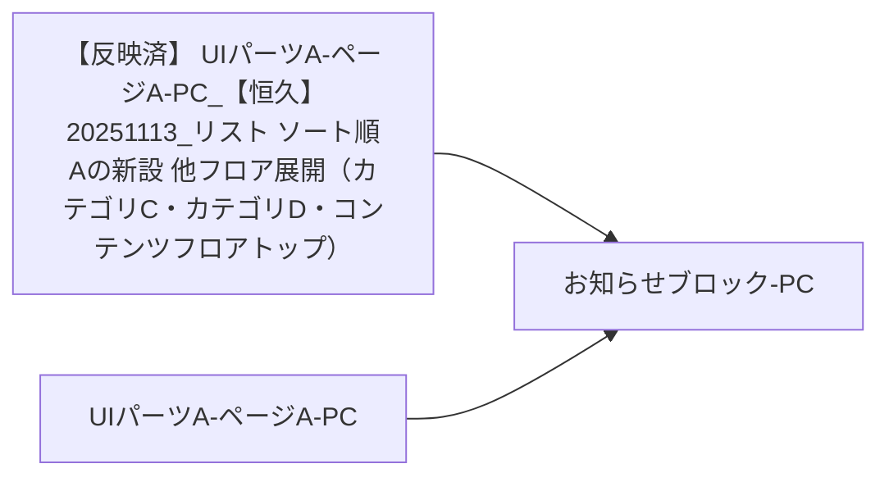

### 更新履歴

 2025年

| 日付 | 施策・修正コンフルURL |
| --- | --- |
| 2025/01/01 |  |

### デザイン

| Image |  |
| --- | --- |
| 撮影日2025/01/15 | 該当ブロックのスクショを挿入すること 複数ある場合列を追加 画像の上に撮影日を入れること 画像が古い場合気づいた人が更新すること 幅400 高さ480 に収まるようにサイズ指定すること 該当画像が必要ない場合は、日付を消して該当無しを記載すること |

| Figma |  |
| --- | --- |
| 該当なし | コンポーネントを挿入すること 複数ある場合ウィジェットを追加 幅640 高さ480 に収まるようにサイズ指定すること 該当UIパーツWがない場合はウィジェットを消して、該当無しを記載すること |

| Componentdocs |  |
| --- | --- |
| 該当なし | Componentdocsの のUIパーツWを記載すること共有LinkではなくコンポーネントへのUIパーツWを記載すること例：https://example-componentdocs-xyz123.pages.github.io/componentdocs/?path=/story/src-model-performer-nav-performer--cinema 共有LinkではなくコンポーネントへのUIパーツWを記載すること 例：https://example-componentdocs-xyz123.pages.github.io/componentdocs/?path=/story/src-model-performer-nav-performer--cinema 複数ある場合は、リスト形式で記載 該当UIパーツWがない場合は該当無しを記載すること |

### 仕様

| 機能名 | 機能概要 | 表示仕様 | 表示条件 | ログイン判定 | アクション | トラッキングシステム | API |
| --- | --- | --- | --- | --- | --- | --- | --- |
| リリース情報 | コンテンツ配信サービスからのお知らせ(リリース情報)ページの導線 | テキストUIパーツW「リリース情報」を固定表示 | - | - | コンテンツ配信サービスからのお知らせページ(リリース情報)※へ遷移※現行URL :[https://example.com](https://example.com) | - | - |
| サポート情報 | コンテンツ配信サービスからのお知らせ(サポート情報)ページの導線 | テキストUIパーツW「サポート情報」を固定表示 | - | - | コンテンツ配信サービスからのお知らせページ(サポート情報)※へ遷移※現行URL :[https://example.com](https://example.com) | - | - |

### 開発資料

| Title | UIパーツW |
| --- | --- |
| 設計Issue | リプレイスチームが、対応したgithubUIパーツWを入れる |

#### **画面仕様書移植確認リスト**

チェックボックス @名前 チェックした日付　のフォーマットでチェック

-   ベース記載 2025/01/15 [小谷野 諭@FE](/display/~koyano-satoshi) 
-   FE  2025/01/21 [浅野 友亮](/display/~asano-tomoaki) 
-   DES 2025/01/17 [北島 加奈@DES](/display/~kitajima-kana) 
-   最終確認 [小谷野 諭@FE](/display/~koyano-satoshi)  日付を記載
-   元ページへのUIパーツWの記載　[小谷野 諭@FE](/display/~koyano-satoshi)

* * *

  

 UIパーツAUIパーツCUIパーツL-PC

## **UIパーツAUIパーツCUIパーツL-PC**

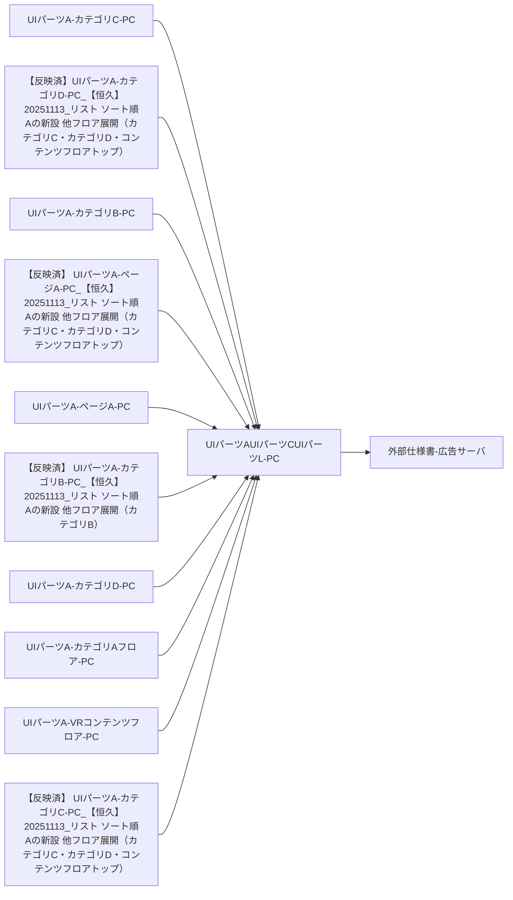

### 更新履歴

 2025年

| 日付 | 施策・修正コンフルURL |
| --- | --- |
| 2025/01/01 |  |

### **デザイン**

| Image |  |
| --- | --- |
| 撮影日2025/01/15 | 該当ブロックのスクショを挿入すること 複数ある場合列を追加 画像の上に撮影日を入れること 画像が古い場合気づいた人が更新すること 幅400 高さ480 に収まるようにサイズ指定すること 該当画像が必要ない場合は、日付を消して該当無しを記載すること |

  

| Figma |  |
| --- | --- |
| 該当無し | コンポーネントを挿入すること 複数ある場合ウィジェットを追加 幅640 高さ480 に収まるようにサイズ指定すること 該当UIパーツWがない場合はウィジェットを消して、該当無しを記載すること |

  

| Componentdocs |  |
| --- | --- |
| 該当なし | Componentdocsの のUIパーツWを記載すること共有LinkではなくコンポーネントへのUIパーツWを記載すること例：https://example-componentdocs-xyz123.pages.github.io/componentdocs/?path=/story/src-model-performer-nav-performer--cinema 共有LinkではなくコンポーネントへのUIパーツWを記載すること 例：https://example-componentdocs-xyz123.pages.github.io/componentdocs/?path=/story/src-model-performer-nav-performer--cinema 複数ある場合は、リスト形式で記載 該当UIパーツWがない場合は該当無しを記載すること |

### 仕様

| 機能名 | 機能概要 | 表示仕様 | 表示条件 | ログイン判定 | アクション | トラッキングシステム | API |
| --- | --- | --- | --- | --- | --- | --- | --- |
| 広告サーバUIパーツM | 広告サーバのUIパーツMを表示する | 広告サーバで設定したUIパーツM画像を表示する設定が行われていない場合、ブロックごと非表示になる | 未設定の場合は非表示。 | ー | 広告サーバで設定したURLに遷移 | - | [広告サーバ広告ID一覧](https://example-confluence.example.com/pages/viewpage.action?pageId=2000000035#id-%E3%82%A2%E3%83%89%E3%82%B5%E3%83%BC%E3%83%90%E5%BA%83%E5%91%8AID%E4%B8%80%E8%A6%A7-PC%E5%B7%A6%E3%83%A1%E3%83%8B%E3%83%A5%E3%83%BC%E3%83%95%E3%83%83%E3%82%BF%E3%83%BC) |

### 開発資料

| Title | UIパーツW |
| --- | --- |
| 設計Issue | [https://github.com/example-org/project-alpha/issues/112](https://github.com/example-org/project-alpha/issues/112) |
| 広告サーバ | [外部仕様書-広告サーバ](/pages/viewpage.action?pageId=2000000036) |

#### **画面仕様書移植確認リスト**

チェックボックス @名前 チェックした日付　のフォーマットでチェック

-   ベース記載 2025/01/14 [小谷野 諭@FE](/display/~koyano-satoshi) 
-   FE  2025/01/20  [藤野 勇輝@FE](/display/~fujino-yuki) 
-   DES 2025/01/15 [北島 加奈@DES](/display/~kitajima-kana) 
-   最終確認 [小谷野 諭@FE](/display/~koyano-satoshi)  日付を記載
-   元ページへのUIパーツWの記載　[小谷野 諭@FE](/display/~koyano-satoshi)

* * *

  

#### **画面仕様書移植確認リスト**

チェックボックス @名前 チェックした日付　のフォーマットでチェック

-   ベース記載 2025/01/15 [小谷野 諭@FE](/display/~koyano-satoshi) 
-   FE  2025/01/21 [浅野 友亮](/display/~asano-tomoaki) 
-   DES 2025/01/17 [北島 加奈@DES](/display/~kitajima-kana) 
-   最終確認 [小谷野 諭@FE](/display/~koyano-satoshi)  日付を記載
-   元ページへのUIパーツWの記載　[小谷野 諭@FE](/display/~koyano-satoshi)

  

* * *

  

**▶ UIパーツFブロック-PC2025年**  
  

# **UIパーツF-PC**

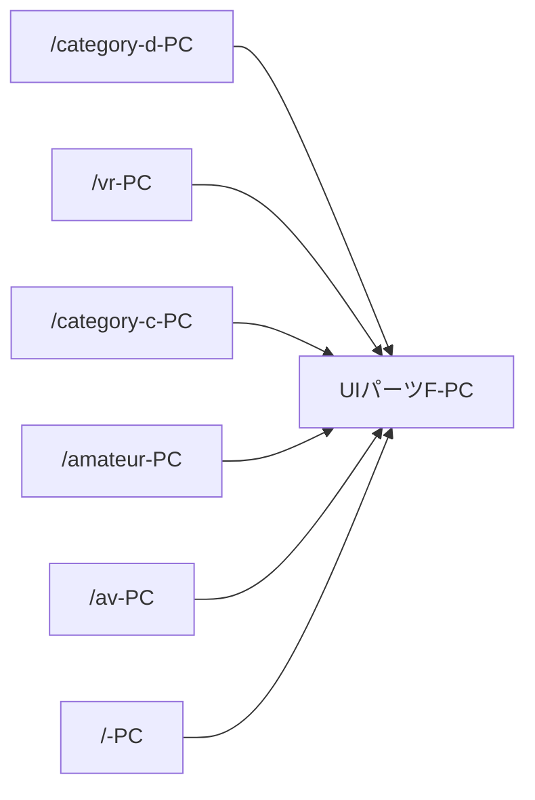

## 更新履歴

 2025年

| 日付 | 施策・修正コンフルURL |
| --- | --- |
| 2025/01/01 |  |

## **デザイン**

| Image |  |
| --- | --- |
| 撮影日 2025/06/04 | 該当ブロックのスクショを挿入すること 複数ある場合列を追加 画像の上に撮影日を入れること 画像が古い場合気づいた人が更新すること 幅400 高さ480 に収まるようにサイズ指定すること 該当画像が必要ない場合は、日付を消して該当無しを記載すること |

| Figma |  |
| --- | --- |
| .widget-link { min-width: 64px; background-image: url("/download/resources/com.atlassian.confluence.extra.widgetconnector:widget/widget.png"); background-repeat: no-repeat; background-position: 50% 0; text-align: center; padding-top: 65px; text-decoration: none; color: #CCC; font-weight: bold; display: inline-block; font-size: .8em; text-decoration: none; } .widget-link:hover { color: #868686; } UIパーツWを入れる | コンポーネントを挿入すること 複数ある場合ウィジェットを追加 幅640 高さ480 に収まるようにサイズ指定すること 該当UIパーツWがない場合はウィジェットを消して、該当無しを記載すること |

| Componentdocs |  |
| --- | --- |
| [UIパーツWを入れる](UIパーツWを入れる) | Componentdocsの のUIパーツWを記載すること共有LinkではなくコンポーネントへのUIパーツWを記載すること例：https://example-componentdocs-xyz123.pages.github.io/componentdocs/?path=/story/src-model-performer-nav-performer--cinema 共有LinkではなくコンポーネントへのUIパーツWを記載すること 例：https://example-componentdocs-xyz123.pages.github.io/componentdocs/?path=/story/src-model-performer-nav-performer--cinema 複数ある場合は、リスト形式で記載 該当UIパーツWがない場合は該当無しを記載すること |

### 仕様

| 機能名 | 機能概要 | 表示仕様 | 表示条件 | ログイン判定 | アクション | トラッキングシステム | API |
| --- | --- | --- | --- | --- | --- | --- | --- |
| UIパーツF | 広告サーバで設定されたUIパーツMを表示する | 広告サーバで設定されたUIパーツMを500×200サイズで表示データが取得できなかった場合、height:200pxの空白を表示 | ー | ー | 設定で指定されたUIパーツWURLに遷移 | ー |  |
| UIパーツF送り | UIパーツFでの表示UIパーツM送り | UIパーツMの左右外側に「<」「>」のUIパーツUカーソルを表示UIパーツM下部にUIパーツM数分の●を表示 | UIパーツFの表示領域にカーソルをあてている時のみ表示 | ー | 「>」UIパーツX次のUIパーツMをスライド表示最後尾のUIパーツMを表示中の場合、先頭に戻る 次のUIパーツMをスライド表示 最後尾のUIパーツMを表示中の場合、先頭に戻る 「<」UIパーツX前のUIパーツMをスライド表示先頭のUIパーツMを表示中の場合、最後尾を表示 前のUIパーツMをスライド表示 先頭のUIパーツMを表示中の場合、最後尾を表示 「●」UIパーツXクリックした位置のUIパーツMをスライド表示 クリックした位置のUIパーツMをスライド表示 | ー |  |

## **開発資料**

| Title | UIパーツW |
| --- | --- |
| 設計Issue | ※リプレイスチームが、対応したgithubUIパーツWがある場合記載する。 |
| Miro | ※リプレイスチームが、対応したMiroなどの資料がある場合記載する。 |

  

| 広告サーバID(PC) |
| --- |
| [広告サーバID一覧](https://example-confluence.example.com/pages/viewpage.action?pageId=2000000003) |

  

* * *

  

**▶ 作品ステータス-トップページ-PC2025年**  
  

# **作品ステータス-トップページ-PC**

**`flowchart LR     node1["/category-d-PC"]     node2["作品ステータス-トップページ-PC"]     node3["/vr-PC"]     node4["/category-c-PC"]     node5["/amateur-PC"]     node6["/av-PC"]     node7["/-PC"]     node1 --> node2     node3 --> node2     node4 --> node2     node5 --> node2     node6 --> node2     node7 --> node2`**

## 更新履歴

 2025年

| 日付 | 施策・修正コンフルURL |
| --- | --- |
| 2025/01/01 |  |

## **デザイン**

| Image |  |
| --- | --- |
| 撮影日2025/01/09
| 公開日に関するステータス | UIパーツRUIパーツIのprefixに【】で表示色コード : #CC0000 |
| --- | --- |
| 機能D・機能Uに関するステータス | UIパーツRUIパーツIのprefixに【】で表示!\[\](/download/attachments/2000000094/image-2024-10-4_20-35-41.png?version=1&modificationDate=1758760938652&api=v2)色コード : #FF4400 |
| 独占配信のステータス | 非表示 |

 | 該当ブロックのスクショを挿入すること 複数ある場合列を追加 画像の上に撮影日を入れること 画像が古い場合気づいた人が更新すること 幅400 高さ480 に収まるようにサイズ指定すること 該当画像が必要ない場合は、日付を消して該当無しを記載すること |

| Figma |  |
| --- | --- |
| .widget-link { min-width: 64px; background-image: url("/download/resources/com.atlassian.confluence.extra.widgetconnector:widget/widget.png"); background-repeat: no-repeat; background-position: 50% 0; text-align: center; padding-top: 65px; text-decoration: none; color: #CCC; font-weight: bold; display: inline-block; font-size: .8em; text-decoration: none; } .widget-link:hover { color: #868686; } UIパーツWを入れる | コンポーネントを挿入すること 複数ある場合ウィジェットを追加 幅640 高さ480 に収まるようにサイズ指定すること 該当UIパーツWがない場合はウィジェットを消して、該当無しを記載すること |

| Componentdocs |  |
| --- | --- |
| [UIパーツWを入れる](UIパーツWを入れる) | Componentdocsの のUIパーツWを記載すること共有LinkではなくコンポーネントへのUIパーツWを記載すること例：https://example-componentdocs-xyz123.pages.github.io/componentdocs/?path=/story/src-model-performer-nav-performer--cinema 共有LinkではなくコンポーネントへのUIパーツWを記載すること 例：https://example-componentdocs-xyz123.pages.github.io/componentdocs/?path=/story/src-model-performer-nav-performer--cinema 複数ある場合は、リスト形式で記載 該当UIパーツWがない場合は該当無しを記載すること |

### 仕様

### 公開日時・販売開始日時を示すステータス

| ステータス | 概要 | 対応フロア | 表示箇所 | 表示仕様 | 表示条件 | 備考 |
| --- | --- | --- | --- | --- | --- | --- |
| 近日公開 | 近日中に予約可or購入可になる状態を示す。 | カテゴリA | パッケージ画像上 UIパーツRUIパーツI頭 | 作品UIパーツIの接頭辞に【近日公開】を表示。 【近日公開】の表示条件を満たす場合、その他のステータスは表示しない。 | 近日公開終了日時のデータが登録されてる 現在時刻が作品公開日(StartPublicAt)と近日公開終了日時の間PublicStartAt < Now < SaleStartAtまで PublicStartAt < Now < SaleStartAtまで | 現行仕様ではカテゴリA作品現在時刻が7日以内に公開時刻（begin）を迎えるかつ7日以内に視聴開始時刻（play_begin）を迎える |
| 予約 | 予約購入可である状態を示す。 | カテゴリA | パッケージ画像上 UIパーツRUIパーツI頭 | 作品UIパーツIの接頭辞に【予約】を表示。 以下ステータスとは共存しない。【予約】の表示を優先する。【機能Q作】【新作】【準新作】【先行公開】 【機能Q作】 【新作】 【準新作】 【先行公開】 | 現在日時が販売開始日時と配信開始日時の間の期間のみ表示販売開始日時 = 配信開始日時の場合は表示しないSaleStartAt <= Now < DeliveryStartAt | 現行仕様では現在時刻が公開時刻（begin）を過ぎているかつ視聴可能時刻（play_begin）が未来 |
| 機能Q作 | UIパーツR発売日から1ヶ月以内の機能Q作であることを示す。 | カテゴリA | パッケージ画像上 UIパーツRUIパーツI頭 | 作品UIパーツIの接頭辞に【機能Q作】を表示。 | メーカー発売日から1ヵ月後までの期間かつ、配信中の作品のみ表示配信開始日時を過ぎている 現在日時がメーカー発売日～メーカー発売日から1ヵ月の間 | 現行仕様では【予約】の表示条件を満たしていない 現在時刻がUIパーツR発売日（release_date）から1ヶ月以内 |
| 新作 | UIパーツR発売日から1ヶ月経過した新作であることを示す。 | 全フロア | パッケージ画像上 UIパーツRUIパーツI頭 | 作品UIパーツIの接頭辞に【新作】を表示。 | カテゴリAフロア, カテゴリBフロア, それ以外のフロアで意味が異なる。カテゴリAフロアでは、機能Q作から期間が経過(1ヵ月)した作品。それ以外のフロアでは、メーカー発売日から1ヵ月以内の作品。カテゴリAフロア機能Eありメーカー発売日(ReleasedAt)から1ヵ月経過時～初回機能E日の間機能Eなし表示しない 機能Eありメーカー発売日(ReleasedAt)から1ヵ月経過時～初回機能E日の間 メーカー発売日(ReleasedAt)から1ヵ月経過時～初回機能E日の間 機能Eなし表示しない 表示しない カテゴリD・カテゴリCフロア現在日時がメーカー発売日(ReleasedAt)から1ヵ月以内 現在日時がメーカー発売日(ReleasedAt)から1ヵ月以内 カテゴリBフロア販売開始日時(SalesStartAt)から1ヵ月以内 販売開始日時(SalesStartAt)から1ヵ月以内 | 現行仕様ではカテゴリA作品の場合現在時刻がUIパーツR発売日（release_date）+ 1ヶ月を過ぎているかつ初回機能E日（release_date + 1年）が未来 現在時刻がUIパーツR発売日（release_date）+ 1ヶ月を過ぎているかつ初回機能E日（release_date + 1年）が未来 カテゴリD・カテゴリC作品の場合現在時刻がUIパーツR発売日（release_date）から1ヶ月以内 現在時刻がUIパーツR発売日（release_date）から1ヶ月以内 カテゴリB現在時刻が公開時刻（begin）から1ヶ月以内 現在時刻が公開時刻（begin）から1ヶ月以内 |
| 準新作 | UIパーツR発売日から1年経過した準新作であることを示す。 | カテゴリA | パッケージ画像上 UIパーツRUIパーツI頭 | 作品UIパーツIの接頭辞に【準新作】を表示。 | 新作から経過した準新作の価格テーブル扱いになった作品。機能Eあり初回機能E日(TYPE-XContent.FirstDiscountAt)～3ヵ月後の間 初回機能E日(TYPE-XContent.FirstDiscountAt)～3ヵ月後の間 機能Eなし表示しない 表示しないメーカー発売日から3ヵ月 or 1年後以外のタイミングで状態Dする場合はCODA内で初回機能Eとして扱わないよう判定される。 | 現行仕様では現在時刻がUIパーツR発売日（release_date）の1年後  =  初回機能E時刻を過ぎているかつUIパーツR発売日（release_date）の1年 + 3ヶ月後 = 2回目機能E時刻が未来2D作品の場合、ストリーム単体販売フラグ（content.digital_content.is_sale_stream） = 1であることも条件に含まれるが、左記の条件を満たしていればis_sale_stream = 1になっているはず。 |
| 先行公開 | DVD等の物理媒体のUIパーツR発売日よりも先行して配信開始している状態を示す。 | カテゴリA カテゴリD カテゴリC | パッケージ画像上 UIパーツRUIパーツI頭 | UIパーツIのprefix(【】)作品UIパーツIの接頭辞に【先行公開】を表示。 作品UIパーツIの接頭辞に【先行公開】を表示。 パッケージ画像まわりのラベル「先行」 「先行」 カテゴリD作品およびカテゴリC作品の場合【新作】とは共存しない。両方の表示条件を満たす場合【先行公開】の表示を優先する。 【新作】とは共存しない。両方の表示条件を満たす場合【先行公開】の表示を優先する。 | ExampleService内での発売日がメーカー発売日より過去で、現在日時がその間の期間のみ表示DeliveryStartAt < Now < ReleasedAtカテゴリBではUIパーツR発売日(ReleasedAt)が存在しないため表示しない | 現行仕様ではカテゴリA作品の場合視聴可能時刻（play_begin）を過ぎているかつUIパーツR発売日（release_date）が未来 視聴可能時刻（play_begin）を過ぎているかつUIパーツR発売日（release_date）が未来 カテゴリD作品およびカテゴリC作品の場合公開時刻（begin）を過ぎているかつUIパーツR発売日（release_date）が未来 公開時刻（begin）を過ぎているかつUIパーツR発売日（release_date）が未来 |

### 機能U・機能Dを示すステータス

| ステータス | 概要 | 対応フロア | 表示箇所 | 表示仕様 | 表示条件 | 備考 |
| --- | --- | --- | --- | --- | --- | --- |
| 状態D | 過去2週間以内に定価が変更(機能E)になったUIパーツRであることを示す | 全フロア | パッケージ画像上 | パッケージ画像の左下に「状態D」のラベルを表示する | 画面表示時点から遡って過去2週間以内に定価の機能E(状態D)が適用されている状態Dから2週間以内に「機能D」「N%OFF」が適用された場合、「状態D」は表示しない状態Eのタイミングが状態Dから2週間以内だった場合、「状態D」は再表示しない 状態Dから2週間以内に「機能D」「N%OFF」が適用された場合、「状態D」は表示しない 状態Eのタイミングが状態Dから2週間以内だった場合、「状態D」は再表示しない |  |
| 機能D | 期間限定機能D（RegularCampaign） 割引機能U(価格指定・値引き額指定)期間内の作品であることを示す。 | 全フロア | パッケージ画像上 UIパーツRUIパーツI頭 | 作品UIパーツIの接頭辞に表示。期間限定機能D : 【機能D】機能U機能D : 【機能U名】 期間限定機能D : 【機能D】 機能U機能D : 【機能U名】 パッケージ画像左下にラベルを表示する期間限定機能D : 機能D機能U機能D(割引率指定) : N%OFF機能U機能D(販売価格指定) : 機能D 期間限定機能D : 機能D 機能U機能D(割引率指定) : N%OFF 機能U機能D(販売価格指定) : 機能D | 期間限定機能D期間内であることカテゴリA作品の場合現在時刻がUIパーツR発売日（release_date）の1年後から1週間以内カテゴリB作品の場合現在時刻が公開時刻（begin）の183日後から1週間以内 カテゴリA作品の場合現在時刻がUIパーツR発売日（release_date）の1年後から1週間以内 現在時刻がUIパーツR発売日（release_date）の1年後から1週間以内 カテゴリB作品の場合現在時刻が公開時刻（begin）の183日後から1週間以内 現在時刻が公開時刻（begin）の183日後から1週間以内 機能D管理で販売価格指定 or 値引き額指定での機能U対象として登録されている現在時刻が登録されている機能Uの以下に含まれること開始日時 ～ (終了日時 - 10分) 現在時刻が登録されている機能Uの以下に含まれること開始日時 ～ (終了日時 - 10分) 開始日時 ～ (終了日時 - 10分) |  |
| ポイント還元 | ポイント還元機能Uの期間内の作品であることを示す。 | 全フロア | UIパーツRUIパーツI頭 | UIパーツRUIパーツIの先頭に接頭辞・タグを表示リストページ「還元」のタグ 「還元」のタグ 作品詳細・トップ・レコメンドなど【機能U名】 【機能U名】 | ポイント還元管理で機能U対象として登録されている現在時刻が登録されている機能Uの以下に含まれること開始日時 ～ (終了日時 - 10分) 現在時刻が登録されている機能Uの以下に含まれること開始日時 ～ (終了日時 - 10分) 開始日時 ～ (終了日時 - 10分) |  |
|  |  |  |  |  |  |  |

  

### ExampleService独占配信（販売）のステータス

| 独占 | ExampleService独占配信（販売）作品であることを示す。 | 全フロア | 作品UIパーツIの接頭辞に【独占】を表示。 | 現在時刻が該当作品の独占開始日時と独占終了日時の間のみ表示ExclusiveDeliveryStartAt < Now < ExclusiveDeliveryEndAt |  |
| --- | --- | --- | --- | --- | --- |

## **開発資料**

| Title | UIパーツW |
| --- | --- |
| 設計Issue | ※リプレイスチームが、対応したgithubUIパーツWがある場合記載する。 |
| Miro | ※リプレイスチームが、対応したMiroなどの資料がある場合記載する。 |

  

* * *

  

**▶ 機能IUIパーツR-PC2025年**  
  

# **UIパーツG-機能IUIパーツR-PC**

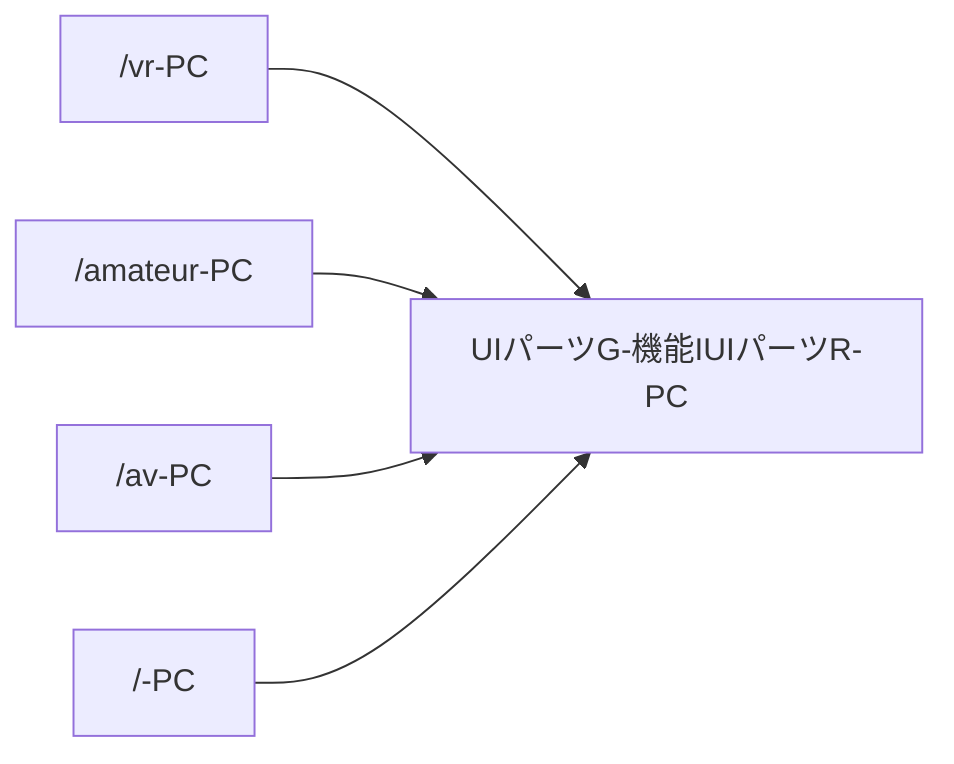

## 更新履歴

 2025年

| 日付 | 施策・修正コンフルURL |
| --- | --- |
| 2025/01/01 |  |

## **デザイン**

| Image | カテゴリB |  |
| --- | --- | --- |
| 撮影日 2025/06/04 |  | 該当ブロックのスクショを挿入すること 複数ある場合列を追加 画像の上に撮影日を入れること 画像が古い場合気づいた人が更新すること 幅400 高さ480 に収まるようにサイズ指定すること 該当画像が必要ない場合は、日付を消して該当無しを記載すること |

| Figma |  |
| --- | --- |
| .widget-link { min-width: 64px; background-image: url("/download/resources/com.atlassian.confluence.extra.widgetconnector:widget/widget.png"); background-repeat: no-repeat; background-position: 50% 0; text-align: center; padding-top: 65px; text-decoration: none; color: #CCC; font-weight: bold; display: inline-block; font-size: .8em; text-decoration: none; } .widget-link:hover { color: #868686; } UIパーツWを入れる | コンポーネントを挿入すること 複数ある場合ウィジェットを追加 幅640 高さ480 に収まるようにサイズ指定すること 該当UIパーツWがない場合はウィジェットを消して、該当無しを記載すること |

| Componentdocs |  |
| --- | --- |
| [UIパーツWを入れる](https://example-componentdocs-xyz123.pages.github.io/componentdocs/?path=/story/src-model-section-top-api-delta-list--pc) | Componentdocsの のUIパーツWを記載すること共有LinkではなくコンポーネントへのUIパーツWを記載すること例：https://example-componentdocs-xyz123.pages.github.io/componentdocs/?path=/story/src-model-performer-nav-performer--cinema 共有LinkではなくコンポーネントへのUIパーツWを記載すること 例：https://example-componentdocs-xyz123.pages.github.io/componentdocs/?path=/story/src-model-performer-nav-performer--cinema 複数ある場合は、リスト形式で記載 該当UIパーツWがない場合は該当無しを記載すること |

### 仕様

| 機能名 | 機能概要 | 表示仕様 | 表示条件 | ログイン判定 | アクション | トラッキングシステム | API |
| --- | --- | --- | --- | --- | --- | --- | --- |
| 枠全体 | 運営管理で個別指定して掲載するUIパーツP | 機能I枠管理 - 仕様書 で登録した内容に応じてUIパーツRを表示表示制限の対象UIパーツRは表示しない現行のchildcontent.ini 表示制限の対象UIパーツRは表示しない現行のchildcontent.ini 現行のchildcontent.ini | 管理画面で有効な表示設定がない場合、枠ごと非表示 日本国外からのアクセスの場合は非表示 | ー | ー |  |  |
| UIパーツI | 枠のUIパーツIテキスト | 以下テキストを表示機能IUIパーツR | ー | ー | ー |  |  |
| UIパーツP | 掲載UIパーツRごとの情報 | UIパーツRごとに以下の要素を表示UIパーツX内テキスト管理画面で指定されたテキスト指定がない場合は吹き出しごと非表示 管理画面で指定されたテキスト 指定がない場合は吹き出しごと非表示 パッケージ画像画像データが無い場合は「Now Printing」を表示VR作品の場合はVRのラベルを表示 画像データが無い場合は「Now Printing」を表示 VR作品の場合はVRのラベルを表示 UIパーツRUIパーツIUIパーツI先頭に独占を除くUIパーツRステータスを最大2個まで表示する作品ステータス - リプレース後の仕様書UIパーツRUIパーツIが2行を超える場合、末尾を「…」で省略表示する UIパーツI先頭に独占を除くUIパーツRステータスを最大2個まで表示する作品ステータス - リプレース後の仕様書 作品ステータス - リプレース後の仕様書 UIパーツRUIパーツIが2行を超える場合、末尾を「…」で省略表示する 現在の最も安い配信形式の販売価格販売形式が単一の場合「n円」販売形式が複数ある場合「n円～」 販売形式が単一の場合「n円」 販売形式が複数ある場合「n円～」 メーカー名UIパーツRに紐づくメーカー名 UIパーツRに紐づくメーカー名 | 機能I枠管理 - 仕様書 で登録した内容に応じてUIパーツRを表示 登録してあった場合でもUIパーツRが廃盤状態の場合は表示しない 表示箇所に複数のUIパーツRが掲載設定されている場合、画面のリロードごとにランダムで表示 | ー | パッケージ画像・UIパーツI対象UIパーツRのUIパーツR詳細ページへ遷移 対象UIパーツRのUIパーツR詳細ページへ遷移 メーカー名対象のメーカーで絞り込まれたカテゴリAフロアのUIパーツQへ遷移 対象のメーカーで絞り込まれたカテゴリAフロアのUIパーツQへ遷移 |  | 最終更新日:2025/06/17 2025/06/17 Query:api-deltaContents api-deltaContents |

## **開発資料**

| Title | UIパーツW |
| --- | --- |
| 設計Issue | ※リプレイスチームが、対応したgithubUIパーツWがある場合記載する。 |
| Miro | ※リプレイスチームが、対応したMiroなどの資料がある場合記載する。 |

  

* * *

  

**▶ UIパーツG-機能A-2D-PC2025年**  
  

# **UIパーツG-機能A-2D-PC**

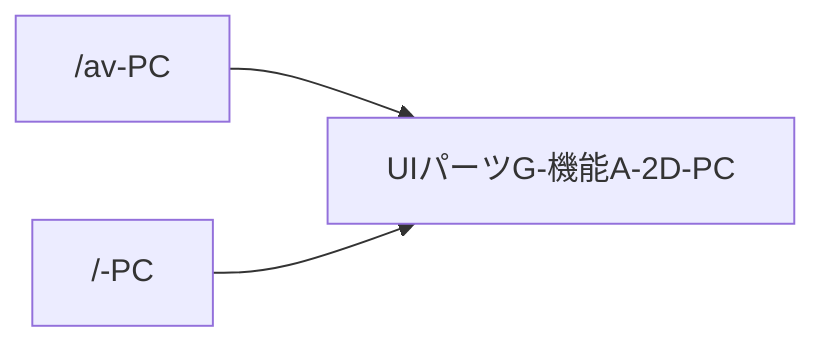

## 更新履歴

 2025年

| 日付 | 施策・修正コンフルURL |
| --- | --- |
| 2025/01/01 |  |

## **デザイン**

| Image |  |
| --- | --- |
| 撮影日 2025/06/05 | 該当ブロックのスクショを挿入すること 複数ある場合列を追加 画像の上に撮影日を入れること 画像が古い場合気づいた人が更新すること 幅400 高さ480 に収まるようにサイズ指定すること 該当画像が必要ない場合は、日付を消して該当無しを記載すること |

| Figma |  |
| --- | --- |
| .widget-link { min-width: 64px; background-image: url("/download/resources/com.atlassian.confluence.extra.widgetconnector:widget/widget.png"); background-repeat: no-repeat; background-position: 50% 0; text-align: center; padding-top: 65px; text-decoration: none; color: #CCC; font-weight: bold; display: inline-block; font-size: .8em; text-decoration: none; } .widget-link:hover { color: #868686; } UIパーツWを入れる | コンポーネントを挿入すること 複数ある場合ウィジェットを追加 幅640 高さ480 に収まるようにサイズ指定すること 該当UIパーツWがない場合はウィジェットを消して、該当無しを記載すること |

| Componentdocs |  |
| --- | --- |
| [https://example-componentdocs-xyz123.pages.github.io/componentdocs/?path=/docs/src-model-section-top-content-caroucel--docs](https://example-componentdocs-xyz123.pages.github.io/componentdocs/?path=/docs/src-model-section-top-content-caroucel--docs) | Componentdocsの のUIパーツWを記載すること共有LinkではなくコンポーネントへのUIパーツWを記載すること例：https://example-componentdocs-xyz123.pages.github.io/componentdocs/?path=/story/src-model-performer-nav-performer--cinema 共有LinkではなくコンポーネントへのUIパーツWを記載すること 例：https://example-componentdocs-xyz123.pages.github.io/componentdocs/?path=/story/src-model-performer-nav-performer--cinema 複数ある場合は、リスト形式で記載 該当UIパーツWがない場合は該当無しを記載すること |

### 仕様

| 機能名 | 機能概要 | 表示仕様 | 表示条件 | ログイン判定 | アクション | トラッキングシステム | API | データ更新方法 | 備考 |
| --- | --- | --- | --- | --- | --- | --- | --- | --- | --- |
| **機能A 2Dコンテンツ** | 2Dコンテンツ機能B(10分)ブロック | データ無: 「2Dコンテンツ」UIパーツIとUIパーツSUIパーツWのみ表示されそうデータ有: 10分ごとの2Dコンテンツ機能A作品をUIパーツFで表示するmax: 40件 / min: ??件 | 画面幅に応じて表示作品数が変動する最大40位まで表示する | ー |  |  |  | whoDigital_Api_Ranking.getRealTImeRankingForTopwhere機能B：Jenkinsバッチwhatンキング：DigitalRankingDB.realtime_ranking_2d | 機能B：videoaの売れ筋リアルタイム機能B（2D）index/parts/carousel/ranking.html |
| 大UIパーツI | 機能A枠のUIパーツI | 固定で以下テキストを表示機能A(10分毎に更新) | 日本国外からのアクセスの場合は非表示 | ー | ー |  |  |  |  |
| 中UIパーツI | UIパーツR種別のUIパーツI | 固定で以下テキストを表示2Dコンテンツ | 機能BUIパーツRが1件も存在しない場合、非表示 | ー | ー |  |  |  |  |
| UIパーツS | 機能Aの導線2Dコンテンツ機能B(10分)へのUIパーツWテキスト | 固定で以下UIパーツWテキストを表示UIパーツS | 機能BUIパーツRが1件も存在しない場合、非表示 | ー | 2DコンテンツカテゴリAフロアの機能A(2D)ページへ遷移 カテゴリAフロアの機能A(2D)ページへ遷移 |  |  |  |  |
| UIパーツT | 表示中のUIパーツT | 表示しているUIパーツTを以下形式で表示ページ : (表示中のUIパーツT)/(総UIパーツT) | 機能BUIパーツRが1件も存在しない場合、非表示 | ー | ー |  |  |  |  |
| 機能A枠全体 | 機能A枠全体 | 2Dコンテンツ カテゴリAフロアの機能A(2D)を最大上位40件まで表示。表示制限の対象UIパーツRは機能Bに含まれない(現行のchildcontent.ini) カテゴリAフロアの機能A(2D)を最大上位40件まで表示。表示制限の対象UIパーツRは機能Bに含まれない(現行のchildcontent.ini) 表示制限の対象UIパーツRは機能Bに含まれない(現行のchildcontent.ini) 機能Bの更新に応じて表示内容は変動。 1ページあたりの表示件数は画面幅に応じて変動。 | 機能BUIパーツRが1件も存在しない場合、枠全体を非表示 | ー | ー |  |  |  |  |
| UIパーツF | UIパーツFでのUIパーツU | UIパーツU可能な場合は濃いグレー、不可能な場合は薄いグレーでUIパーツUUIパーツXを表示 | 機能BUIパーツRが1件も存在しない場合、非表示 | ー | 「<」UIパーツX1ページ目を表示時押下不可2ページ目以降を表示時前のページを表示 1ページ目を表示時押下不可 押下不可 2ページ目以降を表示時前のページを表示 前のページを表示 「>」UIパーツX次のページが存在する次のページを表示次のページが存在しない押下不可 次のページが存在する次のページを表示 次のページを表示 次のページが存在しない押下不可 押下不可 |  |  |  |  |
| 順位 | UIパーツRごとの機能B順位 | 各UIパーツRの順位を表示1~3位順位に応じた(1位は金、2位は銀、3位は銅)王冠UIパーツX内に順位の数値を表示 順位に応じた(1位は金、2位は銀、3位は銅)王冠UIパーツX内に順位の数値を表示 4位～「n位」の形式で順位を表示 「n位」の形式で順位を表示 「2D機能Bへ」順位非表示 順位非表示 | 機能BUIパーツRが1件も存在しない場合、非表示 | ー | ー |  |  |  |  |
| UIパーツP | UIパーツR情報 | 各UIパーツRごとに以下要素を表示パッケージ画像画像データが無い場合は「Now Printing」を表示 画像データが無い場合は「Now Printing」を表示 UIパーツRUIパーツIUIパーツI先頭に独占を除くUIパーツRステータスを最大2個まで表示する作品ステータス - リプレース後の仕様書UIパーツRUIパーツIが2行を超える場合、末尾を「…」で省略表示する UIパーツI先頭に独占を除くUIパーツRステータスを最大2個まで表示する作品ステータス - リプレース後の仕様書 作品ステータス - リプレース後の仕様書 UIパーツRUIパーツIが2行を超える場合、末尾を「…」で省略表示する 現在の最も安い配信形式の販売価格販売形式が単一の場合「n円」販売形式が複数ある場合「n円～」 販売形式が単一の場合「n円」 販売形式が複数ある場合「n円～」機能B最下位の次の枠には機能Aページへの導線を表示 | 機能BUIパーツRが1件も存在しない場合、非表示 | ー | 各UIパーツP該当UIパーツRのUIパーツR詳細ページへ遷移 該当UIパーツRのUIパーツR詳細ページへ遷移 UIパーツS2DコンテンツカテゴリAフロアの機能A(2D)ページへ遷移 2DコンテンツカテゴリAフロアの機能A(2D)ページへ遷移 カテゴリAフロアの機能A(2D)ページへ遷移 |  | 最終更新日:2025/06/17Query:[type-xContentRanking](https://example-bff.gh-pages.example.com/public/queries/type-xContentRanking) |  |  |

## **開発資料**

| Title | UIパーツW |
| --- | --- |
| 設計Issue | ※リプレイスチームが、対応したgithubUIパーツWがある場合記載する。 |
| Miro | ※リプレイスチームが、対応したMiroなどの資料がある場合記載する。 |

  

* * *

  

**▶ UIパーツG-機能A-VR-PC2025年**  
  

# **UIパーツG-機能A-VR-PC**

```mermaid
flowchart LR
    node1["/vr-PC"]
    node2["UIパーツG-機能A-VR-PC"]
    node3["/av-PC"]
    node4["/-PC"]
    node1 --> node2
    node3 --> node2
    node4 --> node2
```

## 更新履歴

 2025年

| 日付 | 施策・修正コンフルURL |
| --- | --- |
| 2025/01/01 |  |

## **デザイン**

| Image |  |
| --- | --- |
| 撮影日 2025/06/05 | 該当ブロックのスクショを挿入すること 複数ある場合列を追加 画像の上に撮影日を入れること 画像が古い場合気づいた人が更新すること 幅400 高さ480 に収まるようにサイズ指定すること 該当画像が必要ない場合は、日付を消して該当無しを記載すること |

| Figma |  |
| --- | --- |
| .widget-link { min-width: 64px; background-image: url("/download/resources/com.atlassian.confluence.extra.widgetconnector:widget/widget.png"); background-repeat: no-repeat; background-position: 50% 0; text-align: center; padding-top: 65px; text-decoration: none; color: #CCC; font-weight: bold; display: inline-block; font-size: .8em; text-decoration: none; } .widget-link:hover { color: #868686; } UIパーツWを入れる | コンポーネントを挿入すること 複数ある場合ウィジェットを追加 幅640 高さ480 に収まるようにサイズ指定すること 該当UIパーツWがない場合はウィジェットを消して、該当無しを記載すること |

| Componentdocs |  |
| --- | --- |
| [https://example-componentdocs-xyz123.pages.github.io/componentdocs/?path=/docs/src-model-section-top-content-caroucel--docs](https://example-componentdocs-xyz123.pages.github.io/componentdocs/?path=/docs/src-model-section-top-content-caroucel--docs) | Componentdocsの のUIパーツWを記載すること共有LinkではなくコンポーネントへのUIパーツWを記載すること例：https://example-componentdocs-xyz123.pages.github.io/componentdocs/?path=/story/src-model-performer-nav-performer--cinema 共有LinkではなくコンポーネントへのUIパーツWを記載すること 例：https://example-componentdocs-xyz123.pages.github.io/componentdocs/?path=/story/src-model-performer-nav-performer--cinema 複数ある場合は、リスト形式で記載 該当UIパーツWがない場合は該当無しを記載すること |

### 仕様

| 機能名 | 機能概要 | 表示仕様 | 表示条件 | ログイン判定 | アクション | トラッキングシステム | API |
| --- | --- | --- | --- | --- | --- | --- | --- |
| 中UIパーツI | UIパーツR種別のUIパーツI | 固定で以下テキストを表示VRコンテンツ | 機能BUIパーツRが1件も存在しない場合、非表示 | ー | ー |  |  |
| UIパーツS | 機能Aの導線 | 固定で以下UIパーツWテキストを表示UIパーツS | 機能BUIパーツRが1件も存在しない場合、非表示 | ー | VRコンテンツカテゴリAフロアの機能A(VR)ページへ遷移 カテゴリAフロアの機能A(VR)ページへ遷移 |  |  |
| UIパーツT | 表示中のUIパーツT | 表示しているUIパーツTを以下形式で表示ページ : (表示中のUIパーツT)/(総UIパーツT) | 機能BUIパーツRが1件も存在しない場合、非表示 | ー | ー |  |  |
| 機能A枠全体 | 機能A枠全体 | VRコンテンツ カテゴリAフロアの機能A(VR)を最大上位20件まで表示。表示制限の対象UIパーツRは機能Bに含まれない(現行のchildcontent.ini) カテゴリAフロアの機能A(VR)を最大上位20件まで表示。表示制限の対象UIパーツRは機能Bに含まれない(現行のchildcontent.ini) 表示制限の対象UIパーツRは機能Bに含まれない(現行のchildcontent.ini) 機能Bの更新に応じて表示内容は変動。 1ページあたりの表示件数は画面幅に応じて変動。 | 機能BUIパーツRが1件も存在しない場合、枠全体を非表示 | ー | ー |  |  |
| UIパーツF | UIパーツFでのUIパーツU | UIパーツU可能な場合は濃いグレー、不可能な場合は薄いグレーでUIパーツUUIパーツXを表示 | 機能BUIパーツRが1件も存在しない場合、非表示 | ー | 「<」UIパーツX1ページ目を表示時押下不可2ページ目以降を表示時前のページを表示 1ページ目を表示時押下不可 押下不可 2ページ目以降を表示時前のページを表示 前のページを表示 「>」UIパーツX次のページが存在する次のページを表示次のページが存在しない押下不可 次のページが存在する次のページを表示 次のページを表示 次のページが存在しない押下不可 押下不可 |  |  |
| 順位 | UIパーツRごとの機能B順位 | 各UIパーツRの順位を表示1~3位順位に応じた(1位は金、2位は銀、3位は銅)王冠UIパーツX内に順位の数値を表示 順位に応じた(1位は金、2位は銀、3位は銅)王冠UIパーツX内に順位の数値を表示 4位～「n位」の形式で順位を表示 「n位」の形式で順位を表示 「VR 機能Bへ」順位非表示 順位非表示 | 機能BUIパーツRが1件も存在しない場合、非表示 | ー | ー |  |  |
| UIパーツP | UIパーツR情報 | 各UIパーツRごとに以下要素を表示パッケージ画像画像データが無い場合は「Now Printing」を表示VR作品の場合はVRのラベルを表示 画像データが無い場合は「Now Printing」を表示 VR作品の場合はVRのラベルを表示 UIパーツRUIパーツIUIパーツI先頭に独占を除くUIパーツRステータスを最大2個まで表示する作品ステータス - リプレース後の仕様書UIパーツRUIパーツIが2行を超える場合、末尾を「…」で省略表示する UIパーツI先頭に独占を除くUIパーツRステータスを最大2個まで表示する作品ステータス - リプレース後の仕様書 作品ステータス - リプレース後の仕様書 UIパーツRUIパーツIが2行を超える場合、末尾を「…」で省略表示する 現在の最も安い配信形式の販売価格販売形式が単一の場合「n円」販売形式が複数ある場合「n円～」 販売形式が単一の場合「n円」 販売形式が複数ある場合「n円～」機能B最下位の次の枠には機能Aページへの導線を表示 | 機能BUIパーツRが1件も存在しない場合、非表示 | ー | 各UIパーツP該当UIパーツRのUIパーツR詳細ページへ遷移 該当UIパーツRのUIパーツR詳細ページへ遷移 UIパーツSVRコンテンツカテゴリAフロアの機能A(VR)ページへ遷移 VRコンテンツカテゴリAフロアの機能A(VR)ページへ遷移 カテゴリAフロアの機能A(VR)ページへ遷移 |  | 最終更新日:2025/06/17Query:[type-xContentRanking](https://example-bff.gh-pages.example.com/public/queries/type-xContentRanking) |

## **開発資料**

| Title | UIパーツW |
| --- | --- |
| 設計Issue | ※リプレイスチームが、対応したgithubUIパーツWがある場合記載する。 |
| Miro | ※リプレイスチームが、対応したMiroなどの資料がある場合記載する。 |

  

* * *

  

**▶ 機能BUIパーツV-PC2025年**  
  

# **機能BUIパーツV-PC**

```mermaid
flowchart LR
    node1["/amateur-PC"]
    node2["機能BUIパーツV-PC"]
    node3["/av-PC"]
    node4["/-PC"]
    node1 --> node2
    node3 --> node2
    node4 --> node2
```

## 更新履歴

 2025年

| 日付 | 施策・修正コンフルURL |
| --- | --- |
| 2025/01/01 |  |

## **デザイン**

| ページA | Image カテゴリAフロア | カテゴリBフロア | カテゴリDフロア | カテゴリCフロア |  |
| --- | --- | --- | --- | --- | --- |
| 撮影日 2025/06/09 | 撮影日 2025/06/05 | 撮影日 2025/06/05 | 撮影日 2025/06/05 | 撮影日 2025/06/05 | 該当ブロックのスクショを挿入すること 複数ある場合列を追加 画像の上に撮影日を入れること 画像が古い場合気づいた人が更新すること 幅400 高さ480 に収まるようにサイズ指定すること 該当画像が必要ない場合は、日付を消して該当無しを記載すること |

| Figma |  |
| --- | --- |
| .widget-link { min-width: 64px; background-image: url("/download/resources/com.atlassian.confluence.extra.widgetconnector:widget/widget.png"); background-repeat: no-repeat; background-position: 50% 0; text-align: center; padding-top: 65px; text-decoration: none; color: #CCC; font-weight: bold; display: inline-block; font-size: .8em; text-decoration: none; } .widget-link:hover { color: #868686; } UIパーツWを入れる | コンポーネントを挿入すること 複数ある場合ウィジェットを追加 幅640 高さ480 に収まるようにサイズ指定すること 該当UIパーツWがない場合はウィジェットを消して、該当無しを記載すること |

| Componentdocs |  |
| --- | --- |
| [https://example-componentdocs-xyz123.pages.github.io/componentdocs/?path=/docs/src-model-section-top-ranking-button--docs](https://example-componentdocs-xyz123.pages.github.io/componentdocs/?path=/docs/src-model-section-top-ranking-button--docs) | Componentdocsの のUIパーツWを記載すること共有LinkではなくコンポーネントへのUIパーツWを記載すること例：https://example-componentdocs-xyz123.pages.github.io/componentdocs/?path=/story/src-model-performer-nav-performer--cinema 共有LinkではなくコンポーネントへのUIパーツWを記載すること 例：https://example-componentdocs-xyz123.pages.github.io/componentdocs/?path=/story/src-model-performer-nav-performer--cinema 複数ある場合は、リスト形式で記載 該当UIパーツWがない場合は該当無しを記載すること |

### 仕様

| 機能名 | 機能概要 | 表示仕様 | 表示条件 | ログイン判定 | アクション | トラッキングシステム | API |
| --- | --- | --- | --- | --- | --- | --- | --- |
| UIパーツR機能B | 日間、週間、月間（UIパーツR or 女の子）機能Bの導線 | 固定で黒枠内に白文字で「▶日間（UIパーツR or 女の子）機能Bへ」「▶週間（UIパーツR or 女の子）機能Bへ」「▶月間（UIパーツR or 女の子）機能Bへ」を表示 | ー | ー | 対象のフロアの日間、週間、月間（UIパーツR or 女の子）機能Bページへ遷移 |  |  |
| 月間エンティティA機能B（カテゴリAフロア） | 月間エンティティA機能Bの導線 | 固定で黒枠内に白文字で「▶月間エンティティA機能Bへ」を表示 | ー | ー | カテゴリAフロアの月間エンティティA機能Bページへ遷移 |  |  |
| 月間シリーズ機能B（カテゴリAフロア） | 月間シリーズ機能Bの導線 | 固定で黒枠内に白文字で「▶月間シリーズ機能Bへ」を表示 | ー | ー | カテゴリAフロアの月間シリーズ機能Bページへ遷移 |  |  |
| エンティティA機能B（カテゴリCフロア） | 月間エンティティA機能Bの導線 | 固定で黒枠内に白文字で「▶エンティティA機能Bへ」を表示 | ー | ー | カテゴリCフロアの月間エンティティA機能Bページへ遷移 |  |  |
| シリーズ機能B（カテゴリC・カテゴリDフロア） | 月間シリーズ機能Bの導線 | 固定で黒枠内に白文字で「▶シリーズ機能Bへ」を表示 | ー | ー | カテゴリC・カテゴリDフロアの月間シリーズ機能Bページへ遷移 |  |  |

## **開発資料**

| Title | UIパーツW |
| --- | --- |
| 設計Issue | ※リプレイスチームが、対応したgithubUIパーツWがある場合記載する。 |
| Miro | ※リプレイスチームが、対応したMiroなどの資料がある場合記載する。 |

  

* * *

  

**▶ UIパーツG-機能KUIパーツR-PC2025年**  
  

# **UIパーツG-機能KUIパーツR-PC**

```mermaid
flowchart LR
    node1["/category-b/content/?id=xxxx-PC"]
    node2["UIパーツG-機能KUIパーツR-PC"]
    node3["/basket-PC"]
    node4["/category-d-PC"]
    node5["/category-d/content/?id=xxxx-PC"]
    node6["作品一覧-該当なし-PC"]
    node7["/amateur-PC"]
    node8["/category-c/content/?id=xxxx-PC"]
    node9["/av-PC"]
    node10["/-PC"]
    node11["/category-a/content/?id=xxxx-PC"]
    node12["【未反映】【404エラーページ-PC】【恒久】YYYYMMDD_404画面にレコメンド設置"]
    node1 --> node2
    node3 --> node2
    node4 --> node2
    node5 --> node2
    node6 --> node2
    node7 --> node2
    node8 --> node2
    node9 --> node2
    node10 --> node2
    node11 --> node2
    node12 --> node2
```

## 更新履歴

 2025年

| 日付 | 施策・修正コンフルURL |
| --- | --- |
| 2025/01/01 |  |

## **デザイン**

| Image | カテゴリD |  |
| --- | --- | --- |
| 撮影日 2025/06/05 |  | 該当ブロックのスクショを挿入すること 複数ある場合列を追加 画像の上に撮影日を入れること 画像が古い場合気づいた人が更新すること 幅400 高さ480 に収まるようにサイズ指定すること 該当画像が必要ない場合は、日付を消して該当無しを記載すること |

| Figma |  |
| --- | --- |
| .widget-link { min-width: 64px; background-image: url("/download/resources/com.atlassian.confluence.extra.widgetconnector:widget/widget.png"); background-repeat: no-repeat; background-position: 50% 0; text-align: center; padding-top: 65px; text-decoration: none; color: #CCC; font-weight: bold; display: inline-block; font-size: .8em; text-decoration: none; } .widget-link:hover { color: #868686; } UIパーツWを入れる | コンポーネントを挿入すること 複数ある場合ウィジェットを追加 幅640 高さ480 に収まるようにサイズ指定すること 該当UIパーツWがない場合はウィジェットを消して、該当無しを記載すること |

| Componentdocs |  |
| --- | --- |
| [https://example-componentdocs-xyz123.pages.github.io/componentdocs/?path=/docs/src-model-section-top-content-caroucel--docs](https://example-componentdocs-xyz123.pages.github.io/componentdocs/?path=/docs/src-model-section-top-content-caroucel--docs) | Componentdocsの のUIパーツWを記載すること共有LinkではなくコンポーネントへのUIパーツWを記載すること例：https://example-componentdocs-xyz123.pages.github.io/componentdocs/?path=/story/src-model-performer-nav-performer--cinema 共有LinkではなくコンポーネントへのUIパーツWを記載すること 例：https://example-componentdocs-xyz123.pages.github.io/componentdocs/?path=/story/src-model-performer-nav-performer--cinema 複数ある場合は、リスト形式で記載 該当UIパーツWがない場合は該当無しを記載すること |

### 仕様

| 機能名 | 機能概要 | 表示仕様 | 表示条件 | ログイン判定 | アクション | トラッキングシステム | API |
| --- | --- | --- | --- | --- | --- | --- | --- |
| u2iレコメンド枠 | 枠全体 | ユーザー嗜好に合わせたレコメンドを最大40件まで表示1ページあたりの表示件数は画面幅に応じて変動 | ログイン時のみ表示 ログイン中だが表示データが存在しない場合は非表示 | あり | ー |  |  |
| 大UIパーツI | 枠のUIパーツI | 固定で以下テキストを表示機能KUIパーツR | 同上 | ー | ー |  |  |
| UIパーツT | 表示中のUIパーツT | 表示しているUIパーツTを以下形式で表示ページ : (表示中のUIパーツT)/(総UIパーツT) | 同上 | ー | ー |  |  |
| UIパーツF | UIパーツFでのUIパーツU | UIパーツU可能な場合は濃いグレー、不可能な場合は薄いグレーでUIパーツUUIパーツXを表示 | 同上 | ー | 「<」UIパーツX1ページ目を表示時押下不可2ページ目以降を表示時前のページを表示 1ページ目を表示時押下不可 押下不可 2ページ目以降を表示時前のページを表示 前のページを表示 「>」UIパーツX次のページが存在する次のページを表示次のページが存在しない押下不可 次のページが存在する次のページを表示 次のページを表示 次のページが存在しない押下不可 押下不可 |  |  |
| UIパーツP | UIパーツR情報 | 各UIパーツRごとに以下要素を表示パッケージ画像画像データが無い場合は「Now Printing」を表示VR作品の場合はVRのラベルを表示 画像データが無い場合は「Now Printing」を表示 VR作品の場合はVRのラベルを表示 UIパーツRUIパーツIUIパーツI先頭に独占を除くUIパーツRステータスを最大2個まで表示する作品ステータス - リプレース後の仕様書UIパーツRUIパーツIが2行を超える場合、末尾を「…」で省略表示する UIパーツI先頭に独占を除くUIパーツRステータスを最大2個まで表示する作品ステータス - リプレース後の仕様書 作品ステータス - リプレース後の仕様書 UIパーツRUIパーツIが2行を超える場合、末尾を「…」で省略表示する 現在の最も安い配信形式の販売価格販売形式が単一の場合「n円」販売形式が複数ある場合「n円～」 販売形式が単一の場合「n円」 販売形式が複数ある場合「n円～」 | 同上 | ー | 該当UIパーツRのUIパーツR詳細ページへ遷移 |  |  |

## **開発資料**

| Title | UIパーツW |
| --- | --- |
| 設計Issue | ※リプレイスチームが、対応したgithubUIパーツWがある場合記載する。 |
| Miro | ※リプレイスチームが、対応したMiroなどの資料がある場合記載する。 |

  

* * *

  

**▶ UIパーツG-機能HUIパーツR-PC2025年**  
  

# **UIパーツG-機能HUIパーツR-PC**

```mermaid
flowchart LR
    node1["/category-d-PC"]
    node2["UIパーツG-機能HUIパーツR-PC"]
    node3["/vr-PC"]
    node4["/category-c-PC"]
    node5["/amateur-PC"]
    node6["/av-PC"]
    node7["/-PC"]
    node1 --> node2
    node3 --> node2
    node4 --> node2
    node5 --> node2
    node6 --> node2
    node7 --> node2
```

## 更新履歴

 2025年

| 日付 | 施策・修正コンフルURL |
| --- | --- |
| 2025/01/01 |  |

## **デザイン**

| Image |  |
| --- | --- |
| 撮影日 2025/06/05 | 該当ブロックのスクショを挿入すること 複数ある場合列を追加 画像の上に撮影日を入れること 画像が古い場合気づいた人が更新すること 幅400 高さ480 に収まるようにサイズ指定すること 該当画像が必要ない場合は、日付を消して該当無しを記載すること |

| Figma |  |
| --- | --- |
| .widget-link { min-width: 64px; background-image: url("/download/resources/com.atlassian.confluence.extra.widgetconnector:widget/widget.png"); background-repeat: no-repeat; background-position: 50% 0; text-align: center; padding-top: 65px; text-decoration: none; color: #CCC; font-weight: bold; display: inline-block; font-size: .8em; text-decoration: none; } .widget-link:hover { color: #868686; } UIパーツWを入れる | コンポーネントを挿入すること 複数ある場合ウィジェットを追加 幅640 高さ480 に収まるようにサイズ指定すること 該当UIパーツWがない場合はウィジェットを消して、該当無しを記載すること |

| Componentdocs |  |
| --- | --- |
| [https://example-componentdocs-xyz123.pages.github.io/componentdocs/?path=/docs/src-model-section-top-content-caroucel--docs](https://example-componentdocs-xyz123.pages.github.io/componentdocs/?path=/docs/src-model-section-top-content-caroucel--docs) | Componentdocsの のUIパーツWを記載すること共有LinkではなくコンポーネントへのUIパーツWを記載すること例：https://example-componentdocs-xyz123.pages.github.io/componentdocs/?path=/story/src-model-performer-nav-performer--cinema 共有LinkではなくコンポーネントへのUIパーツWを記載すること 例：https://example-componentdocs-xyz123.pages.github.io/componentdocs/?path=/story/src-model-performer-nav-performer--cinema 複数ある場合は、リスト形式で記載 該当UIパーツWがない場合は該当無しを記載すること |

### 仕様

| 機能名 | 機能概要 | 表示仕様 | 表示条件 | ログイン判定 | アクション | トラッキングシステム | API |
| --- | --- | --- | --- | --- | --- | --- | --- |
| 機能Hに入っているUIパーツP | 枠全体 | 機能H登録しているUIパーツRを表示機能H登録されているUIパーツRの中から以下条件でUIパーツRを表示状態B > 定価UIパーツR機能H登録日時が新しい順最大40件表示 機能H登録されているUIパーツRの中から以下条件でUIパーツRを表示状態B > 定価UIパーツR機能H登録日時が新しい順 状態B > 定価UIパーツR 機能H登録日時が新しい順 最大40件表示1ページあたりの表示件数は画面幅に応じて変動 | ログイン時のみ表示 ログイン中だが表示データが存在しない場合は非表示 | あり | ー |  |  |
| 大UIパーツI | 枠のUIパーツI | 以下テキストを表示機能HUIパーツR(N点機能E)Nには機能H登録UIパーツRのうち機能Eされた件数を表示 1件も存在しない場合は赤字部分は非表示 | 同上 | ー | ー |  |  |
| 中UIパーツI | UIパーツI | 固定で以下テキストを表示機能Hリスト | 同上 | ー | ー |  |  |
| UIパーツS | 機能Hリストの導線 | 固定で以下UIパーツWテキストを表示UIパーツS | 同上 | ー | 機能Hリストへ遷移 |  |  |
| UIパーツT | 表示中のUIパーツT | 表示しているUIパーツTを以下形式で表示ページ : (表示中のUIパーツT)/(総UIパーツT) | 同上 | ー | ー |  |  |
| UIパーツF | UIパーツFでのUIパーツU | UIパーツU可能な場合は濃いグレー、不可能な場合は薄いグレーでUIパーツUUIパーツXを表示 | 同上 | ー | 「<」UIパーツX1ページ目を表示時押下不可2ページ目以降を表示時前のページを表示 1ページ目を表示時押下不可 押下不可 2ページ目以降を表示時前のページを表示 前のページを表示 「>」UIパーツX次のページが存在する次のページを表示次のページが存在しない押下不可 次のページが存在する次のページを表示 次のページを表示 次のページが存在しない押下不可 押下不可 |  |  |
| UIパーツP | UIパーツR情報 | 各UIパーツRごとに以下要素を表示パッケージ画像画像データが無い場合は「Now Printing」を表示VR作品の場合はVRのラベルを表示 画像データが無い場合は「Now Printing」を表示 VR作品の場合はVRのラベルを表示 UIパーツRUIパーツIUIパーツI先頭に独占を除くUIパーツRステータスを最大2個まで表示する作品ステータス - リプレース後の仕様書UIパーツRUIパーツIが2行を超える場合、末尾を「…」で省略表示する UIパーツI先頭に独占を除くUIパーツRステータスを最大2個まで表示する作品ステータス - リプレース後の仕様書 作品ステータス - リプレース後の仕様書 UIパーツRUIパーツIが2行を超える場合、末尾を「…」で省略表示する 現在の最も安い配信形式の販売価格販売形式が単一の場合「n円」販売形式が複数ある場合「n円～」 販売形式が単一の場合「n円」 販売形式が複数ある場合「n円～」最後尾の次の枠には機能Hリストへの導線を「UIパーツS」と表示 | 同上 | ー | 各UIパーツP該当UIパーツRのUIパーツR詳細ページへ遷移 該当UIパーツRのUIパーツR詳細ページへ遷移 UIパーツS機能Hリストへ遷移 機能Hリストへ遷移 |  |  |

## **開発資料**

| Title | UIパーツW |
| --- | --- |
| 設計Issue | ※リプレイスチームが、対応したgithubUIパーツWがある場合記載する。 |
| Miro | ※リプレイスチームが、対応したMiroなどの資料がある場合記載する。 |

  

* * *

  

**▶ UIパーツG-機能JしたUIパーツR-PC2025年**  
  

# **UIパーツG-機能JしたUIパーツR-PC**

```mermaid
flowchart LR
    node1["/category-b/content/?id=xxxx-PC"]
    node2["UIパーツG-機能JしたUIパーツR-PC"]
    node3["/vr-PC"]
    node4["/category-c-PC"]
    node5["作品一覧-該当なし-PC"]
    node6["/-PC"]
    node7["/category-a/content/?id=xxxx-PC"]
    node8["/basket-PC"]
    node9["/category-d-PC"]
    node10["/category-d/content/?id=xxxx-PC"]
    node11["/amateur-PC"]
    node12["/category-c/content/?id=xxxx-PC"]
    node13["/av-PC"]
    node14["【未反映】【404エラーページ-PC】【恒久】YYYYMMDD_404画面にレコメンド設置"]
    node1 --> node2
    node3 --> node2
    node4 --> node2
    node5 --> node2
    node6 --> node2
    node7 --> node2
    node8 --> node2
    node9 --> node2
    node10 --> node2
    node11 --> node2
    node12 --> node2
    node13 --> node2
    node14 --> node2
```

## 更新履歴

 2025年

| 日付 | 施策・修正コンフルURL |
| --- | --- |
| 2025/01/01 |  |

## **デザイン**

| Image |  |
| --- | --- |
| 撮影日 2025/06/05 | 該当ブロックのスクショを挿入すること 複数ある場合列を追加 画像の上に撮影日を入れること 画像が古い場合気づいた人が更新すること 幅400 高さ480 に収まるようにサイズ指定すること 該当画像が必要ない場合は、日付を消して該当無しを記載すること |

| Figma |  |
| --- | --- |
| .widget-link { min-width: 64px; background-image: url("/download/resources/com.atlassian.confluence.extra.widgetconnector:widget/widget.png"); background-repeat: no-repeat; background-position: 50% 0; text-align: center; padding-top: 65px; text-decoration: none; color: #CCC; font-weight: bold; display: inline-block; font-size: .8em; text-decoration: none; } .widget-link:hover { color: #868686; } UIパーツWを入れる | コンポーネントを挿入すること 複数ある場合ウィジェットを追加 幅640 高さ480 に収まるようにサイズ指定すること 該当UIパーツWがない場合はウィジェットを消して、該当無しを記載すること |

| Componentdocs |  |
| --- | --- |
| [https://example-componentdocs-xyz123.pages.github.io/componentdocs/?path=/docs/src-model-section-top-content-caroucel--docs](https://example-componentdocs-xyz123.pages.github.io/componentdocs/?path=/docs/src-model-section-top-content-caroucel--docs) | Componentdocsの のUIパーツWを記載すること共有LinkではなくコンポーネントへのUIパーツWを記載すること例：https://example-componentdocs-xyz123.pages.github.io/componentdocs/?path=/story/src-model-performer-nav-performer--cinema 共有LinkではなくコンポーネントへのUIパーツWを記載すること 例：https://example-componentdocs-xyz123.pages.github.io/componentdocs/?path=/story/src-model-performer-nav-performer--cinema 複数ある場合は、リスト形式で記載 該当UIパーツWがない場合は該当無しを記載すること |

## データ管理方法

ExampleServiceコンテンツの作品詳細ページへアクセスした際に利用中の端末のローカルにデータを保存する。  
保存したデータを元にUIパーツRデータを表示する。

データ保存のロジックは以下。

  


### 仕様

| 機能名 | 機能概要 | 表示仕様 | 表示条件 | ログイン判定 | アクション | トラッキングシステム | API |
| --- | --- | --- | --- | --- | --- | --- | --- |
| UIパーツI | 機能のUIパーツI | 「機能JしたUIパーツR」のテキストを固定表示 | ー | ー | ー |  |  |
| UIパーツT | UIパーツFの現在のUIパーツTを表示する | UIパーツTを以下形式で表示ページ: (現在UIパーツT)/ 総UIパーツT | ー | ー | ー |  |  |
| UIパーツF | UIパーツUのUIパーツF | 左は「<」、右は「>」のUIパーツXのUIパーツFを表示UIパーツU可能な場合は濃いグレー、これ以上UIパーツUできない状態の場合は薄いグレー表示 | UIパーツTが2ページ以上の場合のみ表示 | ー | 右(>)最後のページを表示中押下不可総ページが2ページ以上かつ最後のページ以外を表示中一つ次のページを表示する 最後のページを表示中押下不可 押下不可 総ページが2ページ以上かつ最後のページ以外を表示中一つ次のページを表示する 一つ次のページを表示する 左(<)最初のページを表示中押下不可総ページが2ページ以上かつ最初のページ以外を表示中一つ次のページを表示する 最初のページを表示中押下不可 押下不可 総ページが2ページ以上かつ最初のページ以外を表示中一つ次のページを表示する 一つ次のページを表示する |  |  |
| UIパーツRブロック全体 | 機能JしたUIパーツRの一覧 | 最大で40件の作品を表示画面幅に応じて1ページあたりの表示作品数は変動する | ユーザーが同一ブラウザで作品詳細ページを閲覧したExampleServiceコンテンツの作品のみ表示 | ー | ー |  |  |
| パッケージ画像 | パッケージ画像 | 
#### カテゴリA・カテゴリD・カテゴリC

90×122サイズのパッケージ画像を表示

#### カテゴリB

90×90サイズのパッケージ画像を表示 | 表示するサンプル画像が存在しない場合は「NOW PRINTING」の画像を表示する | ー | 対象作品の作品詳細ページへ遷移 |  |  |
| 作品UIパーツI | 作品UIパーツI | 作品UIパーツIを最大3行までで表示3行に収まらない場合は「…」で省略するUIパーツIの先頭に作品ステータスの【】を表示する | (ステータスの表示条件のUIパーツW) | ー | 対象作品の作品詳細ページへ遷移 |  |  |
| 価格 | 販売価格 | 販売されている配信形式のうち最安の税込価格を表示する販売パターンが複数ある場合は 円の後に"〜" を追加で表示する | ー | ー | 対象作品の作品詳細ページへ遷移 |  |  |

## **開発資料**

| Title | UIパーツW |
| --- | --- |
| 設計Issue | ※リプレイスチームが、対応したgithubUIパーツWがある場合記載する。 |
| Miro | ※リプレイスチームが、対応したMiroなどの資料がある場合記載する。 |

  

* * *

  

**▶ UIパーツG-あなたに機能Gの機能D-ページA・カテゴリAトップ-PC2025年**  
  

# **UIパーツG-あなたに機能Gの機能D-ページA・カテゴリAトップ-PC**

```mermaid
flowchart LR
    node1["/av-PC"]
    node2["UIパーツG-あなたに機能Gの機能D-ページA・カテゴリAトップ-PC"]
    node3["/-PC"]
    node1 --> node2
    node3 --> node2
```

## 更新履歴

 2025年

| 日付 | 施策・修正コンフルURL |
| --- | --- |
| 2025/01/01 |  |

## **デザイン**

| Image |  |
| --- | --- |
| 撮影日 2025/06/05 | 該当ブロックのスクショを挿入すること 複数ある場合列を追加 画像の上に撮影日を入れること 画像が古い場合気づいた人が更新すること 幅400 高さ480 に収まるようにサイズ指定すること 該当画像が必要ない場合は、日付を消して該当無しを記載すること |

| Figma |  |
| --- | --- |
| .widget-link { min-width: 64px; background-image: url("/download/resources/com.atlassian.confluence.extra.widgetconnector:widget/widget.png"); background-repeat: no-repeat; background-position: 50% 0; text-align: center; padding-top: 65px; text-decoration: none; color: #CCC; font-weight: bold; display: inline-block; font-size: .8em; text-decoration: none; } .widget-link:hover { color: #868686; } UIパーツWを入れる | コンポーネントを挿入すること 複数ある場合ウィジェットを追加 幅640 高さ480 に収まるようにサイズ指定すること 該当UIパーツWがない場合はウィジェットを消して、該当無しを記載すること |

| Componentdocs |  |
| --- | --- |
| [https://example-componentdocs-xyz123.pages.github.io/componentdocs/?path=/docs/src-model-section-top-content-caroucel--docs](https://example-componentdocs-xyz123.pages.github.io/componentdocs/?path=/docs/src-model-section-top-content-caroucel--docs) | Componentdocsの のUIパーツWを記載すること共有LinkではなくコンポーネントへのUIパーツWを記載すること例：https://example-componentdocs-xyz123.pages.github.io/componentdocs/?path=/story/src-model-performer-nav-performer--cinema 共有LinkではなくコンポーネントへのUIパーツWを記載すること 例：https://example-componentdocs-xyz123.pages.github.io/componentdocs/?path=/story/src-model-performer-nav-performer--cinema 複数ある場合は、リスト形式で記載 該当UIパーツWがない場合は該当無しを記載すること |

### 仕様

| 機能名 | 機能概要 | 表示仕様 | 表示条件 | ログイン判定 | アクション | トラッキングシステム | API |
| --- | --- | --- | --- | --- | --- | --- | --- |
| 大UIパーツI | 枠のUIパーツI | 固定で以下テキストを表示機能D中のUIパーツR | 表示するデータが存在しない場合は非表示 | ー | ー |  |  |
| 中UIパーツI | UIパーツI | 各UIパーツGごとに以下テキストを表示あなたに機能Gの機能D | 同上 | ー | ー |  |  |
| 各機能DUIパーツG | 枠全体 | 各UIパーツGごとの条件で絞り込まれたカテゴリAフロアのUIパーツQ(ソート順A)の上位40件を表示表示制限の対象UIパーツRは除外する(現行のchildcontent.ini) 表示制限の対象UIパーツRは除外する(現行のchildcontent.ini) あなたに機能Gの機能D20240216_機能D限定レコメンド設置ABテスト（あなたに機能Gの状態C） 20240216_機能D限定レコメンド設置ABテスト（あなたに機能Gの状態C） | 表示するデータが存在しない場合はUIパーツG単位で非表示 | ー | ー |  |  |
| UIパーツT | 表示中のUIパーツT | 表示しているUIパーツTを以下形式で表示ページ : (表示中のUIパーツT)/(総UIパーツT) | 同上 | ー | ー |  |  |
| UIパーツF | UIパーツFでのUIパーツU | UIパーツU可能な場合は濃いグレー、不可能な場合は薄いグレーでUIパーツUUIパーツXを表示 | 同上 | ー | 「<」UIパーツX1ページ目を表示時押下不可2ページ目以降を表示時前のページを表示 1ページ目を表示時押下不可 押下不可 2ページ目以降を表示時前のページを表示 前のページを表示 「>」UIパーツX次のページが存在する次のページを表示次のページが存在しない押下不可 次のページが存在する次のページを表示 次のページを表示 次のページが存在しない押下不可 押下不可 |  |  |
| UIパーツP | UIパーツR情報 | 各UIパーツRごとに以下要素を表示パッケージ画像画像データが無い場合は「Now Printing」を表示VR作品の場合はVRのラベルを表示 画像データが無い場合は「Now Printing」を表示 VR作品の場合はVRのラベルを表示 UIパーツRUIパーツIUIパーツI先頭に独占を除くUIパーツRステータスを最大2個まで表示する作品ステータス - リプレース後の仕様書UIパーツRUIパーツIが2行を超える場合、末尾を「…」で省略表示する UIパーツI先頭に独占を除くUIパーツRステータスを最大2個まで表示する作品ステータス - リプレース後の仕様書 作品ステータス - リプレース後の仕様書 UIパーツRUIパーツIが2行を超える場合、末尾を「…」で省略表示する 現在の最も安い配信形式の販売価格販売形式が単一の場合「n円」販売形式が複数ある場合「n円～」 販売形式が単一の場合「n円」 販売形式が複数ある場合「n円～」 | 同上 | ー | 該当UIパーツRのUIパーツR詳細ページへ遷移 |  |  |

## **開発資料**

| Title | UIパーツW |
| --- | --- |
| 設計Issue | ※リプレイスチームが、対応したgithubUIパーツWがある場合記載する。 |
| Miro | ※リプレイスチームが、対応したMiroなどの資料がある場合記載する。 |

  

* * *

  

**▶ UIパーツG-機能C-ページA・カテゴリAトップ-PC2025年**  
  

# **UIパーツG-機能C-ページA・カテゴリAトップ-PC**

```mermaid
flowchart LR
    node1["/av-PC"]
    node2["UIパーツG-機能C-ページA・カテゴリAトップ-PC"]
    node3["/-PC"]
    node1 --> node2
    node3 --> node2
```

## 更新履歴

 2025年

| 日付 | 施策・修正コンフルURL |
| --- | --- |
| 2025/01/01 |  |

## **デザイン**

| Image |  |
| --- | --- |
| 撮影日 2025/06/06 | 該当ブロックのスクショを挿入すること 複数ある場合列を追加 画像の上に撮影日を入れること 画像が古い場合気づいた人が更新すること 幅400 高さ480 に収まるようにサイズ指定すること 該当画像が必要ない場合は、日付を消して該当無しを記載すること |

| Figma |  |
| --- | --- |
| .widget-link { min-width: 64px; background-image: url("/download/resources/com.atlassian.confluence.extra.widgetconnector:widget/widget.png"); background-repeat: no-repeat; background-position: 50% 0; text-align: center; padding-top: 65px; text-decoration: none; color: #CCC; font-weight: bold; display: inline-block; font-size: .8em; text-decoration: none; } .widget-link:hover { color: #868686; } UIパーツWを入れる | コンポーネントを挿入すること 複数ある場合ウィジェットを追加 幅640 高さ480 に収まるようにサイズ指定すること 該当UIパーツWがない場合はウィジェットを消して、該当無しを記載すること |

| Componentdocs |  |
| --- | --- |
| [https://example-componentdocs-xyz123.pages.github.io/componentdocs/?path=/docs/src-model-section-top-content-caroucel--docs](https://example-componentdocs-xyz123.pages.github.io/componentdocs/?path=/docs/src-model-section-top-content-caroucel--docs) | Componentdocsの のUIパーツWを記載すること共有LinkではなくコンポーネントへのUIパーツWを記載すること例：https://example-componentdocs-xyz123.pages.github.io/componentdocs/?path=/story/src-model-performer-nav-performer--cinema 共有LinkではなくコンポーネントへのUIパーツWを記載すること 例：https://example-componentdocs-xyz123.pages.github.io/componentdocs/?path=/story/src-model-performer-nav-performer--cinema 複数ある場合は、リスト形式で記載 該当UIパーツWがない場合は該当無しを記載すること |

### 仕様

| 機能名 | 機能概要 | 表示仕様 | 表示条件 | ログイン判定 | アクション | トラッキングシステム | API |
| --- | --- | --- | --- | --- | --- | --- | --- |
| 中UIパーツI | UIパーツI | 各UIパーツGごとに以下テキストを表示機能C | 同上 | ー | ー |  |  |
| 各機能DUIパーツG | 枠全体 | 各UIパーツGごとの条件で絞り込まれたカテゴリAフロアのUIパーツQ(ソート順A)の上位40件を表示表示制限の対象UIパーツRは除外する(現行のchildcontent.ini) 表示制限の対象UIパーツRは除外する(現行のchildcontent.ini) 全ての機能D全ての機能U・機能D対象UIパーツR 全ての機能U・機能D対象UIパーツR | 表示するデータが存在しない場合はUIパーツG単位で非表示 | ー | ー |  |  |
| UIパーツT | 表示中のUIパーツT | 表示しているUIパーツTを以下形式で表示ページ : (表示中のUIパーツT)/(総UIパーツT) | 同上 | ー | ー |  |  |
| UIパーツF | UIパーツFでのUIパーツU | UIパーツU可能な場合は濃いグレー、不可能な場合は薄いグレーでUIパーツUUIパーツXを表示 | 同上 | ー | 「<」UIパーツX1ページ目を表示時押下不可2ページ目以降を表示時前のページを表示 1ページ目を表示時押下不可 押下不可 2ページ目以降を表示時前のページを表示 前のページを表示 「>」UIパーツX次のページが存在する次のページを表示次のページが存在しない押下不可 次のページが存在する次のページを表示 次のページを表示 次のページが存在しない押下不可 押下不可 |  |  |
| UIパーツP | UIパーツR情報 | 各UIパーツRごとに以下要素を表示パッケージ画像画像データが無い場合は「Now Printing」を表示VR作品の場合はVRのラベルを表示 画像データが無い場合は「Now Printing」を表示 VR作品の場合はVRのラベルを表示 UIパーツRUIパーツIUIパーツI先頭に独占を除くUIパーツRステータスを最大2個まで表示する作品ステータス - リプレース後の仕様書UIパーツRUIパーツIが2行を超える場合、末尾を「…」で省略表示する UIパーツI先頭に独占を除くUIパーツRステータスを最大2個まで表示する作品ステータス - リプレース後の仕様書 作品ステータス - リプレース後の仕様書 UIパーツRUIパーツIが2行を超える場合、末尾を「…」で省略表示する 現在の最も安い配信形式の販売価格販売形式が単一の場合「n円」販売形式が複数ある場合「n円～」 販売形式が単一の場合「n円」 販売形式が複数ある場合「n円～」最後尾の次の枠には機能Cリストへの導線を表示 | 同上 | ー | 該当UIパーツRのUIパーツR詳細ページへ遷移 |  |  |

## **開発資料**

| Title | UIパーツW |
| --- | --- |
| 設計Issue | ※リプレイスチームが、対応したgithubUIパーツWがある場合記載する。 |
| Miro | ※リプレイスチームが、対応したMiroなどの資料がある場合記載する。 |

  

* * *

  

**▶ UIパーツG-機能G機能Q作-ページA-PC2025年**  
  

# **UIパーツG-機能G機能Q作-ページA-PC**

```mermaid
flowchart LR
    node1["/-PC"]
    node2["UIパーツG-機能G機能Q作-ページA-PC"]
    node1 --> node2
```

## 更新履歴

 2025年

| 日付 | 施策・修正コンフルURL |
| --- | --- |
| 2025/01/01 |  |

## **デザイン**

| Image |  |
| --- | --- |
| 撮影日 2025/11/11 | 該当ブロックのスクショを挿入すること 複数ある場合列を追加 画像の上に撮影日を入れること 画像が古い場合気づいた人が更新すること 幅400 高さ480 に収まるようにサイズ指定すること 該当画像が必要ない場合は、日付を消して該当無しを記載すること |

| Figma |  |
| --- | --- |
| .widget-link { min-width: 64px; background-image: url("/download/resources/com.atlassian.confluence.extra.widgetconnector:widget/widget.png"); background-repeat: no-repeat; background-position: 50% 0; text-align: center; padding-top: 65px; text-decoration: none; color: #CCC; font-weight: bold; display: inline-block; font-size: .8em; text-decoration: none; } .widget-link:hover { color: #868686; } UIパーツWを入れる | コンポーネントを挿入すること 複数ある場合ウィジェットを追加 幅640 高さ480 に収まるようにサイズ指定すること 該当UIパーツWがない場合はウィジェットを消して、該当無しを記載すること |

| Componentdocs |  |
| --- | --- |
| [https://example-componentdocs-xyz123.pages.github.io/componentdocs/?path=/docs/src-model-section-top-content-caroucel--docs](https://example-componentdocs-xyz123.pages.github.io/componentdocs/?path=/docs/src-model-section-top-content-caroucel--docs) | Componentdocsの のUIパーツWを記載すること共有LinkではなくコンポーネントへのUIパーツWを記載すること例：https://example-componentdocs-xyz123.pages.github.io/componentdocs/?path=/story/src-model-performer-nav-performer--cinema 共有LinkではなくコンポーネントへのUIパーツWを記載すること 例：https://example-componentdocs-xyz123.pages.github.io/componentdocs/?path=/story/src-model-performer-nav-performer--cinema 複数ある場合は、リスト形式で記載 該当UIパーツWがない場合は該当無しを記載すること |

### 仕様

| 機能名 | 機能概要 | 表示仕様 | 表示条件 | ログイン判定 | アクション | トラッキングシステム | API |
| --- | --- | --- | --- | --- | --- | --- | --- |
| 大UIパーツI | 枠のUIパーツI | 固定で以下テキストを表示機能G機能Q作 | 表示するデータが存在しない場合は非表示 | ー | ー |  |  |
| 中UIパーツI | UIパーツI | 固定で以下テキストを表示カテゴリA | 同上 | ー | ー |  |  |
| 各機能GUIパーツG | 枠全体 | 以下条件で絞り込まれたカテゴリAフロアのUIパーツQの上位40件を表示配信開始日 = 機能Q作ソート順Aソート表示制限の対象UIパーツRは除外する(現行のchildcontent.ini) 配信開始日 = 機能Q作 ソート順Aソート 表示制限の対象UIパーツRは除外する(現行のchildcontent.ini) | 表示するデータが存在しない場合はUIパーツG単位で非表示 | ー | ー |  |  |
| UIパーツS | UIパーツQの導線 | 固定で以下UIパーツWテキストを表示UIパーツS | 同上 | ー | 機能Q作で絞り込まれたカテゴリAフロアのUIパーツQページ(ソート順A)へ遷移 |  |  |
| UIパーツT | 表示中のUIパーツT | 表示しているUIパーツTを以下形式で表示ページ : (表示中のUIパーツT)/(総UIパーツT) | 同上 | ー | ー |  |  |
| UIパーツF | UIパーツFでのUIパーツU | UIパーツU可能な場合は濃いグレー、不可能な場合は薄いグレーでUIパーツUUIパーツXを表示 | 同上 | ー | 「<」UIパーツX1ページ目を表示時押下不可2ページ目以降を表示時前のページを表示 1ページ目を表示時押下不可 押下不可 2ページ目以降を表示時前のページを表示 前のページを表示 「>」UIパーツX次のページが存在する次のページを表示次のページが存在しない押下不可 次のページが存在する次のページを表示 次のページを表示 次のページが存在しない押下不可 押下不可 |  |  |
| UIパーツP | UIパーツR情報 | 各UIパーツRごとに以下要素を表示パッケージ画像画像データが無い場合は「Now Printing」を表示VR作品の場合はVRのラベルを表示 画像データが無い場合は「Now Printing」を表示 VR作品の場合はVRのラベルを表示 UIパーツRUIパーツIUIパーツI先頭に独占を除くUIパーツRステータスを最大2個まで表示する作品ステータス - リプレース後の仕様書UIパーツRUIパーツIが2行を超える場合、末尾を「…」で省略表示する UIパーツI先頭に独占を除くUIパーツRステータスを最大2個まで表示する作品ステータス - リプレース後の仕様書 作品ステータス - リプレース後の仕様書 UIパーツRUIパーツIが2行を超える場合、末尾を「…」で省略表示する 現在の最も安い配信形式の販売価格販売形式が単一の場合「n円」販売形式が複数ある場合「n円～」 販売形式が単一の場合「n円」 販売形式が複数ある場合「n円～」最後尾の次の枠には機能Hリストへの導線を「UIパーツS」と表示 | 同上 | ー | 各UIパーツP該当UIパーツRのUIパーツR詳細ページへ遷移 該当UIパーツRのUIパーツR詳細ページへ遷移 UIパーツS機能Q作で絞り込まれたカテゴリAフロアのUIパーツQページ(ソート順A)へ遷移 機能Q作で絞り込まれたカテゴリAフロアのUIパーツQページ(ソート順A)へ遷移 |  |  |
|  |  |  |  |  |  |  |  |

## **開発資料**

| Title | UIパーツW |
| --- | --- |
| 設計Issue | ※リプレイスチームが、対応したgithubUIパーツWがある場合記載する。 |
| Miro | ※リプレイスチームが、対応したMiroなどの資料がある場合記載する。 |

  

* * *

  

**▶ UIパーツG-機能GUIパーツR-ページA-PC2025年**  
  

# **UIパーツG-機能GUIパーツR-ページA-PC**

```mermaid
flowchart LR
    node1["/-PC"]
    node2["UIパーツG-機能GUIパーツR-ページA-PC"]
    node1 --> node2
```

## 更新履歴

 2025年

| 日付 | 施策・修正コンフルURL |
| --- | --- |
| 2025/01/01 |  |
| 2025/11/26 | 
###### [【恒久】20251113_リスト ソート順Aの新設 他フロア展開（カテゴリC・カテゴリD・コンテンツフロアトップ）](https://example-confluence.example.com/pages/viewpage.action?pageId=2000000089)

 |

## **デザイン**

| Image |  |
| --- | --- |
| 撮影日 2025/06/09 | 該当ブロックのスクショを挿入すること 複数ある場合列を追加 画像の上に撮影日を入れること 画像が古い場合気づいた人が更新すること 幅400 高さ480 に収まるようにサイズ指定すること 該当画像が必要ない場合は、日付を消して該当無しを記載すること |

| Figma |  |
| --- | --- |
| .widget-link { min-width: 64px; background-image: url("/download/resources/com.atlassian.confluence.extra.widgetconnector:widget/widget.png"); background-repeat: no-repeat; background-position: 50% 0; text-align: center; padding-top: 65px; text-decoration: none; color: #CCC; font-weight: bold; display: inline-block; font-size: .8em; text-decoration: none; } .widget-link:hover { color: #868686; } UIパーツWを入れる | コンポーネントを挿入すること 複数ある場合ウィジェットを追加 幅640 高さ480 に収まるようにサイズ指定すること 該当UIパーツWがない場合はウィジェットを消して、該当無しを記載すること |

| Componentdocs |  |
| --- | --- |
| [UIパーツWを入れる](UIパーツWを入れる) | Componentdocsの のUIパーツWを記載すること共有LinkではなくコンポーネントへのUIパーツWを記載すること例：https://example-componentdocs-xyz123.pages.github.io/componentdocs/?path=/story/src-model-performer-nav-performer--cinema 共有LinkではなくコンポーネントへのUIパーツWを記載すること 例：https://example-componentdocs-xyz123.pages.github.io/componentdocs/?path=/story/src-model-performer-nav-performer--cinema 複数ある場合は、リスト形式で記載 該当UIパーツWがない場合は該当無しを記載すること |

### 仕様

| 機能名 | 機能概要 | 表示仕様 | 表示条件 | ログイン判定 | アクション | トラッキングシステム | API |
| --- | --- | --- | --- | --- | --- | --- | --- |
| 大UIパーツI | 枠のUIパーツI | 固定で以下テキストを表示機能GUIパーツR | 表示するデータが存在しない場合は非表示 | - | - | - | - |
| 中UIパーツI | UIパーツI | 各UIパーツGごとに以下テキストを表示カテゴリA カテゴリB カテゴリD カテゴリC | 同上 | - | - | - | - |
| 機能GUIパーツRUIパーツG | 枠全体 | 各フロアのUIパーツQ(ソート順A)の上位40件を表示 表示制限の対象UIパーツRは除外する(現行のchildcontent.ini) | 表示するデータが存在しない場合はUIパーツG単位で非表示 | - | - | - | - |
| UIパーツS | UIパーツQの導線 | 固定で以下UIパーツWテキストを表示UIパーツS | 同上 | - | カテゴリAカテゴリAフロアのUIパーツQ(ソート順A) カテゴリAフロアのUIパーツQ(ソート順A) カテゴリBカテゴリBフロアのUIパーツQ(ソート順A) カテゴリBフロアのUIパーツQ(ソート順A) カテゴリDカテゴリDフロアのUIパーツQ(ソート順A) カテゴリDフロアのUIパーツQ(ソート順A) カテゴリCカテゴリCフロアのUIパーツQ(ソート順A) カテゴリCフロアのUIパーツQ(ソート順A) | - | - |
| UIパーツT | 表示中のUIパーツT | 表示しているUIパーツTを以下形式で表示ページ : (表示中のUIパーツT)/(総UIパーツT) | 同上 | - | - | - | - |
| UIパーツF | UIパーツFでのUIパーツU | UIパーツU可能な場合は濃いグレー、不可能な場合は薄いグレーでUIパーツUUIパーツXを表示 | 同上 | - | 「<」UIパーツX1ページ目を表示時押下不可2ページ目以降を表示時前のページを表示 1ページ目を表示時押下不可 押下不可 2ページ目以降を表示時前のページを表示 前のページを表示 「>」UIパーツX次のページが存在する次のページを表示次のページが存在しない押下不可 次のページが存在する次のページを表示 次のページを表示 次のページが存在しない押下不可 押下不可 | - | - |
| UIパーツP | UIパーツR情報 | 各UIパーツRごとに以下要素を表示パッケージ画像画像データが無い場合は「Now Printing」を表示VR作品の場合はVRのラベルを表示 画像データが無い場合は「Now Printing」を表示 VR作品の場合はVRのラベルを表示 UIパーツRUIパーツIUIパーツI先頭に独占を除くUIパーツRステータスを最大2個まで表示する作品ステータス - リプレース後の仕様書UIパーツRUIパーツIが2行を超える場合、末尾を「…」で省略表示する UIパーツI先頭に独占を除くUIパーツRステータスを最大2個まで表示する作品ステータス - リプレース後の仕様書 作品ステータス - リプレース後の仕様書 UIパーツRUIパーツIが2行を超える場合、末尾を「…」で省略表示する 現在の最も安い配信形式の販売価格販売形式が単一の場合「n円」販売形式が複数ある場合「n円～」 販売形式が単一の場合「n円」 販売形式が複数ある場合「n円～」最後尾の次の枠にはUIパーツQへの導線を表示ソート順Aリストへ | 同上 | - | 各UIパーツP該当UIパーツRのUIパーツR詳細ページへ遷移 該当UIパーツRのUIパーツR詳細ページへ遷移 UIパーツSカテゴリAカテゴリAフロアのUIパーツQ(ソート順A)カテゴリBカテゴリBフロアのUIパーツQ(ソート順A)カテゴリDカテゴリDフロアのUIパーツQ(ソート順A)カテゴリCカテゴリCフロアのUIパーツQ(ソート順A) カテゴリAカテゴリAフロアのUIパーツQ(ソート順A) カテゴリAフロアのUIパーツQ(ソート順A) カテゴリBカテゴリBフロアのUIパーツQ(ソート順A) カテゴリBフロアのUIパーツQ(ソート順A) カテゴリDカテゴリDフロアのUIパーツQ(ソート順A) カテゴリDフロアのUIパーツQ(ソート順A) カテゴリCカテゴリCフロアのUIパーツQ(ソート順A) カテゴリCフロアのUIパーツQ(ソート順A) | カテゴリAref_param：api-zeta ref_param2：api-epsilon_digital_top ref_param：api-zeta api-zeta ref_param2：api-epsilon_digital_top api-epsilon_digital_top カテゴリBref_param：api-zeta ref_param2：api-epsilon_amateur_digital_top ref_param：api-zeta api-zeta ref_param2：api-epsilon_amateur_digital_top api-epsilon_amateur_digital_top カテゴリDref_param：api-zeta ref_param2：api-epsilon_anime_digital_top ref_param：api-zeta api-zeta ref_param2：api-epsilon_anime_digital_top api-epsilon_anime_digital_top カテゴリCref_param：api-zeta ref_param2：api-epsilon_cinema_digital_top ref_param：api-zeta api-zeta ref_param2：api-epsilon_cinema_digital_top api-epsilon_cinema_digital_top | カテゴリAContentsearchresponseavApi-zetaedContents ContentsearchresponseavApi-zetaedContents avApi-zetaedContents カテゴリBContentsearchresponseamateurApi-zetaedContents ContentsearchresponseamateurApi-zetaedContents amateurApi-zetaedContents カテゴリDContentsearchresponseanimeApi-zetaedContents ContentsearchresponseanimeApi-zetaedContents animeApi-zetaedContents カテゴリCContentsearchresponsecinemaApi-zetaedContents ContentsearchresponsecinemaApi-zetaedContents cinemaApi-zetaedContents |

## **開発資料**

| Title | UIパーツW |
| --- | --- |
| 設計Issue | ※リプレイスチームが、対応したgithubUIパーツWがある場合記載する。 |
| Miro | ※リプレイスチームが、対応したMiroなどの資料がある場合記載する。 |

  

* * *

  

**▶ フロア紹介テキスト-ページA-PC2025年**  
  

# **フロア紹介テキスト-ページA-PC**

```mermaid
flowchart LR
    node1["/-PC"]
    node2["フロア紹介テキスト-ページA-PC"]
    node1 --> node2
```

## 更新履歴

 2025年

| 日付 | 施策・修正コンフルURL |
| --- | --- |
| 2025/01/01 |  |

## **デザイン**

| Image |  |
| --- | --- |
| 撮影日 2025/06/09 | 該当ブロックのスクショを挿入すること 複数ある場合列を追加 画像の上に撮影日を入れること 画像が古い場合気づいた人が更新すること 幅400 高さ480 に収まるようにサイズ指定すること 該当画像が必要ない場合は、日付を消して該当無しを記載すること |

| Figma |  |
| --- | --- |
| .widget-link { min-width: 64px; background-image: url("/download/resources/com.atlassian.confluence.extra.widgetconnector:widget/widget.png"); background-repeat: no-repeat; background-position: 50% 0; text-align: center; padding-top: 65px; text-decoration: none; color: #CCC; font-weight: bold; display: inline-block; font-size: .8em; text-decoration: none; } .widget-link:hover { color: #868686; } UIパーツWを入れる | コンポーネントを挿入すること 複数ある場合ウィジェットを追加 幅640 高さ480 に収まるようにサイズ指定すること 該当UIパーツWがない場合はウィジェットを消して、該当無しを記載すること |

| Componentdocs |  |
| --- | --- |
| [https://example-componentdocs-xyz123.pages.github.io/componentdocs/?path=/docs/src-model-section-top-section-top-about--docs](https://example-componentdocs-xyz123.pages.github.io/componentdocs/?path=/docs/src-model-section-top-section-top-about--docs) | Componentdocsの のUIパーツWを記載すること共有LinkではなくコンポーネントへのUIパーツWを記載すること例：https://example-componentdocs-xyz123.pages.github.io/componentdocs/?path=/story/src-model-performer-nav-performer--cinema 共有LinkではなくコンポーネントへのUIパーツWを記載すること 例：https://example-componentdocs-xyz123.pages.github.io/componentdocs/?path=/story/src-model-performer-nav-performer--cinema 複数ある場合は、リスト形式で記載 該当UIパーツWがない場合は該当無しを記載すること |

### 仕様

| 機能名 | 機能概要 | 表示仕様 | 表示条件 | ログイン判定 | アクション | トラッキングシステム | API |
| --- | --- | --- | --- | --- | --- | --- | --- |
| フロア紹介テキスト | コンテンツサービスの紹介テキスト | UIパーツIコンテンツサービスについて コンテンツサービスについて 本文業界シェアNo1！ExampleServiceが選ばれる3つの理由！1.国内No1の品揃え！話題の機能Q作、機能RAVエンティティAの作品からマニアックなフェチ作品までさまざまなジャンルのコンテンツを販売しています！ExampleServiceだけでしか見られない独占配信作品も多数取り扱っていますので、あなたの理想の作品がきっと見つかります。2.パソコン、スマホ、タブレット、テレビなど、多数のデバイスで視聴可能！購入したコンテンツは、さまざまなデバイスで視聴可能です。追加料金は一切かかりません！VRなどの新しいデバイスにも対応しています！3.どのサイトよりも安心・安全！迷惑メール、個人情報漏洩の心配なし！24時間のサポート体制で、困った時も安心してご利用いただけます。 業界シェアNo1！ExampleServiceが選ばれる3つの理由！1.国内No1の品揃え！話題の機能Q作、機能RAVエンティティAの作品からマニアックなフェチ作品までさまざまなジャンルのコンテンツを販売しています！ExampleServiceだけでしか見られない独占配信作品も多数取り扱っていますので、あなたの理想の作品がきっと見つかります。2.パソコン、スマホ、タブレット、テレビなど、多数のデバイスで視聴可能！購入したコンテンツは、さまざまなデバイスで視聴可能です。追加料金は一切かかりません！VRなどの新しいデバイスにも対応しています！3.どのサイトよりも安心・安全！迷惑メール、個人情報漏洩の心配なし！24時間のサポート体制で、困った時も安心してご利用いただけます。 | 日本国外からのアクセスの場合は非表示 | ー | ー |  |  |

## **開発資料**

| Title | UIパーツW |
| --- | --- |
| 設計Issue | ※リプレイスチームが、対応したgithubUIパーツWがある場合記載する。 |
| Miro | ※リプレイスチームが、対応したMiroなどの資料がある場合記載する。 |

  

* * *

  

**▶ UIパーツC-PCこのページのトップへ-PC2025年コンテンツ・ご利用ガイド-PC2025年関連会社・規約-PC2025年2024年お得な情報-PC2025年ExampleService共通UIパーツC-PC2025年**  
  

# **UIパーツC-PC**

```mermaid
flowchart LR
    node1["お得な情報-PC"]
    node2["UIパーツC-PC"]
    node3["ExampleService共通UIパーツC-PC"]
    node4["コンテンツ・ご利用ガイド-PC"]
    node5["外部仕様書-共通ナビ"]
    node6["関連会社・規約-PC"]
    node7["このページのトップへ-PC"]
    node8["/category-b/content/?id=xxxx-PC"]
    node9["/category-c-PC"]
    node10["/category-c/producer-PC"]
    node11["/category-a/collection-PC"]
    node12["/category-a/list/?key=xxx-PC"]
    node13["/-PC"]
    node14["/category-d/list/?key=xxx-PC"]
    node15["/category-a/content/?id=xxxx-PC"]
    node16["/category-c/category/?display=syllabary-PC"]
    node17["/category-a/producer/?syllabary=a-PC"]
    node18["/category-c/category-PC"]
    node19["/basket-PC"]
    node20["/category-d-PC"]
    node21["/category-d/content/?id=xxxx-PC"]
    node22["/category-c/collection/?syllabary=a-PC"]
    node23["/category-d/collection-PC"]
    node24["/category-d/category-PC"]
    node25["/category-a/performer/?syllabary=a-PC"]
    node26["/amateur-PC"]
    node27["/category-c/content/?id=xxxx-PC"]
    node28["/category-c/collection-PC"]
    node29["/av-PC"]
    node30["/category-a/producer/?category=xxxx-PC"]
    node31["/category-b/category/?display=syllabary-PC"]
    node32["/category-b/category-PC"]
    node33["【反映済】 /category-b/category/?display=syllabary-PC_【恒久】20251113_リスト ソート順Aの新設 他フロア展開（カテゴリB）"]
    node34["/category-b/performer/?syllabary=a-PC"]
    node35["/vr-PC"]
    node36["/search/?key=xxx-PC"]
    node37["/category-a/producer/?category=top-PC"]
    node38["/category-a/category-PC"]
    node39["/category-c/performer-content/?syllabary=a-PC"]
    node40["/category-d/producer-PC"]
    node41["/category-b/list/?key=xxx-PC"]
    node42["/category-d/category/?display=syllabary-PC"]
    node43["/category-c/creator/?syllabary=a-PC"]
    node44["/category-a/category/?display=syllabary-PC"]
    node45["/category-c/writer/?syllabary=a-PC"]
    node46["/category-c/list/?key=xxx-PC"]
    node47["/category-d/collection/?syllabary=a-PC"]
    node48["/category-a/collection/?syllabary=a-PC"]
    node49["/category-c/performer/?syllabary=a-PC"]
    node2 --> node1
    node2 --> node3
    node2 --> node4
    node2 --> node5
    node2 --> node6
    node2 --> node7
    node8 --> node2
    node9 --> node2
    node10 --> node2
    node11 --> node2
    node12 --> node2
    node13 --> node2
    node14 --> node2
    node15 --> node2
    node16 --> node2
    node17 --> node2
    node18 --> node2
    node19 --> node2
    node20 --> node2
    node21 --> node2
    node22 --> node2
    node23 --> node2
    node24 --> node2
    node25 --> node2
    node26 --> node2
    node27 --> node2
    node28 --> node2
    node29 --> node2
    node30 --> node2
    node31 --> node2
    node32 --> node2
    node33 --> node2
    node34 --> node2
    node35 --> node2
    node36 --> node2
    node37 --> node2
    node38 --> node2
    node39 --> node2
    node40 --> node2
    node41 --> node2
    node42 --> node2
    node43 --> node2
    node44 --> node2
    node45 --> node2
    node46 --> node2
    node47 --> node2
    node48 --> node2
    node49 --> node2
```

/*<!--\[CDATA\[*/ div.rbtoc1766199459533 {padding: 0px;} div.rbtoc1766199459533 ul {margin-left: 0px;} div.rbtoc1766199459533 li {margin-left: 0px;padding-left: 0px;} /*\]\]-->*/

-   [UIパーツC-PC](#id-/PC-UIパーツC-PC)
    -   [デザイン](#id-/PC-デザイン)
    -   [仕様](#id-/PC-仕様)
    -   [開発資料](#id-/PC-開発資料)
    -   [このページのトップへ-PC](#id-/PC-このページのトップへ-PC)
        -   [更新履歴](#id-/PC-更新履歴)
        -   [デザイン](#id-/PC-デザイン.1)
        -   [仕様](#id-/PC-仕様.1)
        -   [開発資料](#id-/PC-開発資料.1)
            -   [画面仕様書移植確認リスト](#id-/PC-画面仕様書移植確認リスト)
    -   [コンテンツ・ご利用ガイド-PC](#id-/PC-コンテンツ・ご利用ガイド-PC)
        -   [更新履歴](#id-/PC-更新履歴.1)
        -   [デザイン](#id-/PC-デザイン.2)
        -   [仕様](#id-/PC-仕様.2)
        -   [開発資料](#id-/PC-開発資料.2)
            -   [画面仕様書移植確認リスト](#id-/PC-画面仕様書移植確認リスト.1)
    -   [関連会社・規約-PC](#id-/PC-関連会社・規約-PC)
        -   [更新履歴](#id-/PC-更新履歴.2)
        -   [デザイン](#id-/PC-デザイン.3)
        -   [仕様](#id-/PC-仕様.3)
        -   [開発資料](#id-/PC-開発資料.3)
            -   [画面仕様書移植確認リスト](#id-/PC-画面仕様書移植確認リスト.2)
    -   [お得な情報-PC](#id-/PC-お得な情報-PC)
        -   [更新履歴](#id-/PC-更新履歴.3)
        -   [デザイン](#id-/PC-デザイン.4)
        -   [仕様](#id-/PC-仕様.4)
        -   [開発資料](#id-/PC-開発資料.4)
            -   [画面仕様書移植確認リスト](#id-/PC-画面仕様書移植確認リスト.3)
    -   [ExampleService共通UIパーツC-PC](#id-/PC-ExampleService共通UIパーツC-PC)
        -   [更新履歴](#id-/PC-更新履歴.4)
        -   [デザイン](#id-/PC-デザイン.5)
        -   [仕様](#id-/PC-仕様.5)
        -   [開発資料](#id-/PC-開発資料.5)
            -   [画面仕様書移植確認リスト](#id-/PC-画面仕様書移植確認リスト.4)
            -   [画面仕様書移植確認リスト](#id-/PC-画面仕様書移植確認リスト.5)

## **デザイン**

| Image |  |
| --- | --- |
| 撮影日2025/01/17 | 該当ブロックのスクショを挿入すること 複数ある場合列を追加 画像の上に撮影日を入れること 画像が古い場合気づいた人が更新すること 幅400 高さ480 に収まるようにサイズ指定すること 該当画像が必要ない場合は、日付を消して該当無しを記載すること |

  

| Figma |  |
| --- | --- |
| 該当なし ※PF要素のため | コンポーネントを挿入すること 複数ある場合ウィジェットを追加 幅640 高さ480 に収まるようにサイズ指定すること 該当UIパーツWがない場合はウィジェットを消して、該当無しを記載すること |

  

| Componentdocs |  |
| --- | --- |
| 該当なし | Componentdocsの のUIパーツWを記載すること共有LinkではなくコンポーネントへのUIパーツWを記載すること例：https://example-componentdocs-xyz123.pages.github.io/componentdocs/?path=/story/src-model-performer-nav-performer--cinema 共有LinkではなくコンポーネントへのUIパーツWを記載すること 例：https://example-componentdocs-xyz123.pages.github.io/componentdocs/?path=/story/src-model-performer-nav-performer--cinema 複数ある場合は、リスト形式で記載 該当UIパーツWがない場合は該当無しを記載すること |

## **仕様**

| 機能名 | 機能概要 | 表示仕様 | 表示条件 | ログイン判定 | アクション | トラッキングシステム | API |
| --- | --- | --- | --- | --- | --- | --- | --- |
| UIパーツC全体 | APIベータの返却データに依存 | Apibetaから返却された他サービスの導線を表示 |  | - | 各サービスのURLへ遷移 | - | [外部仕様書-共通ナビ](/pages/viewpage.action?pageId=2000000032) |

## **開発資料**

| Title | UIパーツW |
| --- | --- |
| 設計Issue | リプレイスチームが、対応したgithubUIパーツWを入れる |
| 共通APIベータ | [外部仕様書-共通ナビ](/pages/viewpage.action?pageId=2000000032) |

  

* * *

  

 このページのトップへ-PC

## このページのトップへ-PC

```mermaid
flowchart LR
    node1["UIパーツC-PC"]
    node2["このページのトップへ-PC"]
    node1 --> node2
```

### 更新履歴

 2025年

| 日付 | 施策・修正コンフルURL |
| --- | --- |
| 2025/01/01 |  |

### **デザイン**

| Image |  |
| --- | --- |
| 撮影日2025/01/16 | 該当ブロックのスクショを挿入すること 複数ある場合列を追加 画像の上に撮影日を入れること 画像が古い場合気づいた人が更新すること 幅400 高さ480 に収まるようにサイズ指定すること 該当画像が必要ない場合は、日付を消して該当無しを記載すること |

  

| Figma |  |
| --- | --- |
| 該当なし ※PF要素のため | コンポーネントを挿入すること 複数ある場合ウィジェットを追加 幅640 高さ480 に収まるようにサイズ指定すること 該当UIパーツWがない場合はウィジェットを消して、該当無しを記載すること |

  

| Componentdocs |  |
| --- | --- |
| 該当なし | Componentdocsの のUIパーツWを記載すること共有LinkではなくコンポーネントへのUIパーツWを記載すること例：https://example-componentdocs-xyz123.pages.github.io/componentdocs/?path=/story/src-model-performer-nav-performer--cinema 共有LinkではなくコンポーネントへのUIパーツWを記載すること 例：https://example-componentdocs-xyz123.pages.github.io/componentdocs/?path=/story/src-model-performer-nav-performer--cinema 複数ある場合は、リスト形式で記載 該当UIパーツWがない場合は該当無しを記載すること |

### 仕様

| 機能名 | 機能概要 | 表示仕様 | 表示条件 | ログイン判定 | アクション | トラッキングシステム | API |
| --- | --- | --- | --- | --- | --- | --- | --- |
| ページトップ移動 | ページ最上部へ移動するテキストUIパーツW | 固定で「このページのトップへ」のテキストUIパーツWを表示 | 固定 | - | 表示中のページの最上部へ移動 | - | - |

### **開発資料**

| Title | UIパーツW |
| --- | --- |
| 設計Issue | リプレイスチームが、対応したgithubUIパーツWを入れる |

#### **画面仕様書移植確認リスト**

チェックボックス @名前 チェックした日付　のフォーマットでチェック

-   ベース記載 2025/01/17 [小谷野 諭@FE](/display/~koyano-satoshi) 
-   FE  2025/01/23 [小野寺 剣人](/display/~onodera-kento) 
-   DES 2025/01/23 [中田 裕美子@DES](/display/~nakada-yumiko) 
-   最終確認 [小谷野 諭@FE](/display/~koyano-satoshi)  日付を記載
-   元ページへのUIパーツWの記載　[小谷野 諭@FE](/display/~koyano-satoshi)

  

* * *

  

 コンテンツ・ご利用ガイド-PC

## **コンテンツ・ご利用ガイド-PC**

```mermaid
flowchart LR
    node1["UIパーツC-PC"]
    node2["コンテンツ・ご利用ガイド-PC"]
    node1 --> node2
```

### 更新履歴

 2025年

| 日付 | 施策・修正コンフルURL |
| --- | --- |
| 2025/01/01 |  |

### **デザイン**

| Image |  |
| --- | --- |
| 撮影日2025/01/16 | 該当ブロックのスクショを挿入すること 複数ある場合列を追加 画像の上に撮影日を入れること 画像が古い場合気づいた人が更新すること 幅400 高さ480 に収まるようにサイズ指定すること 該当画像が必要ない場合は、日付を消して該当無しを記載すること |

  

| Figma |  |
| --- | --- |
| 該当なし ※PF要素のため | コンポーネントを挿入すること 複数ある場合ウィジェットを追加 幅640 高さ480 に収まるようにサイズ指定すること 該当UIパーツWがない場合はウィジェットを消して、該当無しを記載すること |

  

| Componentdocs |  |
| --- | --- |
| 該当なし | Componentdocsの のUIパーツWを記載すること共有LinkではなくコンポーネントへのUIパーツWを記載すること例：https://example-componentdocs-xyz123.pages.github.io/componentdocs/?path=/story/src-model-performer-nav-performer--cinema 共有LinkではなくコンポーネントへのUIパーツWを記載すること 例：https://example-componentdocs-xyz123.pages.github.io/componentdocs/?path=/story/src-model-performer-nav-performer--cinema 複数ある場合は、リスト形式で記載 該当UIパーツWがない場合は該当無しを記載すること |

### 仕様

| 機能名 | 機能概要 | 表示仕様 | 表示条件 | ログイン判定 | アクション | トラッキングシステム | API |
| --- | --- | --- | --- | --- | --- | --- | --- |
| よくある質問 | ヘルプページのUIパーツW | 固定で「よくある質問」のテキストUIパーツWを表示 | 固定 | - | ヘルプページのコンテンツカテゴリーに遷移 | click_commonfooter footer | - |
| お問い合わせ | ヘルプセンターのUIパーツW | 固定で「お問い合わせ」のテキストUIパーツWを表示 | 固定 | - | ヘルプセンターのトップページに遷移 | - |

### **開発資料**

| Title | UIパーツW |
| --- | --- |
| 設計Issue | リプレイスチームが、対応したgithubUIパーツWを入れる |

#### **画面仕様書移植確認リスト**

チェックボックス @名前 チェックした日付　のフォーマットでチェック

-   ベース記載 2025/01/17 [小谷野 諭@FE](/display/~koyano-satoshi) 
-   FE  2025/01/23 [小野寺 剣人](/display/~onodera-kento) 
-   DES 2025/01/23 [中田 裕美子@DES](/display/~nakada-yumiko) 
-   最終確認 [小谷野 諭@FE](/display/~koyano-satoshi)  日付を記載
-   元ページへのUIパーツWの記載　[小谷野 諭@FE](/display/~koyano-satoshi)

  

* * *

  

 関連会社・規約-PC

## **関連会社・規約-PC**

```mermaid
flowchart LR
    node1["UIパーツC-PC"]
    node2["関連会社・規約-PC"]
    node1 --> node2
```

### 更新履歴

 2025年

| 日付 | 施策・修正コンフルURL |
| --- | --- |
| 2025/01/01 |  |

 2024年

| 日付 | 施策・修正コンフルURL |
| --- | --- |
| 2025/01/01 |  |

### **デザイン**

| Image |  |
| --- | --- |
| 撮影日2025/01/16 | 該当ブロックのスクショを挿入すること 複数ある場合列を追加 画像の上に撮影日を入れること 画像が古い場合気づいた人が更新すること 幅400 高さ480 に収まるようにサイズ指定すること 該当画像が必要ない場合は、日付を消して該当無しを記載すること |

  

| Figma |  |
| --- | --- |
| 該当なし ※PF要素のため | コンポーネントを挿入すること 複数ある場合ウィジェットを追加 幅640 高さ480 に収まるようにサイズ指定すること 該当UIパーツWがない場合はウィジェットを消して、該当無しを記載すること |

  

| Componentdocs |  |
| --- | --- |
| 該当無し ※PF提供のため | Componentdocsの のUIパーツWを記載すること共有LinkではなくコンポーネントへのUIパーツWを記載すること例：https://example-componentdocs-xyz123.pages.github.io/componentdocs/?path=/story/src-model-performer-nav-performer--cinema 共有LinkではなくコンポーネントへのUIパーツWを記載すること 例：https://example-componentdocs-xyz123.pages.github.io/componentdocs/?path=/story/src-model-performer-nav-performer--cinema 複数ある場合は、リスト形式で記載 該当UIパーツWがない場合は該当無しを記載すること |

### 仕様

| 機能名 | 機能概要 | 表示仕様 | 表示条件 | ログイン判定 | アクション | トラッキングシステム | API |
| --- | --- | --- | --- | --- | --- | --- | --- |
| 株式会社デジタルコマース | デジタルコマース社コーポレートサイトのUIパーツW | 固定で「株式会社デジタルコマース」のテキストUIパーツWを表示 | 固定 | - | [デジタルコマース社のコーポレートサイト](http://digitalcommerce.co.jp/?_gl=1*1k8goxt*rieSh3Ee_ga*MTUyMTQzNjM4OS4xNzAyOTY4NTQ4*rieSh3Ee_ga_KQYE0DE5JW*MTcwMjk2ODU0Ny4xLjEuMTcwMjk2ODU4OC4xOS4wLjA).へ遷移 | click_commonfooter footer | - |
| デジタルコンテンツ利用規約 | 利用規約のUIパーツW | 固定で「デジタルコンテンツ利用規約」のテキストUIパーツWを表示 | 固定 | - | [デジタルコンテンツ利用規約](https://example.com)へ遷移 | - |
| 取引に関する告知事項 | 告知事項のUIパーツW | 固定で「取引に関する告知事項」のテキストUIパーツWを表示 | 固定 | - | [取引に関する告知事項](https://example.com)へ遷移 | - |

### **開発資料**

| Title | UIパーツW |
| --- | --- |
| 設計Issue | 該当無し ※PF提供のため |

#### **画面仕様書移植確認リスト**

チェックボックス @名前 チェックした日付　のフォーマットでチェック

-   ベース記載 2025/01/17 [小谷野 諭@FE](/display/~koyano-satoshi) 
-   FE  2025/01/20  [藤野 勇輝@FE](/display/~fujino-yuki) 
-   DES 2025/01/23 [中田 裕美子@DES](/display/~nakada-yumiko) 
-   最終確認 [小谷野 諭@FE](/display/~koyano-satoshi)  日付を記載
-   元ページへのUIパーツWの記載　[小谷野 諭@FE](/display/~koyano-satoshi)

  

* * *

  

 お得な情報-PC

## **お得な情報-PC**

```mermaid
flowchart LR
    node1["UIパーツC-PC"]
    node2["お得な情報-PC"]
    node1 --> node2
```

### 更新履歴

 2025年

| 日付 | 施策・修正コンフルURL |
| --- | --- |
| 2025/01/01 |  |

### **デザイン**

| Image |  |
| --- | --- |
| 撮影日2025/01/16 | 該当ブロックのスクショを挿入すること 複数ある場合列を追加 画像の上に撮影日を入れること 画像が古い場合気づいた人が更新すること 幅400 高さ480 に収まるようにサイズ指定すること 該当画像が必要ない場合は、日付を消して該当無しを記載すること |

  

| Figma |  |
| --- | --- |
| 該当なし ※PF要素のため | コンポーネントを挿入すること 複数ある場合ウィジェットを追加 幅640 高さ480 に収まるようにサイズ指定すること 該当UIパーツWがない場合はウィジェットを消して、該当無しを記載すること |

  

| Componentdocs |  |
| --- | --- |
| 該当なし | Componentdocsの のUIパーツWを記載すること共有LinkではなくコンポーネントへのUIパーツWを記載すること例：https://example-componentdocs-xyz123.pages.github.io/componentdocs/?path=/story/src-model-performer-nav-performer--cinema 共有LinkではなくコンポーネントへのUIパーツWを記載すること 例：https://example-componentdocs-xyz123.pages.github.io/componentdocs/?path=/story/src-model-performer-nav-performer--cinema 複数ある場合は、リスト形式で記載 該当UIパーツWがない場合は該当無しを記載すること |

### 仕様

| 機能名 | 機能概要 | 表示仕様 | 表示条件 | ログイン判定 | アクション | トラッキングシステム | **API** |
| --- | --- | --- | --- | --- | --- | --- | --- |
| メールマガジン | メルマガ管理へのUIパーツW | 固定で「メールマガジン」のテキストUIパーツWを表示 | 固定 | - | メルマガ管理[https://example.com](https://example.com)へ遷移 | click_commonfooter footer | - |
| アフィリエイト | ExampleServiceアフィリエイトへのUIパーツW | 固定で「アフィリエイト」のテキストUIパーツWを表示 | 固定 | - | ExampleServiceアフィリエイト[https://example.com](https://example.com)へ遷移ログインセッションを引き継ぐ | - |

### **開発資料**

| Title | UIパーツW |
| --- | --- |
| 設計Issue | リプレイスチームが、対応したgithubUIパーツWを入れる |

#### **画面仕様書移植確認リスト**

チェックボックス @名前 チェックした日付　のフォーマットでチェック

-   ベース記載 2025/01/17 [小谷野 諭@FE](/display/~koyano-satoshi) 
-   FE  2025/01/23  [小野寺 剣人](/display/~onodera-kento) 
-   DES 2025/01/23 [中田 裕美子@DES](/display/~nakada-yumiko) 
-   最終確認 [小谷野 諭@FE](/display/~koyano-satoshi)  日付を記載
-   元ページへのUIパーツWの記載　[小谷野 諭@FE](/display/~koyano-satoshi)

  

* * *

  

 ExampleService共通UIパーツC-PC

## **ExampleService共通UIパーツC-PC**

```mermaid
flowchart LR
    node1["UIパーツC-PC"]
    node2["ExampleService共通UIパーツC-PC"]
    node1 --> node2
```

### 更新履歴

 2025年

| 日付 | 施策・修正コンフルURL |
| --- | --- |
| 2025/01/01 |  |

### **デザイン**

| Image |  |
| --- | --- |
| 撮影日2025/01/16 | 該当ブロックのスクショを挿入すること 複数ある場合列を追加 画像の上に撮影日を入れること 画像が古い場合気づいた人が更新すること 幅400 高さ480 に収まるようにサイズ指定すること 該当画像が必要ない場合は、日付を消して該当無しを記載すること |

  

| Figma |  |
| --- | --- |
| 該当なし ※PF要素のため | コンポーネントを挿入すること 複数ある場合ウィジェットを追加 幅640 高さ480 に収まるようにサイズ指定すること 該当UIパーツWがない場合はウィジェットを消して、該当無しを記載すること |

  

| Componentdocs |  |
| --- | --- |
| 該当なし | Componentdocsの のUIパーツWを記載すること共有LinkではなくコンポーネントへのUIパーツWを記載すること例：https://example-componentdocs-xyz123.pages.github.io/componentdocs/?path=/story/src-model-performer-nav-performer--cinema 共有LinkではなくコンポーネントへのUIパーツWを記載すること 例：https://example-componentdocs-xyz123.pages.github.io/componentdocs/?path=/story/src-model-performer-nav-performer--cinema 複数ある場合は、リスト形式で記載 該当UIパーツWがない場合は該当無しを記載すること |

### 仕様

| 機能名 | 機能概要 | 表示仕様 | 表示条件 | ログイン判定 | アクション | トラッキングシステム | API |
| --- | --- | --- | --- | --- | --- | --- | --- |
| 会社概要 | 会社概要へのUIパーツW | 固定で「会社概要」のテキストUIパーツWを表示 | 固定 | - | [ExampleServiceグループの企業概要](https://example.com)へ遷移 | click_commonfooter footer |  |
| 会員規約 | 会員規約へのUIパーツW | 固定で「会員規約」のテキストUIパーツWを表示 | 固定 | - | [ExampleService会員規約](https://example.com)へ遷移 |  |
| 個人情報保護に関して | 個人情報保護の規約へのUIパーツW | 固定で「個人情報保護に関して」のテキストUIパーツWを表示 | 固定 | - | [個人情報保護の規約](https://example.com)へ遷移 |  |
| 特定商取引法に基づく表示 | 特商法の規約へのUIパーツW | 固定で「特定商取引法に基づく表示」のテキストUIパーツWを表示 | 固定 | - | [特商法の規約](https://example.com)へ遷移 |  |
| 事業提携・事業譲渡(M&A) |  | 固定で「事業提携・事業譲渡(M&A)」のテキストUIパーツWを表示 | 固定 | - | [ExampleServiceグループの事業提携ページ](https://example-corp.example.com)へ遷移 |  |
| コピーライト | コピーライト | 固定で「」のコピーライト画像を表示※SEO対策の一環でExampleServiceの表記をBotに拾われないようにするための処置 | 固定 | - | ー |  |

### **開発資料**

| Title | UIパーツW |
| --- | --- |
| 設計Issue | リプレイスチームが、対応したgithubUIパーツWを入れる |

#### **画面仕様書移植確認リスト**

チェックボックス @名前 チェックした日付　のフォーマットでチェック

-   ベース記載 2025/01/17 [小谷野 諭@FE](/display/~koyano-satoshi) 
-   FE  2025/01/23 [小野寺 剣人](/display/~onodera-kento) 
-   DES 2025/01/23 [中田 裕美子@DES](/display/~nakada-yumiko) 
-   最終確認 [小谷野 諭@FE](/display/~koyano-satoshi)  日付を記載
-   元ページへのUIパーツWの記載　[小谷野 諭@FE](/display/~koyano-satoshi)

  

* * *

  

#### **画面仕様書移植確認リスト**

チェックボックス @名前 チェックした日付　のフォーマットでチェック

-   ベース記載 2025/01/17 [小谷野 諭@FE](/display/~koyano-satoshi) 
-   FE  2025/01/23 [小野寺 剣人](/display/~onodera-kento) 
-   DES 2025/01/23 [中田 裕美子@DES](/display/~nakada-yumiko) 
-   最終確認 [小谷野 諭@FE](/display/~koyano-satoshi)  日付を記載
-   元ページへのUIパーツWの記載　[小谷野 諭@FE](/display/~koyano-satoshi)

  

* * *